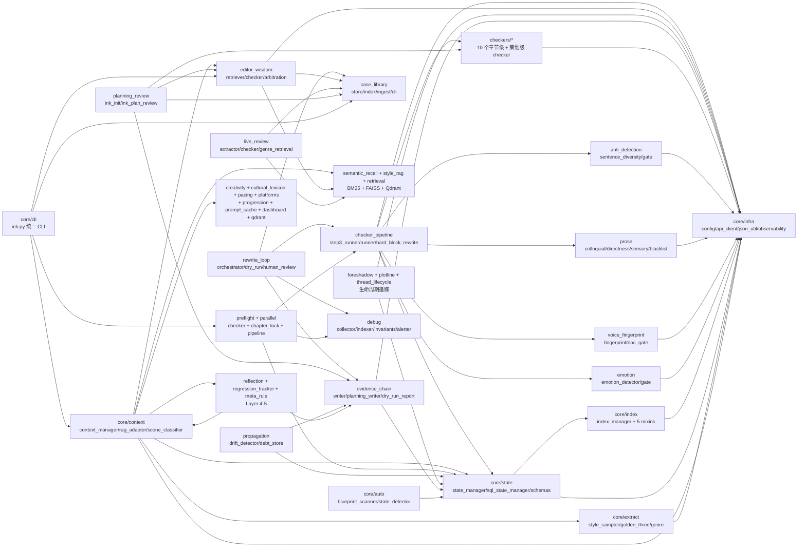

# Ink Writer Pro — Codemap (静态梳理基础底座)

> **文档目的**:作为后续测试与 bug 修复分析的事实底座。本文只做静态结构梳理,**不做评价、不做赏析、不写测试**。
>
> **生成时间**:2026-04-28(基于 commit `268f2e1` 状态)
> **生成方式**:4 个并行扫描 agent + grep/wc 静态采集,无代码执行
> **不确定的事实**:本文出现 `(?)` 标记的位置都附说明

---

## 1. 项目元信息

### 1.1 基本属性

| 项 | 值 | 来源 |
|---|---|---|
| 项目名 | `ink-writer` | pyproject.toml:6 |
| 版本 | `26.3.0` | pyproject.toml:7 |
| 语言 | Python | — |
| 运行时版本 | `>=3.12` | pyproject.toml:12 |
| License | GPL-3.0 | pyproject.toml:10 |
| 描述 | "长篇网文创作系统(skills + agents + data chain + RAG)" | pyproject.toml:8 |
| 作者 | cipher-wb | pyproject.toml:11 |

### 1.2 主要依赖(逐字摘自 `pyproject.toml:13-27`)

```
aiohttp>=3.8.0
filelock>=3.0.0
pydantic>=2.0.0
fastapi>=0.115.0
uvicorn[standard]>=0.32.0
watchdog>=5.0.0
httpx>=0.27.0
numpy~=2.4
faiss-cpu~=1.13
PyYAML~=6.0
jsonschema~=4.26
sentence-transformers~=5.4
anthropic~=0.89
```

`requirements.txt` 额外补充:
- `qdrant-client~=1.12` — M1 起替换 FAISS(requirements.txt:16)

### 1.3 入口点

**两层结构,用户层与开发者层不同**:

| 层 | 入口形式 | 文件:行号 |
|---|---|---|
| **用户层(Claude Code 用户敲的)** | 17 个 slash commands | `ink-writer/skills/<name>/SKILL.md` |
| 用户层最常用命令 | `/ink-auto N` | `ink-writer/scripts/ink-auto.sh`(整套 1588 行) |
| **开发者层(脚本入口)** | `python ink-writer/scripts/ink.py` | 进而调 `ink_writer/core/cli/ink.py:697` |
| Python 包统一 CLI | `python -m ink_writer.creativity validate` | `ink_writer/creativity/__main__.py:20` |
| Python 包统一 CLI | `python -m ink_writer.meta_rule_emergence` | `ink_writer/meta_rule_emergence/__main__.py:140` |
| Python 包统一 CLI | `python -m ink_writer.regression_tracker` | `ink_writer/regression_tracker/__main__.py:85` |
| 项目初始化 | `python ink-writer/scripts/init_project.py` | `ink-writer/scripts/init_project.py:1033` |

**Pytest 路径配置**(pytest.ini): `pythonpath = . ink-writer ink-writer/scripts ink-writer/dashboard scripts` — 这五条路径都被加进 sys.path,意味着代码导入时 `ink_writer.*` 与 `<scripts>.*` 都解析得到。

### 1.4 文件与代码规模

> 已排除:`.git/ .pytest_cache/ .ruff_cache/ __pycache__/ .egg-info/ archive/ benchmark/`

| 范围 | .py 文件数 | 代码行数 | 说明 |
|---|---:|---:|---|
| `ink_writer/`(Python 包,被 pyproject 打包) | 268 | 48,653 | **唯一被打包发布的源码** |
| `ink-writer/`(Claude Code 插件目录) | 50 | 16,275 | skills/scripts/dashboard 等 |
| `scripts/`(顶层维护脚本) | 62 | 15,405 | live-review/audit/maintenance 等 |
| **源码合计** | **380** | **80,333** | |
| `tests/` | 443 | 75,215 | 测试,不计入源码 |
| **项目合计(含 tests)** | 823 | 155,548 | |

### 1.5 README 中声明的运行模式(逐字摘录)

> **来源**: `README.md` 第 118-144 行(快速上手章节)。注:README 用"模式"指**用户场景**,不指 slash command。

| 模式名 | README 中的逐字描述(原文摘录,不改写) | README:行号 |
|---|---|---|
| **快速模式(推荐新手)** | `/ink-init --quick      # 生成 3 套小说方案，选一个直接开写` | 120-126 |
| **深度模式(完全掌控)** | `/ink-init              # 交互式采集（书名/题材/角色/世界观/金手指/创意约束）` | 128-134 |
| **日常工作流** | `/ink-auto 5~10         # 每天产出 1~2 万字` + 每 5 章自动审查修复,每 20 章深度结构分析,大纲写完自动生成下一卷,全程无需干预 | 136-144 |

另外 README 在功能亮点段(第 19 行)提及第 4 种隐式模式:

| 模式名 | README 中的描述 | README:行号 |
|---|---|---|
| **Debug Mode 自我观察(v26.3+)** | "写作全链路自动记录'AI 偷懒/契约脱节/工作流偏航'等事件到 `<project>/.ink-debug/`(JSONL + SQLite 双层),零侵入、默认开、`INK_DEBUG_OFF=1` 一键关" | 19 |

跨平台/外部环境模式(README 安装段):

| 模式名 | 触发方式 | README:行号 |
|---|---|---|
| Claude Code 模式(主推荐) | `claude plugin marketplace add cipher-wb/ink-writerPro` | 39-66 |
| Gemini CLI 模式 | `gemini extensions install .` | 68-74 |
| Codex CLI 模式 | symlink 安装到 `~/.codex/ink-writer` | 76-84 |
| Windows 原生模式 | 同 Claude Code,底层用 .ps1/.cmd | 188 |

---

## 2. 文件清单

### 2-A. `ink_writer/` Python 包(268 文件,完整 importer 反查)

> **说明**:被 `pyproject.toml:33-36` 打包的唯一源码树。"直接 importer 数量"统计的是**全项目内**(含 tests/、scripts/、ink-writer/、benchmark/)直接 import 该模块的 .py 文件数,**已排除文件自身**。0 个 importer 的文件是死代码候选。

<details><summary>展开完整 268 行表格</summary>

| 路径 | 行数 | 一句话职责 | 直接 importer 数量 | 直接 importer 列表 |
|---|---|---|---|---|
| ink_writer/__init__.py | 0 | (空文件,纯包标记) | 0 | (none) |
| ink_writer/_compat/__init__.py | 5 | 跨平台兼容原语集(Windows ↔ POSIX) | 0 | (none) |
| ink_writer/_compat/locking.py | 113 | 跨平台文件锁原语 | 4 | ink_writer/case_library/_id_alloc.py, ink_writer/rewrite_loop/dry_run.py, tests/_compat/test_locking.py, +1 |
| ink_writer/anti_detection/__init__.py | 1 | Anti-detection 包标记 | 0 | (none) |
| ink_writer/anti_detection/anti_detection_gate.py | 299 | ink-write 的反 AI 硬门 | 6 | ink_writer/checker_pipeline/hard_block_rewrite.py, ink_writer/checker_pipeline/step3_runner.py, tests/anti_detection/test_anti_detection_gate.py, +3 |
| ink_writer/anti_detection/config.py | 118 | anti-detection.yaml 加载器 | 8 | ink_writer/anti_detection/anti_detection_gate.py, ink_writer/anti_detection/sentence_diversity.py, tests/anti_detection/test_anti_detection_gate.py, +5 |
| ink_writer/anti_detection/fix_prompt_builder.py | 91 | 构造反 AI 修复提示词 | 4 | ink_writer/anti_detection/anti_detection_gate.py, tests/anti_detection/test_anti_detection_gate.py, tests/anti_detection/test_conjunction_density.py, +1 |
| ink_writer/anti_detection/sentence_diversity.py | 241 | 句式多样性零容忍统计 | 3 | tests/anti_detection/test_anti_detection_gate.py, tests/anti_detection/test_conjunction_density.py, tests/anti_detection/test_zt_extended.py |
| ink_writer/case_library/__init__.py | 0 | 包标记 | 1 | tests/case_library/test_id_alloc_concurrency.py |
| ink_writer/case_library/_id_alloc.py | 70 | 并发安全的 case ID 分配 | 5 | ink_writer/learn/auto_case.py, ink_writer/learn/promote.py, ink_writer/live_review/case_id.py, +2 |
| ink_writer/case_library/approval.py | 96 | pending case 批量审批 | 2 | ink_writer/case_library/cli.py, tests/case_library/test_id_alloc_concurrency.py |
| ink_writer/case_library/cli.py | 292 | `ink case` CLI 子命令集 | 7 | tests/case_library/test_cli.py, tests/case_library/test_cli_approve.py, tests/case_library/test_cli_convert.py, +4 |
| ink_writer/case_library/errors.py | 18 | Case library 异常类 | 9 | ink_writer/case_library/approval.py, ink_writer/case_library/cli.py, ink_writer/case_library/meta_rule_cli.py, +6 |
| ink_writer/case_library/index.py | 143 | 反向 sqlite 索引 | 3 | ink_writer/case_library/cli.py, tests/case_library/test_id_alloc_concurrency.py, tests/case_library/test_index.py |
| ink_writer/case_library/ingest.py | 133 | Case 摄取入口 | 7 | ink_writer/case_library/cli.py, ink_writer/case_library/rules_to_cases.py, ink_writer/preflight/checker.py, +4 |
| ink_writer/case_library/meta_rule_cli.py | 319 | `ink meta-rule {list,approve,...}` 子命令 | 3 | ink_writer/case_library/cli.py, tests/case_library/test_id_alloc_concurrency.py, tests/case_library/test_meta_rule_cli.py |
| ink_writer/case_library/models.py | 185 | Case dataclass + 枚举 | 22 | ink_writer/case_library/approval.py, ink_writer/case_library/ingest.py, ink_writer/case_library/store.py, +19 |
| ink_writer/case_library/rules_to_cases.py | 138 | editor-wisdom rules.json → cases | 4 | ink_writer/case_library/cli.py, tests/case_library/test_id_alloc_concurrency.py, tests/case_library/test_rules_to_cases.py, +1 |
| ink_writer/case_library/schema.py | 50 | Case JSON Schema 加载器 | 6 | ink_writer/case_library/store.py, scripts/live-review/jsonl_to_cases.py, tests/case_library/test_id_alloc_concurrency.py, +3 |
| ink_writer/case_library/store.py | 145 | Case 持久层(YAML+SQLite) | 34 | ink_writer/case_library/approval.py, ink_writer/case_library/cli.py, ink_writer/case_library/index.py, +31 |
| ink_writer/chapter_paths_types.py | 70 | 章节路径类型定义 | 0 | (none) |
| ink_writer/checker_pipeline/__init__.py | 9 | checker_pipeline 包标记 | 2 | tests/checker_pipeline/test_step3_runner_real_checker.py, tests/integration/test_step3_enforce_real_polish.py |
| ink_writer/checker_pipeline/block_threshold_wrapper.py | 89 | 阈值升级到硬阻断 wrapper | 4 | tests/checker_pipeline/test_block_threshold_wrapper.py, tests/checker_pipeline/test_step3_runner_real_checker.py, tests/integration/test_m3_e2e.py, +1 |
| ink_writer/checker_pipeline/hard_block_rewrite.py | 379 | US-013 Hard Block Rewrite Mode | 4 | ink_writer/checker_pipeline/step3_runner.py, tests/checker_pipeline/test_step3_runner_real_checker.py, tests/integration/test_step3_enforce_real_polish.py, +1 |
| ink_writer/checker_pipeline/llm_checker_factory.py | 274 | LLM 5-gate checker 工厂 | 5 | ink_writer/checker_pipeline/step3_runner.py, tests/checker_pipeline/test_llm_checker_factory.py, tests/checker_pipeline/test_step3_runner_real_checker.py, +2 |
| ink_writer/checker_pipeline/merge_fix_suggestion.py | 280 | 合并多 checker 修复建议 | 3 | tests/checker_pipeline/test_merge_fix_suggestion.py, tests/checker_pipeline/test_step3_runner_real_checker.py, tests/integration/test_step3_enforce_real_polish.py |
| ink_writer/checker_pipeline/polish_llm_fn.py | 277 | LLM 驱动的 polish 工厂 | 5 | ink_writer/checker_pipeline/step3_runner.py, tests/checker_pipeline/test_polish_llm_fn.py, tests/checker_pipeline/test_step3_runner_real_checker.py, +2 |
| ink_writer/checker_pipeline/runner.py | 248 | 并行 checker 管线编排 | 6 | ink_writer/checker_pipeline/__init__.py, ink_writer/checker_pipeline/step3_runner.py, tests/checker_pipeline/test_checker_runner.py, +3 |
| ink_writer/checker_pipeline/step3_runner.py | 696 | Step 3 总编排器(全 checker) | 5 | tests/checker_pipeline/test_colloquial_checker_pipeline.py, tests/checker_pipeline/test_directness_checker.py, tests/checker_pipeline/test_step3_runner_real_checker.py, +2 |
| ink_writer/checker_pipeline/thresholds_loader.py | 70 | M3 阈值总加载器 | 7 | ink_writer/planning_review/ink_init_review.py, ink_writer/planning_review/ink_plan_review.py, tests/checker_pipeline/test_block_threshold_wrapper.py, +4 |
| ink_writer/checkers/__init__.py | 1 | M3 章节级 checker 集合 | 0 | (none) |
| ink_writer/checkers/chapter_hook_density/__init__.py | 13 | chapter-hook-density 包入口 | 2 | ink_writer/planning_review/ink_plan_review.py, tests/checkers/chapter_hook_density/test_checker.py |
| ink_writer/checkers/chapter_hook_density/checker.py | 170 | 章节钩子密度检查 | 3 | ink_writer/checkers/chapter_hook_density/__init__.py, ink_writer/planning_review/ink_plan_review.py, tests/checkers/chapter_hook_density/test_checker.py |
| ink_writer/checkers/chapter_hook_density/models.py | 33 | 钩子密度报告 dataclass | 4 | (4 引用,见详表) |
| ink_writer/checkers/conflict_skeleton/__init__.py | 6 | conflict-skeleton 包入口 | 1 | tests/checkers/conflict_skeleton/test_checker.py |
| ink_writer/checkers/conflict_skeleton/checker.py | 152 | 章节冲突骨架检查 | 2 | (2 引用) |
| ink_writer/checkers/conflict_skeleton/models.py | 41 | ConflictReport dataclass | 3 | (3 引用) |
| ink_writer/checkers/genre_novelty/__init__.py | 6 | M4 题材新颖度 checker | 2 | ink_writer/planning_review/ink_init_review.py, tests/checkers/genre_novelty/test_checker.py |
| ink_writer/checkers/genre_novelty/checker.py | 173 | 与起点 top200 比对相似度 | 3 | (3 引用) |
| ink_writer/checkers/genre_novelty/models.py | 29 | GenreNoveltyReport | 4 | (4 引用) |
| ink_writer/checkers/golden_finger_spec/__init__.py | 6 | M4 金手指规格 checker | 2 | (2 引用) |
| ink_writer/checkers/golden_finger_spec/checker.py | 121 | 金手指 4 维度评估 | 3 | (3 引用) |
| ink_writer/checkers/golden_finger_spec/models.py | 29 | GoldenFingerSpecReport | 4 | (4 引用) |
| ink_writer/checkers/golden_finger_timing/__init__.py | 12 | M4 金手指出场时机 checker | 2 | (2 引用) |
| ink_writer/checkers/golden_finger_timing/checker.py | 215 | 前 3 章金手指出场判定 | 3 | (3 引用) |
| ink_writer/checkers/golden_finger_timing/models.py | 31 | GoldenFingerTimingReport | 4 | (4 引用) |
| ink_writer/checkers/naming_style/__init__.py | 6 | M4 角色起名风格 checker | 3 | (3 引用) |
| ink_writer/checkers/naming_style/checker.py | 150 | 词典化打分 | 4 | (4 引用) |
| ink_writer/checkers/naming_style/models.py | 29 | NamingStyleReport | 5 | (5 引用) |
| ink_writer/checkers/protagonist_agency/__init__.py | 6 | 主角能动性 checker | 1 | tests/checkers/protagonist_agency/test_checker.py |
| ink_writer/checkers/protagonist_agency/checker.py | 157 | 反"主角当摄像头" | 2 | (2 引用) |
| ink_writer/checkers/protagonist_agency/models.py | 42 | AgencyReport | 3 | (3 引用) |
| ink_writer/checkers/protagonist_agency_skeleton/__init__.py | 13 | 主角能动性骨架 checker | 2 | (2 引用) |
| ink_writer/checkers/protagonist_agency_skeleton/checker.py | 158 | LLM 打分平均 | 3 | (3 引用) |
| ink_writer/checkers/protagonist_agency_skeleton/models.py | 29 | ProtagonistAgencySkeletonReport | 4 | (4 引用) |
| ink_writer/checkers/protagonist_motive/__init__.py | 6 | M4 主角动机 checker | 2 | (2 引用) |
| ink_writer/checkers/protagonist_motive/checker.py | 122 | 动机 3 维度评估 | 3 | (3 引用) |
| ink_writer/checkers/protagonist_motive/models.py | 29 | ProtagonistMotiveReport | 4 | (4 引用) |
| ink_writer/core/__init__.py | 0 | 包标记 | 0 | (none) |
| ink_writer/core/auto/__init__.py | 0 | 包标记 | 0 | (none) |
| ink_writer/core/auto/blueprint_scanner.py | 46 | 扫描 CWD 顶层蓝图文件 | 2 | tests/core/auto/test_blueprint_scanner.py, tests/core/auto/test_integration_s0a.py |
| ink_writer/core/auto/blueprint_to_quick_draft.py | 218 | 蓝图 .md → quick mode 草稿 | 1 | tests/core/auto/test_blueprint_to_quick_draft.py |
| ink_writer/core/auto/state_detector.py | 43 | 检测 ink-writer 项目状态(S0/S1/S2) | 2 | tests/core/auto/test_integration_s0a.py, tests/core/auto/test_state_detector.py |
| ink_writer/core/cli/__init__.py | 0 | 包标记 | 1 | tests/docs/test_verify_docs_data_modules.py |
| ink_writer/core/cli/checkpoint_utils.py | 206 | ink-auto 分层检查点工具 | 4 | (4 引用) |
| ink_writer/core/cli/cli_args.py | 96 | CLI 参数兼容工具 | 8 | (8 引用) |
| ink_writer/core/cli/cli_output.py | 69 | CLI 输出格式化 | 9 | (9 引用) |
| ink_writer/core/cli/ink.py | 697 | **`ink` 统一 CLI 总入口** | 4 | ink-writer/scripts/ink.py, tests/data_modules/test_ink_unified_cli.py, tests/docs/test_verify_docs_data_modules.py, +1 |
| ink_writer/core/context/__init__.py | 0 | 包标记 | 0 | (none) |
| ink_writer/core/context/context_manager.py | **1804** | ContextManager — 上下文组装器 | 10 | ink-writer/scripts/extract_chapter_context.py, scripts/e2e_smoke_harness.py, tests/core/context/test_context_pack_schema.py, +7 |
| ink_writer/core/context/context_ranker.py | 209 | Context ranker 排序 | 2 | (2 引用) |
| ink_writer/core/context/context_weights.py | 44 | 中央化的 context 模板权重 | 3 | (3 引用) |
| ink_writer/core/context/memory_compressor.py | 328 | 跨卷记忆压缩模块 | 3 | ink_writer/core/cli/ink.py, tests/data_modules/test_memory_compressor.py, tests/reflection/test_reflection_agent.py |
| ink_writer/core/context/query_router.py | 144 | RAG 查询路由 | 2 | (2 引用) |
| ink_writer/core/context/rag_adapter.py | **1667** | RAG 检索适配模块 | 3 | ink-writer/scripts/extract_chapter_context.py, tests/data_modules/test_data_modules.py, tests/data_modules/test_rag_adapter.py |
| ink_writer/core/context/scene_classifier.py | 211 | scene_mode 场景识别器 | 2 | (2 引用) |
| ink_writer/core/context/writing_guidance_builder.py | 729 | 写作指导/checklist 构建器 | 1 | ink_writer/core/context/context_manager.py |
| ink_writer/core/extract/__init__.py | 0 | 包标记 | 0 | (none) |
| ink_writer/core/extract/anti_ai_lint.py | 380 | 章节文本反 AI lint | 2 | ink_writer/core/extract/style_sampler.py, tests/data_modules/test_golden_three.py |
| ink_writer/core/extract/entity_linker.py | 289 | 实体消歧辅助 | 3 | (3 引用) |
| ink_writer/core/extract/genre_aliases.py | 66 | 题材别名归一化 | 4 | (4 引用) |
| ink_writer/core/extract/genre_profile_builder.py | 107 | 题材 profile 解析 | 1 | ink_writer/core/context/context_manager.py |
| ink_writer/core/extract/golden_three.py | 562 | 黄金三章策略 | 4 | (4 引用) |
| ink_writer/core/extract/style_anchor.py | 203 | 风格锚定模块 | 1 | tests/data_modules/test_style_anchor.py |
| ink_writer/core/extract/style_sampler.py | 728 | 风格样本管理 | 2 | (2 引用) |
| ink_writer/core/index/__init__.py | 0 | 包标记 | 1 | tests/migration/test_fix11_script.py |
| ink_writer/core/index/index_chapter_mixin.py | 298 | IndexChapterMixin | 2 | ink_writer/core/index/index_manager.py, tests/migration/test_fix11_script.py |
| ink_writer/core/index/index_debt_mixin.py | 504 | IndexDebtMixin | 2 | (2 引用) |
| ink_writer/core/index/index_entity_mixin.py | 985 | IndexEntityMixin | 2 | (2 引用) |
| ink_writer/core/index/index_manager.py | **2336** | **Index Manager — 索引管理(最大文件)** | **49** | ink-writer/scripts/archive_manager.py, ink-writer/scripts/backup_manager.py, ink-writer/scripts/extract_chapter_context.py, +46 |
| ink_writer/core/index/index_observability_mixin.py | 242 | IndexObservabilityMixin | 2 | (2 引用) |
| ink_writer/core/index/index_reading_mixin.py | 898 | IndexReadingMixin | 2 | (2 引用) |
| ink_writer/core/index/index_types.py | 273 | 索引相关数据类型 | 7 | (7 引用) |
| ink_writer/core/index/review_report_sync.py | 189 | Review report JSON↔DB 同步 | 2 | tests/migration/test_fix11_script.py, tests/review/test_json_db_consistency.py |
| ink_writer/core/infra/__init__.py | 0 | 包标记 | 4 | (4 引用) |
| ink_writer/core/infra/api_client.py | 814 | LLM API 客户端 | 12 | (12 引用) |
| ink_writer/core/infra/config.py | 429 | **核心配置加载** | **74** | benchmark/e2e_shadow_300.py, ink-writer/scripts/archive_manager.py, ink-writer/scripts/backup_manager.py, +71 |
| ink_writer/core/infra/json_util.py | 116 | 共享 JSON 解析工具 | 13 | (13 引用) |
| ink_writer/core/infra/observability.py | 87 | 共享可观测性 helper | 10 | (10 引用) |
| ink_writer/core/preferences.py | 126 | 用户偏好加载器 | 7 | (7 引用) |
| ink_writer/core/state/__init__.py | 0 | 包标记 | 2 | (2 引用) |
| ink_writer/core/state/migrate_state_to_sqlite.py | 394 | state.json → SQLite 迁移 | 3 | (3 引用) |
| ink_writer/core/state/schemas.py | 255 | data_modules pydantic schema | 3 | (3 引用) |
| ink_writer/core/state/snapshot_manager.py | 92 | Context snapshot 管理 | 4 | (4 引用) |
| ink_writer/core/state/sql_state_manager.py | **1145** | SQL State Manager(SQLite 后端) | 9 | (9 引用) |
| ink_writer/core/state/state_manager.py | **1955** | **State Manager(主状态管理)** | 11 | benchmark/e2e_shadow_300.py, ink-writer/scripts/archive_manager.py, ink-writer/scripts/update_state.py, +8 |
| ink_writer/core/state/state_validator.py | 249 | 运行时校验/规整 | 6 | (6 引用) |
| ink_writer/creativity/__init__.py | 54 | creativity 包(v16 US-009~013) | 1 | tests/creativity/test_quick_mode_integration.py |
| ink_writer/creativity/__main__.py | 20 | `python -m ink_writer.creativity` | 1 | tests/creativity/test_quick_mode_integration.py |
| ink_writer/creativity/cli.py | 270 | creativity CLI | 2 | (2 引用) |
| ink_writer/creativity/cost_validator.py | 308 | v26 金手指代价池校验 | 2 | (2 引用) |
| ink_writer/creativity/gf_validator.py | 404 | 金手指三重硬约束 | 4 | (4 引用) |
| ink_writer/creativity/name_validator.py | 287 | 书名+人名陈词黑名单 | 10 | (10 引用) |
| ink_writer/creativity/perturbation_engine.py | 101 | 扰动引擎(Layer 3) | 3 | (3 引用) |
| ink_writer/creativity/retry_loop.py | 116 | Quick Mode 5 次重抽 | 3 | (3 引用) |
| ink_writer/creativity/sensitive_lexicon_validator.py | 296 | L0-L3 敏感词密度校验 | 4 | (4 引用) |
| ink_writer/cultural_lexicon/__init__.py | 17 | Cultural lexicon 包 | 0 | (none) |
| ink_writer/cultural_lexicon/config.py | 79 | cultural-lexicon.yaml 加载 | 3 | (3 引用) |
| ink_writer/cultural_lexicon/context_injection.py | 88 | Cultural lexicon 注入 context | 2 | (2 引用) |
| ink_writer/cultural_lexicon/loader.py | 108 | 加载 cultural lexicon 词条 | 3 | (3 引用) |
| ink_writer/dashboard/__init__.py | 80 | Dashboard 聚合接口 | 0 | (none) |
| ink_writer/dashboard/aggregator.py | 223 | M5 治理指标聚合 | 3 | (3 引用) |
| ink_writer/dashboard/m5_overview.py | 144 | M5 case 治理 overview | 4 | (4 引用) |
| ink_writer/dashboard/weekly_report.py | 257 | `ink dashboard report` | 3 | (3 引用) |
| ink_writer/debug/__init__.py | 4 | Debug mode v0.5 包 | 2 | (2 引用) |
| ink_writer/debug/alerter.py | 80 | 章末 alert summary | 4 | (4 引用) |
| ink_writer/debug/checker_router.py | 60 | Layer B: checker 路由 | 3 | (3 引用) |
| ink_writer/debug/cli.py | 129 | Debug CLI(status/report/toggle) | 2 | (2 引用) |
| ink_writer/debug/collector.py | 119 | Debug 写入入口 | 7 | (7 引用) |
| ink_writer/debug/config.py | 133 | debug.yaml 加载 | 21 | (21 引用,含 _pyshim) |
| ink_writer/debug/indexer.py | 125 | SQLite 增量索引 | 9 | (9 引用) |
| ink_writer/debug/invariants/__init__.py | 0 | 包标记 | 2 | (2 引用) |
| ink_writer/debug/invariants/auto_step_skipped.py | 31 | Invariant: ink-auto 跳步检查 | 3 | (3 引用) |
| ink_writer/debug/invariants/context_required_files.py | 33 | Invariant: context-agent 必读文件 | 4 | (4 引用) |
| ink_writer/debug/invariants/polish_diff.py | 40 | Invariant: polish 前后 diff | 4 | (4 引用) |
| ink_writer/debug/invariants/review_dimensions.py | 33 | Invariant: review 维度齐全 | 4 | (4 引用) |
| ink_writer/debug/invariants/writer_word_count.py | 32 | Invariant: writer 字数下限 | 5 | (5 引用) |
| ink_writer/debug/reporter.py | 90 | Reporter: SQLite → 双视图 md | 7 | (7 引用) |
| ink_writer/debug/rotate.py | 36 | JSONL 滚动归档 | 5 | (5 引用) |
| ink_writer/debug/schema.py | 104 | Incident schema + kind 白名单 | 14 | (14 引用) |
| ink_writer/editor_wisdom/__init__.py | 0 | 包标记 | 3 | (3 引用) |
| ink_writer/editor_wisdom/arbitration.py | 497 | Checker 冲突仲裁矩阵 | 9 | (9 引用) |
| ink_writer/editor_wisdom/checker.py | 181 | editor-wisdom checker(评分) | 8 | (8 引用) |
| ink_writer/editor_wisdom/cli.py | 124 | editor-wisdom CLI 子命令 | 6 | (6 引用) |
| ink_writer/editor_wisdom/config.py | 122 | editor-wisdom.yaml 加载 | 26 | (26 引用) |
| ink_writer/editor_wisdom/context_injection.py | 114 | 把规则注入 context | 7 | (7 引用) |
| ink_writer/editor_wisdom/coverage_metrics.py | 218 | 覆盖度指标 | 5 | (5 引用) |
| ink_writer/editor_wisdom/exceptions.py | 24 | 自定义异常 | 10 | (10 引用) |
| ink_writer/editor_wisdom/golden_three.py | 136 | 黄金三章 enhancement | 9 | (9 引用) |
| ink_writer/editor_wisdom/llm_backend.py | 159 | LLM 后端适配 | 9 | (9 引用) |
| ink_writer/editor_wisdom/models.py | 6 | Anthropic 模型 ID 常量 | 6 | (6 引用) |
| ink_writer/editor_wisdom/polish_injection.py | 111 | polish 阶段注入违规 | 4 | (4 引用) |
| ink_writer/editor_wisdom/retriever.py | 115 | editor-wisdom 语义检索 | 24 | (24 引用) |
| ink_writer/editor_wisdom/review_gate.py | 263 | ink-review 硬门 | 9 | (9 引用) |
| ink_writer/editor_wisdom/writer_injection.py | 203 | writer 阶段注入规则 | 8 | (8 引用) |
| ink_writer/emotion/__init__.py | 1 | Emotion 包标记 | 0 | (none) |
| ink_writer/emotion/config.py | 56 | emotion-curve.yaml 加载 | 3 | (3 引用) |
| ink_writer/emotion/emotion_detector.py | 232 | Scene 级情绪曲线检测 | 1 | tests/emotion/test_emotion_engine.py |
| ink_writer/emotion/emotion_gate.py | 191 | 情绪曲线硬门 | 2 | ink_writer/checker_pipeline/step3_runner.py, tests/emotion/test_emotion_engine.py |
| ink_writer/emotion/fix_prompt_builder.py | 83 | 情绪修复提示词 | 2 | (2 引用) |
| ink_writer/evidence_chain/__init__.py | 25 | M3/M4 evidence_chain 包 | 10 | (10 引用) |
| ink_writer/evidence_chain/dry_run_report.py | 116 | Dry-run 5 次观察聚合报告 | 11 | (11 引用) |
| ink_writer/evidence_chain/models.py | 126 | EvidenceChain dataclass | 14 | (14 引用) |
| ink_writer/evidence_chain/planning_writer.py | 103 | planning_evidence_chain.json 写盘 | 12 | (12 引用) |
| ink_writer/evidence_chain/writer.py | 100 | evidence_chain.json 写盘 | 12 | (12 引用) |
| ink_writer/foreshadow/__init__.py | 1 | Foreshadow 包标记 | 0 | (none) |
| ink_writer/foreshadow/config.py | 69 | foreshadow-lifecycle.yaml 加载 | 5 | (5 引用) |
| ink_writer/foreshadow/fix_prompt_builder.py | 82 | 伏笔修复提示词 | 1 | tests/foreshadow/test_foreshadow_fix_prompt.py |
| ink_writer/foreshadow/tracker.py | 306 | 伏笔生命周期追踪 | 5 | (5 引用) |
| ink_writer/learn/__init__.py | 7 | M5 ink-learn 包 | 0 | (none) |
| ink_writer/learn/auto_case.py | 273 | US-009 自动 propose pending | 4 | (4 引用) |
| ink_writer/learn/promote.py | 156 | US-010 提升短期到长期 | 3 | (3 引用) |
| ink_writer/live_review/__init__.py | 4 | Live-Review 包 | 1 | tests/live_review/test_genre_retrieval.py |
| ink_writer/live_review/_llm_provider.py | 53 | LLM 客户端工厂 | 4 | (4 引用) |
| ink_writer/live_review/_vector_index.py | 132 | 病例向量索引(bge) | 7 | (7 引用) |
| ink_writer/live_review/case_id.py | 29 | Live-review case ID 分配 | 3 | (3 引用) |
| ink_writer/live_review/checker.py | 177 | live-review-checker | 4 | (4 引用) |
| ink_writer/live_review/config.py | 75 | live-review.yaml 加载 | 5 | (5 引用) |
| ink_writer/live_review/extractor.py | 218 | LLM 切分核心 | 4 | (4 引用) |
| ink_writer/live_review/genre_retrieval.py | 46 | 题材感知语义检索 | 3 | (3 引用) |
| ink_writer/live_review/init_injection.py | 199 | ink-init Step 99 注入 | 4 | (4 引用) |
| ink_writer/live_review/review_injection.py | 96 | ink-review Step 注入 | 2 | (2 引用) |
| ink_writer/meta_rule_emergence/__init__.py | 24 | Layer 5 meta-rule emergence | 2 | (2 引用) |
| ink_writer/meta_rule_emergence/__main__.py | 140 | `python -m ...meta_rule_emergence` | 2 | (2 引用) |
| ink_writer/meta_rule_emergence/emerger.py | 251 | Layer 5 meta-rule 涌现 | 4 | (4 引用) |
| ink_writer/meta_rule_emergence/models.py | 32 | Layer 5 dataclass | 4 | (4 引用) |
| ink_writer/pacing/__init__.py | 1 | Pacing 子系统包标记 | 0 | (none) |
| ink_writer/pacing/high_point_scheduler.py | 277 | High-point 主动调度 | 1 | tests/pacing/test_high_point_scheduler.py |
| ink_writer/parallel/__init__.py | 6 | parallel 包标记 | 0 | (none) |
| ink_writer/parallel/chapter_lock.py | 339 | 章节级写入锁 | 7 | (7 引用) |
| ink_writer/parallel/pipeline_manager.py | 603 | 章节级并发管线编排 | 5 | (5 引用) |
| ink_writer/planning_review/__init__.py | 36 | M4 P0 策划期审查编排层 | 0 | (none) |
| ink_writer/planning_review/dry_run.py | 63 | 策划期独立 dry-run 计数器 | 4 | (4 引用) |
| ink_writer/planning_review/dry_run_report.py | 169 | 策划期 5 次观察期聚合报告 | 1 | ink_writer/planning_review/__init__.py |
| ink_writer/planning_review/ink_init_review.py | 302 | ink-init Step 99 编排 | 4 | (4 引用) |
| ink_writer/planning_review/ink_plan_review.py | 236 | ink-plan Step 99 编排 | 4 | (4 引用) |
| ink_writer/platforms/__init__.py | 10 | 平台模式解析工具 | 0 | (none) |
| ink_writer/platforms/resolver.py | 76 | 平台模式 resolver | 8 | (8 引用) |
| ink_writer/plotline/__init__.py | 1 | Plotline 包标记 | 0 | (none) |
| ink_writer/plotline/config.py | 59 | plotline-lifecycle.yaml 加载 | 5 | (5 引用) |
| ink_writer/plotline/fix_prompt_builder.py | 65 | 明暗线修复提示词 | 1 | tests/plotline/test_plotline_fix_prompt.py |
| ink_writer/plotline/tracker.py | 287 | 明暗线生命周期追踪 | 7 | (7 引用) |
| ink_writer/preflight/__init__.py | 0 | 包标记 | 0 | (none) |
| ink_writer/preflight/checker.py | 136 | Preflight 聚合器 | 3 | (3 引用) |
| ink_writer/preflight/checks.py | 128 | 6 个独立 preflight 检查 | 2 | ink_writer/preflight/checker.py, tests/preflight/test_checks.py |
| ink_writer/preflight/cli.py | 205 | `ink preflight` CLI | 2 | tests/integration/test_m1_e2e.py, tests/preflight/test_cli.py |
| ink_writer/preflight/errors.py | 15 | preflight 异常 | 2 | (2 引用) |
| ink_writer/progression/__init__.py | 13 | character progression 包 | 3 | (3 引用) |
| ink_writer/progression/context_injection.py | 117 | 进展数据注入 context | 4 | (4 引用) |
| ink_writer/prompt_cache/__init__.py | 22 | Anthropic prompt cache 包 | 0 | (none) |
| ink_writer/prompt_cache/config.py | 65 | prompt-cache.yaml 加载 | 3 | (3 引用) |
| ink_writer/prompt_cache/metrics.py | 159 | 缓存命中指标 | 4 | (4 引用) |
| ink_writer/prompt_cache/segmenter.py | 108 | system_prompt 切段 | 2 | ink_writer/prompt_cache/__init__.py, tests/prompt_cache/test_prompt_cache.py |
| ink_writer/propagation/__init__.py | 39 | FIX-17 propagation debt 包 | 7 | (7 引用) |
| ink_writer/propagation/debt_store.py | 53 | propagation_debt 读写 | 10 | (10 引用) |
| ink_writer/propagation/drift_detector.py | 549 | Canon drift 检测器 | 9 | (9 引用) |
| ink_writer/propagation/macro_integration.py | 84 | macro-review propagation 集成 | 8 | (8 引用) |
| ink_writer/propagation/models.py | 42 | propagation pydantic models | 12 | (12 引用) |
| ink_writer/propagation/plan_integration.py | 82 | ink-plan 消费 propagation | 8 | (8 引用) |
| ink_writer/prose/__init__.py | 59 | Prose 工具包入口 | 3 | (3 引用) |
| ink_writer/prose/blacklist_loader.py | 319 | Prose dictionary 加载 | 12 | (12 引用) |
| ink_writer/prose/colloquial_checker.py | 752 | US-004 Colloquial-checker | 9 | (9 引用) |
| ink_writer/prose/directness_checker.py | 809 | US-005 Directness checker | 18 | (18 引用) |
| ink_writer/prose/directness_threshold_gates.py | 149 | prose-impact / flow gate | 7 | (7 引用) |
| ink_writer/prose/sensory_immersion_gate.py | 41 | sensory-immersion-checker gate | 7 | (7 引用) |
| ink_writer/prose/simplification_pass.py | 565 | polish-agent simplification | 7 | (7 引用) |
| ink_writer/qdrant/__init__.py | 0 | 包标记 | 0 | (none) |
| ink_writer/qdrant/client.py | 57 | qdrant-client 薄封装 | 7 | (7 引用) |
| ink_writer/qdrant/errors.py | 10 | Qdrant 异常 | 3 | (3 引用) |
| ink_writer/qdrant/payload_schema.py | 99 | Qdrant collection schema | 4 | (4 引用) |
| ink_writer/quality_metrics/__init__.py | 16 | Q1-Q8 quality metrics 包 | 2 | benchmark/e2e_shadow_300.py, tests/quality_metrics/test_collectors.py |
| ink_writer/quality_metrics/collectors.py | 559 | Q1-Q8 metric collectors | 3 | (3 引用) |
| ink_writer/reader_pull/__init__.py | 1 | Reader-pull 包标记 | 0 | (none) |
| ink_writer/reader_pull/config.py | 52 | reader-pull.yaml 加载 | 3 | (3 引用) |
| ink_writer/reader_pull/fix_prompt_builder.py | 99 | reader-pull 修复提示词 | 2 | (2 引用) |
| ink_writer/reader_pull/hook_retry_gate.py | 194 | reader-pull 重试硬门 | 2 | ink_writer/checker_pipeline/step3_runner.py, tests/hooks/test_reader_pull_retry.py |
| ink_writer/reflection/__init__.py | 11 | Macro reflection agent 包 | 2 | ink_writer/core/context/context_manager.py, tests/reflection/test_reflection_agent.py |
| ink_writer/reflection/reflection_agent.py | 296 | reflection agent | 3 | (3 引用) |
| ink_writer/regression_tracker/__init__.py | 24 | Layer 4 regression tracker 包 | 2 | (2 引用) |
| ink_writer/regression_tracker/__main__.py | 85 | `python -m ...regression_tracker` | 2 | (2 引用) |
| ink_writer/regression_tracker/models.py | 35 | Layer 4 dataclass | 4 | (4 引用) |
| ink_writer/regression_tracker/tracker.py | 164 | 扫 evidence chain 找回归 | 4 | (4 引用) |
| ink_writer/retrieval/__init__.py | 15 | retrieval 包(爆款示例) | 0 | (none) |
| ink_writer/retrieval/explosive_retriever.py | 152 | 爆款示例语义检索 | 4 | (4 引用) |
| ink_writer/retrieval/inject.py | 66 | writer-agent step 2 注入 | 3 | (3 引用) |
| ink_writer/rewrite_loop/__init__.py | 0 | 包标记 | 0 | (none) |
| ink_writer/rewrite_loop/dry_run.py | 190 | dry-run 模式控制 + 计数器 | 5 | (5 引用) |
| ink_writer/rewrite_loop/human_review.py | 182 | needs_human_review 兜底 | 3 | (3 引用) |
| ink_writer/rewrite_loop/orchestrator.py | 355 | rewrite_loop 总编排 | 3 | (3 引用) |
| ink_writer/rewrite_loop/polish_prompt.py | 79 | case_id 驱动 polish prompt | 2 | (2 引用) |
| ink_writer/semantic_recall/__init__.py | 11 | Semantic chapter recall 包 | 1 | benchmark/e2e_shadow_300.py |
| ink_writer/semantic_recall/bm25.py | 138 | Pure-Python BM25 | 3 | (3 引用) |
| ink_writer/semantic_recall/chapter_index.py | 234 | FAISS 章节索引 | 9 | (9 引用) |
| ink_writer/semantic_recall/config.py | 48 | semantic-recall.yaml 加载 | 9 | (9 引用) |
| ink_writer/semantic_recall/retriever.py | 230 | Hybrid 章节检索器 | 6 | (6 引用) |
| ink_writer/style_rag/__init__.py | 16 | Style RAG 包 | 0 | (none) |
| ink_writer/style_rag/polish_integration.py | 190 | polish-agent + style RAG 桥 | 2 | ink_writer/style_rag/__init__.py, tests/style_rag/test_polish_integration.py |
| ink_writer/style_rag/retriever.py | 316 | 人类风格语义检索 | 5 | (5 引用) |
| ink_writer/thread_lifecycle/__init__.py | 14 | 统一线生命周期追踪包 | 1 | tests/thread_lifecycle/test_unified_tracker.py |
| ink_writer/thread_lifecycle/tracker.py | 106 | Unified thread lifecycle tracker | 2 | ink_writer/thread_lifecycle/__init__.py, tests/thread_lifecycle/test_unified_tracker.py |
| ink_writer/voice_fingerprint/__init__.py | 1 | Voice fingerprint 包标记 | 0 | (none) |
| ink_writer/voice_fingerprint/config.py | 91 | voice-fingerprint.yaml 加载 | 5 | (5 引用) |
| ink_writer/voice_fingerprint/fingerprint.py | 457 | Voice fingerprint 数据模型 | 3 | (3 引用) |
| ink_writer/voice_fingerprint/fix_prompt_builder.py | 112 | OOC 修复提示词 | 2 | (2 引用) |
| ink_writer/voice_fingerprint/ooc_gate.py | 190 | OOC 硬门 | 2 | ink_writer/checker_pipeline/step3_runner.py, tests/voice_fingerprint/test_voice_ooc_gate.py |
| ink_writer/writer_self_check/__init__.py | 12 | M3 writer-self-check 包 | 1 | tests/writer_self_check/test_checker.py |
| ink_writer/writer_self_check/checker.py | 228 | 写完比对 rule_compliance | 2 | ink_writer/writer_self_check/__init__.py, tests/writer_self_check/test_checker.py |
| ink_writer/writer_self_check/models.py | 33 | ComplianceReport | 3 | (3 引用) |

</details>

#### 2-A 关键观察(对后续测试/bug 修复有意义)

- **最大文件 Top 5**(按行数,均在 `ink_writer/core/`):
  1. `core/index/index_manager.py` — **2336 行 / 49 个 importer**(中心化最高)
  2. `core/state/state_manager.py` — 1955 行 / 11 个 importer
  3. `core/context/context_manager.py` — 1804 行 / 10 个 importer
  4. `core/context/rag_adapter.py` — 1667 行 / 3 个 importer
  5. `core/state/sql_state_manager.py` — 1145 行 / 9 个 importer

- **最高被引用 Top 3**(单文件被全项目 import):
  1. `core/infra/config.py` — **74 次**(全项目最热点)
  2. `core/index/index_manager.py` — 49 次
  3. `case_library/store.py` — 34 次

- **零 importer 文件 = 34 个**(候选死代码,但需注意类别):
  - **17 个 `__init__.py`**:大多是包标记或纯 re-export,正常
  - **真正实质模块只有 1 个**:`ink_writer/chapter_paths_types.py`(70 行)— **是死代码候选**(?)
    - (?) 标记原因:它的同名兄弟 `ink-writer/scripts/chapter_paths_types.py`(62 行)看起来是 shim 转发,需要后续核实是否其实通过 PYTHONPATH 被间接 import
  - 其它零 importer `__init__.py` 列出:`ink_writer/__init__.py`、`anti_detection/__init__.py`、`checkers/__init__.py`、`core/__init__.py`、`core/auto/__init__.py`、`core/context/__init__.py`、`core/extract/__init__.py`、`cultural_lexicon/__init__.py`(虽 0 importer 但 cultural_lexicon 子模块被引用,正常)、`dashboard/__init__.py`、`emotion/__init__.py`、`foreshadow/__init__.py`、`learn/__init__.py`、`pacing/__init__.py`、`parallel/__init__.py`、`platforms/__init__.py`、`plotline/__init__.py`、`preflight/__init__.py`、`prompt_cache/__init__.py`、`qdrant/__init__.py`、`reader_pull/__init__.py`、`retrieval/__init__.py`、`rewrite_loop/__init__.py`、`style_rag/__init__.py`、`voice_fingerprint/__init__.py`

### 2-B. `ink-writer/` Claude Code 插件目录(50 文件)

> **说明**:不被 pyproject 打包,但被 pytest.ini:pythonpath 加进 sys.path。包含 dashboard FastAPI 应用 + 26 个 .py 维护脚本 + 10 个 _pyshim 转发文件。

| 路径 | 行数 | 一句话职责 | argparse | main 行号 |
|---|---|---|---|---|
| ink-writer/dashboard/__init__.py | 1 | 包标记 | ❌ | - |
| ink-writer/dashboard/__main__.py | 4 | `python -m dashboard` 入口 | ❌ | - |
| ink-writer/dashboard/app.py | 619 | Ink Dashboard FastAPI 主应用 | ❌ | - |
| ink-writer/dashboard/path_guard.py | 28 | 路径防穿越工具 | ❌ | - |
| ink-writer/dashboard/server.py | 87 | Dashboard 启动脚本 | ✅ | 86 |
| ink-writer/dashboard/watcher.py | 94 | Watchdog + SSE 推送 | ❌ | - |
| ink-writer/scripts/__init__.py | 19 | scripts 包初始化 | ❌ | - |
| ink-writer/scripts/anti_ai_scanner.py | 1056 | Anti-AI 自动扫描工具 | ✅ | 1055 |
| ink-writer/scripts/archive_manager.py | 575 | state.json 数据归档 | ✅ | 574 |
| ink-writer/scripts/backup_manager.py | 488 | Git 集成备份系统 | ✅ | 487 |
| ink-writer/scripts/blueprint_scanner.py | 62 | CWD 蓝图扫描(转发) | ✅ | 51 |
| ink-writer/scripts/blueprint_to_quick_draft.py | 206 | 蓝图 → quick mode 草稿 | ✅ | 197 |
| ink-writer/scripts/chapter_outline_loader.py | 132 | 章纲加载器 | ❌ | - |
| ink-writer/scripts/chapter_paths.py | 180 | 章节路径 helper | ❌ | - |
| ink-writer/scripts/chapter_paths_types.py | 62 | 章节路径类型(shim) | ❌ | - |
| ink-writer/scripts/computational_checks.py | 772 | Step 2C 计算型闸门 | ✅ | 766 |
| ink-writer/scripts/encoding_validator.py | 144 | 章节编码校验(U+FFFD 检测) | ✅ | 143 |
| ink-writer/scripts/extract_chapter_context.py | **1855** | **章节上下文抽取(本树最大文件)** | ✅ | 1852 |
| ink-writer/scripts/hook_contract.py | 123 | 钩子契约解析 | ❌ | - |
| ink-writer/scripts/init_project.py | 1034 | **网文项目初始化主入口** | ✅ | 1033 |
| ink-writer/scripts/ink.py | 41 | `ink` 统一入口转发器(调 `ink_writer.core.cli.ink`) | ❌ | 39 |
| ink-writer/scripts/logic_precheck.py | 446 | Logic-checker 计算型预检 | ✅ | 445 |
| ink-writer/scripts/migrate.py | 259 | 轻量级 schema 迁移框架 | ✅ | 244 |
| ink-writer/scripts/migration_auditor.py | 475 | 迁移审计工具 | ✅ | 474 |
| ink-writer/scripts/post_polish_zt_check.py | 151 | Polish 后零容忍复查 | ✅ | 142 |
| ink-writer/scripts/project_locator.py | 462 | 项目定位 helper | ❌ | - |
| ink-writer/scripts/quality_trend_report.py | 241 | 章节质量趋势报告 | ✅ | 237 |
| ink-writer/scripts/runtime_compat.py | 272 | 运行时兼容 helper(Windows) | ❌ | - |
| ink-writer/scripts/security_utils.py | 596 | 安全工具函数库 | ❌ | 590 |
| ink-writer/scripts/slim_review_bundle.py | 225 | 生成 per-checker slim bundle | ✅ | 224 |
| ink-writer/scripts/state_schema.py | 347 | state.json Pydantic v2 schema | ❌ | - |
| ink-writer/scripts/status_reporter.py | **1252** | **可视化状态报告系统** | ✅ | 1251 |
| ink-writer/scripts/step2b_metrics.py | 183 | Step 2B 风格适配前置指标 | ✅ | 182 |
| ink-writer/scripts/step3_harness_gate.py | 287 | Step 3 Harness Gate(硬拦截) | ✅ | 286 |
| ink-writer/scripts/sync_plugin_version.py | 356 | 插件版本同步 | ✅ | 355 |
| ink-writer/scripts/sync_settings.py | 351 | 自动回写设定集 | ✅ | 350 |
| ink-writer/scripts/update_state.py | 721 | state.json 安全更新 | ✅ | 720 |
| ink-writer/scripts/verify_golden_three.py | 162 | 验证 1-3 章对齐大纲 | ✅ | 153 |
| ink-writer/scripts/workflow_manager.py | 1027 | Workflow state manager | ✅ | 939 |
| ink-writer/scripts/_pyshim/ink_writer/__init__.py | 0 | shim 包标记 | ❌ | - |
| ink-writer/scripts/_pyshim/ink_writer/debug/__init__.py | 4 | Debug shim 包标记 | ❌ | - |
| ink-writer/scripts/_pyshim/ink_writer/debug/alerter.py | 80 | Alerter shim | ❌ | - |
| ink-writer/scripts/_pyshim/ink_writer/debug/checker_router.py | 60 | Checker router shim | ❌ | - |
| ink-writer/scripts/_pyshim/ink_writer/debug/cli.py | 129 | Debug CLI shim | ✅ | 128 |
| ink-writer/scripts/_pyshim/ink_writer/debug/collector.py | 119 | Collector shim | ❌ | - |
| ink-writer/scripts/_pyshim/ink_writer/debug/config.py | 133 | Debug config shim | ❌ | - |
| ink-writer/scripts/_pyshim/ink_writer/debug/indexer.py | 125 | Indexer shim | ❌ | - |
| ink-writer/scripts/_pyshim/ink_writer/debug/reporter.py | 90 | Reporter shim | ❌ | - |
| ink-writer/scripts/_pyshim/ink_writer/debug/rotate.py | 36 | Rotate shim | ❌ | - |
| ink-writer/scripts/_pyshim/ink_writer/debug/schema.py | 104 | Schema shim | ❌ | - |

> **`_pyshim/` 是什么**(?) 看上去是 `ink-writer/scripts/` 下重新声明 `ink_writer.debug.*` 命名空间的转发层 — 用于 Claude Code 不能直接 `pip install ink_writer` 时,把同名模块塞进 PYTHONPATH 让 hook 仍能 import。这一层与 `ink_writer/debug/*` **代码内容不一定字节一致**,后续 bug 修复要警惕它们漂移。

### 2-C. 顶层 `scripts/` 维护脚本(62 文件)

| 路径 | 行数 | 一句话职责 | argparse | main 行号 |
|---|---|---|---|---|
| scripts/__init__.py | 0 | 包标记 | ❌ | - |
| scripts/ab_prompts.py | 231 | A/B test harness | ✅ | 230 |
| scripts/analyze_prose_directness.py | 384 | 直白密度 5 维度基线 | ✅ | 383 |
| scripts/audit_architecture.py | 657 | 架构静态扫描 | ✅ | 656 |
| scripts/audit_cross_platform.py | **1194** | **跨平台兼容性全盘扫描** | ✅ | 14 |
| scripts/build_blind_test.py | 263 | US-602 盲测工具 | ✅ | 262 |
| scripts/build_chapter_index.py | 84 | FAISS 章节向量索引构建 | ✅ | 83 |
| scripts/build_explosive_hit_index.py | 186 | 爆款示例 RAG 语义索引构建 | ✅ | 185 |
| scripts/build_reference_corpus.py | 326 | 从语料筛选 Top 117 标杆 | ✅ | 325 |
| scripts/build_style_rag.py | 194 | Style RAG 索引构建 | ✅ | 193 |
| scripts/calibrate_anti_ai_thresholds.py | 317 | 反 AI 三大 checker 阈值校准 | ✅ | 316 |
| scripts/e2e_anti_ai_overhaul_eval.py | 196 | 旧/新 pipeline 对照评估 | ✅ | 195 |
| scripts/e2e_smoke_harness.py | 450 | Mac+Windows e2e smoke | ✅ | 449 |
| scripts/gen_directness_baseline_report.py | 518 | 直白度基线报告 | ✅ | 517 |
| scripts/measure_baseline.py | 397 | 质量基线测量 | ✅ | 396 |
| scripts/mine_hook_patterns.py | 587 | 爆款对照集钩子模式抽取 | ✅ | 586 |
| scripts/regen_directness_thresholds_explosive.py | 234 | 从语料校准 explosive 阈值 | ✅ | 233 |
| scripts/run_300chapter_benchmark.py | 273 | 300 章无人值守压测 | ✅ | 272 |
| scripts/run_m4_test_book.py | 204 | M4 P0 测试书端到端 | ✅ | 203 |
| scripts/verify_docs.py | 373 | 自动校验 README/architecture | ✅ | 372 |
| scripts/verify_optimization_quality.py | 199 | review 报告对比 | ✅ | 198 |
| scripts/verify_prose_directness.py | 755 | US-011 端到端验证 | ✅ | 754 |
| scripts/audit/scan_unused.py | 635 | 死代码与未用资源扫描 | ✅ | 634 |
| scripts/case_library/__init__.py | 0 | 包标记 | ❌ | - |
| scripts/case_library/init_zero_case.py | 162 | 注册 CASE-2026-0000 | ✅ | 161 |
| scripts/corpus_chunking/__init__.py | 5 | corpus chunking 包 | ❌ | - |
| scripts/corpus_chunking/chunk_indexer.py | 81 | TaggedChunk → Qdrant 向量化 | ❌ | - |
| scripts/corpus_chunking/chunk_tagger.py | 147 | LLM 给 RawChunk 打标签 | ❌ | - |
| scripts/corpus_chunking/cli.py | 578 | `ink corpus` CLI | ✅ | 577 |
| scripts/corpus_chunking/embedding_client.py | 77 | Qwen3-Embedding-8B 客户端 | ❌ | - |
| scripts/corpus_chunking/llm_client.py | 113 | LLM 客户端(模仿 anthropic API) | ❌ | - |
| scripts/corpus_chunking/models.py | 112 | corpus chunking dataclass | ❌ | - |
| scripts/corpus_chunking/scene_segmenter.py | 135 | LLM 切场景边界 | ❌ | - |
| scripts/debug/hook_handler.py | 89 | Claude Code hook 入口 | ❌ | 88 |
| scripts/editor-wisdom/01_scan.py | 93 | 扫描编辑星河数据源 | ❌ | 92 |
| scripts/editor-wisdom/02_clean.py | 162 | 去重 + 噪音过滤 | ❌ | 161 |
| scripts/editor-wisdom/03_classify.py | 241 | 10 个固定类别分类 | ❌ | 240 |
| scripts/editor-wisdom/04_build_kb.py | 180 | 构建人类可读 KB | ❌ | 179 |
| scripts/editor-wisdom/05_extract_rules.py | 287 | 抽取原子规则 | ❌ | 286 |
| scripts/editor-wisdom/06_build_index.py | 86 | 构建 FAISS 向量索引 | ❌ | 85 |
| scripts/editor-wisdom/smoke_test.py | 251 | E2E smoke test | ❌ | 250 |
| scripts/live-review/aggregate_genre.py | 247 | 题材聚合器 | ✅ | 246 |
| scripts/live-review/build_vector_index.py | 75 | live-review 向量索引 | ✅ | 74 |
| scripts/live-review/check_links.py | 144 | markdown 内部链接检查 | ✅ | 143 |
| scripts/live-review/dedupe_approved_candidates.py | 259 | bge cosine 去重 | ✅ | 258 |
| scripts/live-review/extract_one.py | 245 | 单文件 + 多份冒烟 | ✅ | 244 |
| scripts/live-review/extract_rule_candidates.py | 436 | 规则候选抽取器 | ✅ | 435 |
| scripts/live-review/jsonl_to_cases.py | 300 | jsonl → CASE-LR-*.yaml | ✅ | 299 |
| scripts/live-review/promote_approved_rules.py | 225 | approved 规则入库 | ✅ | 224 |
| scripts/live-review/review_rule_candidates.py | 169 | 规则候选交互式审核 | ✅ | 168 |
| scripts/live-review/run_batch.py | 280 | 全量批跑 | ✅ | 279 |
| scripts/live-review/smoke_test.py | 286 | E2E smoke | ✅ | 285 |
| scripts/live-review/validate_jsonl_batch.py | 242 | 批量校验 jsonl | ✅ | 241 |
| scripts/maintenance/__init__.py | 1 | 维护脚本包 | ❌ | - |
| scripts/maintenance/check_plugin_version_consistency.py | 103 | 插件版本一致性自检 | ✅ | 102 |
| scripts/maintenance/fix_reference_corpus_symlinks.py | 171 | 修复 corpus symlink | ✅ | 170 |
| scripts/market_intelligence/__init__.py | 0 | 包标记 | ❌ | - |
| scripts/market_intelligence/fetch_qidian_top200.py | 293 | 起点 top200 爬虫 | ✅ | 292 |
| scripts/migration/__init__.py | 1 | FIX-11 migration 包 | ❌ | - |
| scripts/migration/fix11_merge_packages.py | 296 | 改写 data_modules 导入 | ✅ | 295 |
| scripts/qdrant/__init__.py | 0 | 包标记 | ❌ | - |
| scripts/qdrant/migrate_faiss_to_qdrant.py | 176 | FAISS → Qdrant 迁移 | ✅ | 175 |

### 2-D. Shell 入口(5 个 .sh + 配套 .ps1/.cmd)

| 路径 | 行数 | 一句话职责 | 平台对等 (.ps1/.cmd) |
|---|---|---|---|
| ink-writer/scripts/env-setup.sh | 98 | 共享环境初始化 | ✅/✅ |
| ink-writer/scripts/ink-auto.sh | **1588** | **跨会话无人值守智能批量写作主驱动** | ✅/✅ |
| ink-writer/scripts/interactive_bootstrap.sh | 95 | empty-dir 7 问 fallback | ✅/✅ |
| ink-writer/scripts/migrate_webnovel_to_ink.sh | 223 | webnovel → ink 迁移 | ✅/✅ |
| scripts/e2e_smoke.sh | 69 | Mac/Linux e2e smoke 入口 | ✅/✅ |

> 注:用户敲 `/ink-auto N` 时,SKILL.md 调的就是 `ink-writer/scripts/ink-auto.sh`,这一文件 **1588 行 shell** 是项目最复杂的 shell 入口,所有自动写作的"大脑"都在这里。

---

## 3. 模块依赖图

> **说明**:`ink_writer/` 包内 41 个子包,按功能聚合到 12 个"功能区"绘制 macro 视图。边由 importer 反查数据聚合而来,`A → B` 表示 A 区里 ≥ 1 文件 import B 区文件。



> 简化策略:把同包内的边、init/__main__ 之类的纯转发边、所有 → INFRA 的低级边略去呈现成"中心化"。INFRA 实际是被 74 个文件 import 的"全局热点",无法在图中如实表达——读者请记住:**几乎每个区都依赖 `core/infra/config.py`**。

---

## 4. CLI 命令清单

### 4-A. Slash Commands(用户层入口,17 个)

> 来源:`ink-writer/skills/<name>/SKILL.md`。frontmatter `description` 字段提取的触发关键词。

| 命令 | 触发关键词(SKILL.md 描述) | SKILL.md 行数 | 主要执行入口 | 一句话功能 |
|---|---|---:|---|---|
| `/ink-audit` | Data consistency audit for ink-writer projects | 182 | SKILL.md:41 起 inline `python3 -X utf8 -c ...` | 数据对账,检测幽灵实体/伏笔孤儿/主角漂移 |
| `/ink-auto` | 跨会话无人值守智能批量写作 | 312 | SKILL.md:92 调 `ink-writer/scripts/ink-auto.sh` | 自动写 N 章 + 内置审查修复 + 大纲不够自动生成 |
| `/ink-dashboard` | 启动可视化小说管理面板(只读 Web) | 110 | SKILL.md:39 起 `python3 -m pip install` + `dashboard.server` | 实时查看项目状态、实体图谱、章节内容 |
| `/ink-debug-report` | 生成 Debug Mode 的 markdown 双视图报告 | 40 | SKILL.md:19 调 `${SCRIPTS_DIR}/debug/ink-debug-report.sh`(?) | 按发生位置/按根因两视图 markdown 报告 |
| `/ink-debug-status` | 显示 Debug Mode 当前状态 | 32 | SKILL.md:19 调 `${SCRIPTS_DIR}/debug/ink-debug-status.sh`(?) | 显示 5 开关 + 24h 计数 + top3 频发 kind |
| `/ink-debug-toggle` | 临时切换 Debug Mode 开关 on\|off | 49 | SKILL.md:15 调 `${SCRIPTS_DIR}/debug/ink-debug-toggle.sh`(?) | 切换 master/layer_a-d/invariants |
| `/ink-fix` | 自动修复审查/审计/宏观审查报告 | 325 | SKILL.md:145 调 `python3 ${SCRIPTS_DIR}/ink.py fix` | 自动修复正文与数据库,无人值守 |
| `/ink-init` | 深度初始化网文项目,支持 --quick | 1158 | SKILL.md:321 调 `python -m ink_writer.creativity validate` | 生成项目骨架,4 档激进度 + 三层创意体系 |
| `/ink-learn` | 从审查数据中提取成功模式 | 244 | SKILL.md:173 inline `from ink_writer.learn.auto_case` | 提取模式写入 project_memory.json |
| `/ink-macro-review` | 50/200 章 multi-tier macro review | 281 | SKILL.md:156 调 `python3 ${SCRIPTS_DIR}/ink.py status` | Tier2(50) + Tier3(200) 跨卷分析 |
| `/ink-migrate` | 旧版项目(v8.x)迁移到 v9.0 | 174 | SKILL.md:37 调 `python3 ${SCRIPTS_DIR}/migration_auditor.py` | 三阶段:资产发现 → Schema → 审计 |
| `/ink-plan` | Builds volume and chapter outlines | 1005 | SKILL.md:132 inline `from ink_writer.propagation` | 从总纲生成卷章大纲,平台感知 |
| `/ink-query` | Queries project settings | 264 | SKILL.md:143 调 `python3 ${SCRIPTS_DIR}/ink.py status` | 查询角色/能力/伏笔/金手指 |
| `/ink-resolve` | Resolve disambiguation entries | 119 | SKILL.md:89 inline `python3 -c ...` | 处理消歧项,合并/拆分/忽略 |
| `/ink-resume` | Recovers interrupted ink tasks | 308 | SKILL.md:153 调 `python3 ${SCRIPTS_DIR}/ink.py workflow` | 从断点恢复,已写章节一字不丢 |
| `/ink-review` | Reviews chapter quality with checkers | 377 | SKILL.md:65 调 `python3 ${SCRIPTS_DIR}/ink.py workflow` | 章节质量评审 + 完整报告 |
| `/ink-write` | Writes ink chapters (≥ 2200 字) | 2441 | SKILL.md:84 调 `python3 -X utf8 ${SCRIPTS_DIR}/ink.py status` | 全流水线:context → draft → review → polish |

> **三个 debug 命令的入口标 (?)**:Agent 报告 `${SCRIPTS_DIR}/debug/ink-debug-*.sh`,但 §2-D 表中我没扫到这 3 个 .sh 文件(只看到 4 个 .sh)。后续 bug 排查时若遇到 debug 命令异常,需先核实这 3 个 .sh 是否真的存在或被 inline 化(?)。
>
> 16/17 个命令有外部脚本入口,1 个(`/ink-plan`)纯 inline Python 模块导入。

### 4-B. argparse 入口及参数(开发者层)

> **66 个文件含 argparse,共 221 个参数**。完整清单见 `/tmp/ink_codemap_scripts.md`(本次扫描产物)。下面只列**核心入口与参数**(精选,后续 bug 修复最常碰到的命令面):

| 入口 | 参数 | 默认值 | 必填 | 说明 |
|---|---|---|---|---|
| `ink-writer/scripts/init_project.py` | `project_dir` | - | ✅(positional) | 项目目录(建议 `./ink-project`) |
| | `title` | - | ❌ | 小说标题 |
| | `genre` | - | ❌ | 题材类型 |
| | `--protagonist-name` | `""` | ❌ | 主角姓名 |
| | `--target-words` | `2_000_000` | ❌ | 目标总字数(默认 200 万) |
| | (… 共 41 个参数) | | | |
| `ink-writer/scripts/computational_checks.py` | `--project-root` | - | ✅ | 书项目根目录 |
| | `--chapter` | - | ✅ | 章节号 |
| | `--chapter-file` | - | ✅ | 章节文件路径 |
| | `--format` | `"json"` | ❌ | 输出格式 |
| `ink-writer/scripts/extract_chapter_context.py` | `--chapter` | - | ✅ | 目标章节号 |
| | `--project-root` | - | ❌ | 项目根目录 |
| | `--format` | `"text"` | ❌ | 输出格式 |
| `ink-writer/dashboard/server.py` | `--project-root` | None | ❌ | 项目根 |
| | `--host` | `"127.0.0.1"` | ❌ | 监听地址 |
| | `--port` | `8765` | ❌ | 监听端口 |
| | `--no-browser` | flag | ❌ | 不自动开浏览器 |
| `scripts/audit_cross_platform.py` | `--root` | `PROJECT_ROOT` | ❌ | 扫描根目录 |
| | `--output` | `PROJECT_ROOT/reports/...` | ❌ | Markdown 报告路径 |
| | `--fail-on` | `"never"` | ❌ | 非零退出阈值(never/blocker/high) |
| `scripts/run_300chapter_benchmark.py` | `--project-root` | - | ✅ | 项目目录 |
| | `--parallel` | `4` | ❌ | 并发数 |
| | `--chapters` | `300` | ❌ | 总章数 |
| | `--dry-run` | flag | ❌ | 仅生成空报告框架 |
| `scripts/build_blind_test.py` | `--project-root` | - | ✅ | - |
| | `--samples` | `10` | ❌ | - |
| | `--seed` | `42` | ❌ | - |
| `scripts/e2e_smoke_harness.py` | `--project-dir` | None | ❌ | 临时项目目录 |
| | `--chapters` | `3` | ❌ | 合成章节数 |
| | `--keep` | flag | ❌ | 保留临时项目 |
| | `--log` | None | ❌ | 日志路径 |
| `scripts/corpus_chunking/cli.py` | `--config` | `DEFAULT_CONFIG` | ❌ | 配置路径 |
| `scripts/verify_prose_directness.py` | `--corpus` | `CORPUS_ROOT` | ❌ | benchmark corpus root |
| | `--output` | `DEFAULT_OUTPUT` | ❌ | markdown 报告路径 |
| | `--json-output` | `DEFAULT_JSON_OUTPUT` | ❌ | JSON 输出路径 |
| `ink_writer/case_library/cli.py:292` | (`ink case` 子命令) | | | list / show / approve / convert |
| `ink_writer/preflight/cli.py:205` | (`ink preflight` 子命令) | | | preflight 检查 |
| `ink_writer/editor_wisdom/cli.py:124` | (`editor-wisdom` 子命令) | | | retrieve / score / classify |
| `ink_writer/debug/cli.py:129` | (`debug` 子命令) | | | status / report / toggle |
| `ink_writer/dashboard/weekly_report.py` | (`ink dashboard report`) | | | M5 治理周报 |

> 完整 221 条参数表见 `/tmp/ink_codemap_scripts.md` 第 132 行起。

---

## 5. 配置项清单

### 5-A. YAML 配置文件(`config/`,共 23 个)

| 配置文件 | 顶层字段 | 默认值 | 谁读它(file:line) |
|---|---|---|---|
| config/anti-detection.yaml | enabled / prose_overhaul_enabled / score_threshold / max_retries / sentence_cv_min / zero_tolerance | true / true / 70.0 / 1 / 0.35 / (10 条规则) | ink_writer/anti_detection/config.py:10 |
| config/foreshadow-lifecycle.yaml | enabled / overdue_grace_chapters / silence_threshold_chapters / priority_overdue_rules / max_forced_payoffs_per_chapter | true / 10 / 30 / (4 项) / 2 | ink_writer/foreshadow/config.py:11 |
| config/prompt-cache.yaml | enabled / min_cacheable_tokens / stable_segments / volatile_segments | true / 1024 / (7 项) / (3 项) | ink_writer/prompt_cache/config.py:39 |
| config/model_selection.yaml | task_models / _fallback | (writer→opus-4-7 / polish→opus-4-7 / context→sonnet-4-6 / data→sonnet-4-6 / checker→haiku-4-5 / classify→haiku-4-5 / extract→haiku-4-5) / claude-haiku-4-5 | ink_writer/core/infra/api_client.py:535 |
| config/ab_channels.yaml | enabled / channels | false / (A: conservative baseline, B: M5 meta-rule) | **(?) 仅测试和 spec 引用,生产代码未加载** |
| config/arbitration.yaml | symptom_key_groups / severity_priority | (flow_issue 组 3 个) / (critical→P2 ... info→P4) | ink_writer/editor_wisdom/arbitration.py:67 |
| config/semantic-recall.yaml | enabled / model_name / semantic_top_k / final_top_k / hybrid_enabled | true / BAAI/bge-small-zh-v1.5 / 8 / 10 / true | ink_writer/semantic_recall/config.py:43 |
| config/llm_timeouts.yaml | task_timeouts / _fallback | (writer:300 / polish:180 / checker:90 / classify:60 / extract:60) / 120 | ink_writer/core/infra/api_client.py:554 |
| config/live-review.yaml | enabled / model / batch / hard_gate_threshold | true / claude-sonnet-4-6 / (input/output/...) / 0.65 | ink_writer/live_review/config.py:10 |
| config/checker-thresholds.yaml | (21 个 checker 阈值组,含 platforms 重写) | (见 file) | ink_writer/checker_pipeline/thresholds_loader.py:19 |
| config/reader-pull.yaml | enabled / score_threshold / golden_three_threshold / max_retries / platforms | true / 70.0 / 80.0 / 2 / (fanqie 重写) | ink_writer/reader_pull/config.py:13 |
| config/debug.yaml | master_enabled / layers / severity / storage / alerts | true / (4 layer) / (4 阈值) / (.ink-debug/100MB/5) / (...) | ink_writer/debug/config.py:103 |
| config/corpus_chunking.yaml | scene_segmenter / chunk_tagger / chunk_indexer | (各自 model/threshold/batch_size) | ink_writer/scripts/corpus_chunking/cli.py:57 |
| config/parallel-pipeline.yaml | max_parallel / default_parallel / cooldown / checkpoint_cooldown / sqlite_busy_timeout / chapter_lock_ttl / state_lock_timeout / abort_on_batch_failure / enable_explosive_retrieval | 8 / 4 / 10 / 15 / 10000 / 600 / 30 / true / true | **(?) Agent C 报告"loaded but hardcoded in PipelineConfig"** |
| config/incremental-extract.yaml | enabled / diff_confidence_threshold / skip_unchanged_entities / always_extract_protagonist / max_prior_state_age | true / 0.8 / true / true / 5 | **(?) 仅测试引用,生产代码未直接加载** |
| config/high-point-scheduler.yaml | max_consecutive_no_hp / combo_window / milestone_window / type_repeat_limit / climax_zone_start / climax_zone_end / opening_boost_chapters / platforms | 2 / 5 / 12 / 2 / 0.85 / 1.0 / 3 / (fanqie 重写) | ink_writer/pacing/high_point_scheduler.py:32 |
| config/voice-fingerprint.yaml | enabled / score_threshold / max_retries / deviation_thresholds / learning / core_tiers | true / 60.0 / 2 / (5 项) / (5 项) / [核心,重要] | ink_writer/voice_fingerprint/config.py:10 |
| config/editor-wisdom.yaml | enabled / retrieval_top_k / hard_gate_threshold / golden_three_threshold / golden_three_hard_threshold / golden_three_soft_threshold / categories / rule_sources / scoring_dimensions / prose_categories / directness_recall | true / 15 / 0.75 / 0.92 / 0.75 / 0.92 / (15 类) / (4 项) / (5 维) / (5 项) / (...) | ink_writer/editor_wisdom/config.py:10 |
| config/cultural-lexicon.yaml | enabled / inject_into / min_terms_per_chapter / inject_count / seed_offset | true / (context+writer) / (按题材 3-5) / 20 / 42 | ink_writer/cultural_lexicon/config.py:10 |
| config/colloquial.yaml | enabled / score_threshold / max_retries / thresholds / platforms | true / 70 / 1 / (5 维 C1-C5) / (fanqie 重写) | (经 thresholds_loader 加载) |
| config/ink_learn_throttle.yaml | auto_case_from_failure | (max_per_week:5 / min_pattern_occurrences:2 / pattern_window_days:7) | **(?) 仅 spec 引用,代码未加载** |
| config/emotion-curve.yaml | enabled / variance_threshold / flat_segment_max / corpus_similarity_threshold / score_threshold / max_retries / platforms | true / 0.15 / 2 / 0.8 / 60.0 / 2 / (fanqie 重写) | ink_writer/emotion/config.py:12 |
| config/plotline-lifecycle.yaml | enabled / inactivity_rules / max_forced_advances_per_chapter / plan_injection_mode / active_plotline_warn_limit / heatmap_bucket_size | true / (main:3/sub:8/dark:15) / 2 / force / 10 / 10 | ink_writer/plotline/config.py:10 |

#### 候选死配置(标 (?) 项)

3 个 YAML 在生产代码中未直接加载,只在测试 / spec 中被引用:
- `config/ab_channels.yaml` — A/B 通道路由,未激活
- `config/incremental-extract.yaml` — 增量抽取
- `config/ink_learn_throttle.yaml` — ink-learn 节流

### 5-B. 环境变量(共 28 个)

| 环境变量 | 默认值 | 读取位置(file:line) | 用途 |
|---|---|---|---|
| `ANTHROPIC_API_KEY` | (无 fallback,缺失抛错或禁用 LLM polish) | ink_writer/core/infra/api_client.py:746; ink_writer/checker_pipeline/step3_runner.py:69 | Claude API 鉴权 |
| `INK_PROJECT_ROOT` | (无 fallback,缺失走 `os.getcwd()`) | ink_writer/scripts/debug/hook_handler.py:23; ink_writer/core/infra/config.py:21 | 项目根目录显式指定 |
| `INK_DEBUG_OFF` | `"0"` | ink_writer/debug/config.py:130; ink-writer/scripts/_pyshim/ink_writer/debug/config.py:130 | Debug 总开关("1"=关) |
| `INK_CHAPTERS_PER_VOLUME` | `"50"` | ink_writer/scripts/init_project.py:30; ink_writer/chapter_paths_types.py:29 | 每卷默认章数 |
| `INK_DEBUG_RUN_ID` | `f"cc-{utc-timestamp}"` | ink_writer/scripts/debug/hook_handler.py:27 | Debug 运行 ID |
| `INK_SKIP_STYLE_RAG_INIT` | (存在即跳过) | ink_writer/scripts/init_project.py:989 | 跳过 style RAG 初始化 |
| `INK_EMBED_BACKEND` | (无 fallback,空 → FAISS) | tests/style_rag/test_style_rag.py:17 | 嵌入后端(`bm25` 或 FAISS) |
| `INK_CHAPTER_TIMEOUT` | `"1800"`(30 分钟) | ink_writer/parallel/pipeline_manager.py:82; tests/harness/test_pipeline_chapter_timeout.py:28 | 单章超时秒数 |
| `INK_USE_LLM_COMPRESSOR` | (无,缺失走规则压缩) | ink_writer/core/context/memory_compressor.py:260 | LLM 压缩模式启用 |
| `INK_STEP3_LLM_POLISH` | (检查 ANTHROPIC_API_KEY) | ink_writer/checker_pipeline/step3_runner.py:64 | Step 3 LLM polish 启用 |
| `INK_STEP3_LLM_CHECKER` | (检查 ANTHROPIC_API_KEY) | ink_writer/checker_pipeline/step3_runner.py:94 | Step 3 LLM checker 启用 |
| `EMBED_BASE_URL` | `"https://api-inference.modelscope.cn/v1"` | ink_writer/core/infra/config.py:138 | 嵌入服务端点 |
| `EMBED_MODEL` | `"Qwen/Qwen3-Embedding-8B"` | ink_writer/core/infra/config.py:139 | 嵌入模型名 |
| `EMBED_API_KEY` | `""` | ink_writer/core/infra/config.py:140; ink_writer/scripts/corpus_chunking/cli.py:105 | 嵌入服务密钥 |
| `RERANK_BASE_URL` | `"https://api.jina.ai/v1"` | ink_writer/core/infra/config.py:148 | 重排序服务端点 |
| `RERANK_MODEL` | `"jina-reranker-v3"` | ink_writer/core/infra/config.py:149 | 重排序模型 |
| `RERANK_API_KEY` | `""` | ink_writer/core/infra/config.py:150 | 重排序服务密钥 |
| `LLM_BASE_URL` | `"https://open.bigmodel.cn/api/paas/v4"` | ink_writer/scripts/corpus_chunking/cli.py:128 | corpus_chunking 用 GLM API |
| `LLM_API_KEY` | (缺失走 EMBED_API_KEY) | ink_writer/scripts/corpus_chunking/cli.py:129; ink_writer/live_review/_llm_provider.py:33 | LLM 密钥 |
| `LLM_MODEL` | `"glm-5.1"`(实际多用 `"glm-4-flash"`) | ink_writer/scripts/corpus_chunking/cli.py:130; ink_writer/live_review/_llm_provider.py:38 | corpus_chunking 用 LLM 名 |
| `CLAUDE_HOME` | (缺失走系统默认) | ink_writer/scripts/project_locator.py:86; ink_writer/core/infra/config.py:21 | Claude 插件主目录 |
| `INK_CLAUDE_HOME` | (同上,优先) | ink_writer/scripts/project_locator.py:86 | ink-writer 专属 Claude 主目录 |
| `CLAUDE_PROJECT_DIR` | (缺失走默认查询) | ink_writer/scripts/project_locator.py:163 | 当前工作区目录 |
| `NO_COLOR` | (存在即禁彩) | ink_writer/scripts/_pyshim/ink_writer/debug/alerter.py:43 | 禁用彩色输出(UNIX 标准) |
| `PYTEST_CURRENT_TEST` | (pytest 自动注入) | tests/conftest.py:39; ink_writer/scripts/runtime_compat.py:35 | Pytest 上下文检测 |
| `INK_DEBUG_SKILL` | `"claude-code"` | ink_writer/scripts/debug/hook_handler.py:73 | Debug hook 执行 skill 名 |
| `INK_L1_WINDOW` | `"8"` | ink_writer/core/context/memory_compressor.py:28 | 上下文 L1 压缩窗口(章数) |
| `INK_L1_BULLETS` | `"3"` | ink_writer/core/context/memory_compressor.py:29 | L1 压缩输出行数 |

### 5-C. 其它配置入口

| 文件 | 关键字段/段落 | 用途 |
|---|---|---|
| pyproject.toml `[project]` | name=ink-writer / version=26.3.0 / requires-python>=3.12 | 项目元数据 |
| pyproject.toml `[tool.ruff]` | target-version=py312 / line-length=120 | Linter 配置 |
| pyproject.toml `[tool.ruff.lint]` | select=E,F,W,I,UP,B,SIM / ignore=E501,E741,B905,SIM108,UP007 | Linter 规则集 |
| pyproject.toml `[tool.ruff.lint.isort]` | known-first-party=["data_modules"] | 导入排序 |
| pytest.ini `testpaths` | tests/(56 个子目录枚举) | 测试发现路径 |
| pytest.ini `pythonpath` | `. ink-writer ink-writer/scripts ink-writer/dashboard scripts` | sys.path 注入(关键!) |
| pytest.ini `asyncio_mode` | auto | 异步测试模式 |
| pytest.ini `addopts` | `-q --cov --cov-report=term-missing --cov-fail-under=70` | 覆盖率门禁 ≥70% |
| .coveragerc `[run] source` | ink-writer/scripts, ink-writer/dashboard, ink_writer/core, ink_writer/checker_pipeline | 覆盖率统计范围 |
| .coveragerc `omit` | tests / __pycache__ / frontend / dashboard/__main__.py / scripts/__init__.py | 覆盖率排除 |
| .pre-commit-config.yaml | no-data-modules-imports hook(白名单 archive/benchmark/ralph) | 禁止 data_modules 导入(FIX-11 收尾) |
| ink-writer/.claude-plugin/plugin.json | (插件元数据) | Claude Code 插件清单(未深度扫描) |
| ink-writer/skills/<17>/SKILL.md | name / description / allowed-tools(YAML frontmatter) | 17 个 skill 元数据 |

---

## 6. 运行模式清单

### 6-A. 主用户场景模式(README 声明,3 个)

| 模式名 | 触发命令 | 入口文件 | README 行号 | 一句话功能 |
|---|---|---|---:|---|
| **快速模式(推荐新手)** | `/ink-init --quick` → `/ink-plan 1` → `/ink-auto 20` | ink-writer/skills/ink-init/SKILL.md(1158 行) | 120-126 | 生成 3 套方案,选一个直接开写 |
| **深度模式(完全掌控)** | `/ink-init`(交互式) → `/ink-plan 1` → `/ink-auto 20` | ink-writer/skills/ink-init/SKILL.md(1158 行) | 128-134 | 完整采集书名/题材/角色/世界观/金手指 |
| **日常工作流** | `/ink-auto 5~10` + `/ink-resume` + `/ink-resolve` | ink-writer/skills/ink-auto/SKILL.md(312 行) → ink-writer/scripts/ink-auto.sh:1 | 136-144 | 每天 1~2 万字,每 5 章自动审查修复 |

### 6-B. 隐式模式(README 功能亮点段)

| 模式名 | 触发方式 | 入口文件 | README 行号 | 一句话功能 |
|---|---|---|---:|---|
| **Debug Mode(v26.3+)** | 默认开;`INK_DEBUG_OFF=1` 或 `/ink-debug-toggle` 关 | ink_writer/debug/collector.py:1 + ink_writer/scripts/debug/hook_handler.py:1 | 19 | 全链路记录"AI 偷懒/契约脱节/工作流偏航"到 `<project>/.ink-debug/`(JSONL+SQLite) |
| **跨平台原生支持** | macOS/Windows 同一套 `/ink-*` 命令 | 双脚本(.sh + .ps1) + `ink_writer/scripts/runtime_compat.py:1` | 20, 187-188 | 同数据格式,无缝切换;Windows UTF-8 stdio 兼容 |

### 6-C. 外部环境模式(README 安装段)

| 模式名 | 触发方式 | README 行号 | 入口 |
|---|---|---:|---|
| Claude Code 模式(主推荐) | `claude plugin marketplace add cipher-wb/ink-writerPro` | 39-66 | ink-writer/.claude-plugin/plugin.json |
| Gemini CLI 模式 | `gemini extensions install .` | 68-74 | gemini-extension.json |
| Codex CLI 模式 | symlink 到 `~/.codex/ink-writer` | 76-84 | (使用同一 ink-writer/) |

### 6-D. ink-auto 内置自动化模式(README FAQ 第 179 行)

> 严格说不是独立运行模式,而是 `/ink-auto N` 命令内部的"分层检查点":

| 触发 | 动作 | 入口 |
|---|---|---|
| 每 5 章 | review + fix | ink-writer/scripts/ink-auto.sh + ink_writer/core/cli/checkpoint_utils.py:1 |
| 每 10 章 | audit quick | (同上) |
| 每 20 章 | audit standard | (同上) |
| 每 50 章 | Tier2 macro review + drift 检测 | ink_writer/dashboard/aggregator.py + ink_writer/propagation/drift_detector.py:1 |
| 每 200 章 | Tier3 跨卷分析 | (同上) |

---

## 7. 总结(可追溯统计)

- **源码总文件数**:**380 个 .py + 5 个 .sh + 23 个 yaml + 17 个 SKILL.md = 425 个核心文件**
  - 不含 tests/(443 个 .py)/archive/benchmark/.git
  - 总代码行 80,333(源码) + 75,215(tests) = 155,548 行
- **识别出 6 种用户场景运行模式**:
  - 3 主模式(快速/深度/日常工作流)
  - 1 隐式模式(Debug Mode)
  - 2 外部环境模式(Gemini/Codex)
  - 加 4 个 ink-auto 自动化触发点(5/10/20/50 章 + 200 章)
- **CLI 命令**:**17 个 slash commands**(用户层) + **66 个 argparse 入口**(开发者层) + **221 条参数**
- **零 importer 文件 = 34 个候选死代码**:其中 17 个是包标记 `__init__.py`(正常)、16 个是 cultural/emotion 等子包 `__init__.py`(子模块仍被引用,正常)、**仅 1 个实质模块 `ink_writer/chapter_paths_types.py`(70 行) 是真正死代码候选,需后续核实**(?)
- **配置项**:**23 个 YAML(其中 3 个候选死配置) + 28 个环境变量 + 4 个项目元配置文件**
- **被引用最多的文件**:`core/infra/config.py`(74 次)、`core/index/index_manager.py`(49 次)、`case_library/store.py`(34 次)
- **最大文件**:`core/index/index_manager.py`(2336 行)、`core/state/state_manager.py`(1955 行)、`scripts/extract_chapter_context.py`(1855 行)、`scripts/ink-auto.sh`(1588 行 shell)

### 后续 bug 修复需重点关注的 6 个不确定项

1. (?) `ink_writer/chapter_paths_types.py` 是否真死:存在同名 shim `ink-writer/scripts/chapter_paths_types.py`(62 行) — 是否通过 PYTHONPATH 隐式调用?
2. (?) `_pyshim/ink_writer/debug/*` 10 个 shim 文件与 `ink_writer/debug/*` 是否字节漂移
3. (?) `/ink-debug-{toggle,status,report}` SKILL.md 中提到的 `${SCRIPTS_DIR}/debug/*.sh` — 我未在文件系统中扫到,可能是 inline 化或动态生成
4. (?) `config/parallel-pipeline.yaml` Agent C 报告"loaded but hardcoded in PipelineConfig" — 配置文件与代码默认值是否真的同步
5. (?) `config/{ab_channels,incremental-extract,ink_learn_throttle}.yaml` 3 个 YAML 仅测试/spec 引用 — 是计划中未启用,还是已废弃
6. (?) `ink_writer/` 与 `ink-writer/` 双源码树 — 哪些 .py 是 shim 转发,哪些是各自独立实现,需要后续逐个核对
