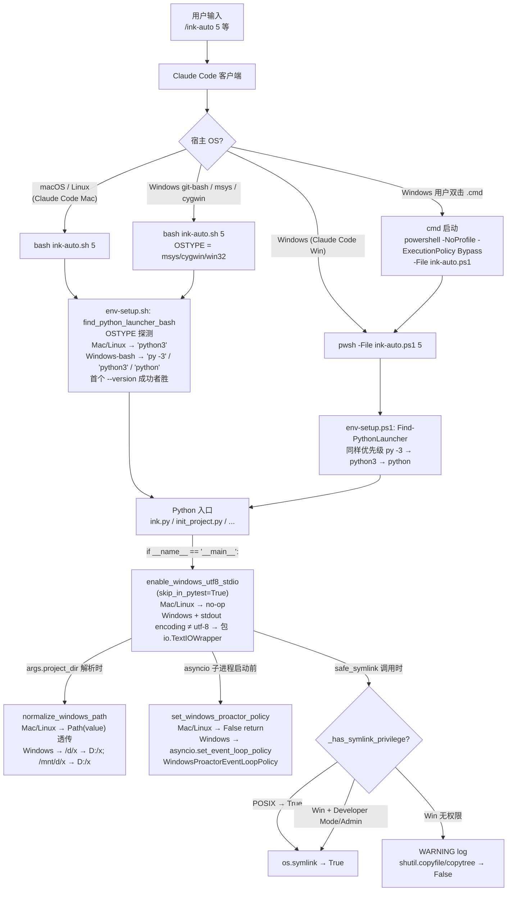

# 跨平台原生支持（Cross-Platform Mode） — 函数级精确分析

> 来源：codemap §6-B.2。本文档基于 commit `268f2e1`（master 分支）的源码逐行核对。
> 这不是独立的"运行模式"，而是**贯穿所有 17 个 skill 的兼容层**。Mac/Linux 行为与原版**字节级一致**；所有 Windows 特化代码走 `if sys.platform == "win32":` 分支。

---

## A. 模式概述

### A.1 触发方式

跨平台支持是**自动激活**的——同一套 `/ink-init` `/ink-plan` `/ink-auto` 等 17 个 slash command，在 macOS / Linux / Windows 三平台行为一致。激活路径：

| 平台 | 入口脚本 | 实现 |
|---|---|---|
| **macOS / Linux** | `*.sh`（5 个 shell 脚本）| Bash 原生；不调任何 Windows shim |
| **Windows（PowerShell）** | `*.ps1`（5 个 PS1 脚本，UTF-8 BOM）| PS 5.1+ 原生 |
| **Windows（cmd 双击）** | `*.cmd`（2 个 cmd 包装）| 转发到 `.ps1` 的 4 行 wrapper |
| **Windows（git-bash / WSL）** | `*.sh` | 与 Mac/Linux 走同分支（OSTYPE 探测） |
| **Python（全平台）** | 在 `if __name__ == "__main__":` 入口调 `runtime_compat.enable_windows_utf8_stdio()` | Mac/Linux no-op；Windows 包裹 stdout/stderr 为 UTF-8 |

### A.2 最终达到的效果（用户视角）

Windows 用户与 Mac/Linux 用户看到**完全相同的 slash command 列表与产出结构**。中文文件名 / 路径 / 子进程 stdout 不会因 cp936 编码出 `UnicodeDecodeError`；POSIX 风格路径（`/d/...`、`/mnt/d/...`）能自动规范化为 `D:\...`；Windows 不带 Developer Mode 时 symlink 自动降级为 `shutil.copy`，不报错。

### A.3 涉及文件清单

#### 共享原语（全平台 Python 模块）

| 路径 | 行 | 角色 | 7 个公开 API |
|---|---:|---|---|
| `ink-writer/scripts/runtime_compat.py` | 272 | 跨平台兼容层（CLAUDE.md 强制约定） | `enable_windows_utf8_stdio` / `normalize_windows_path` / `set_windows_proactor_policy` / `_has_symlink_privilege` / `safe_symlink` / `find_python_launcher` / `_probe_launcher` |

#### 平台对等的 5 个 Shell 入口（Mac/Linux + Windows 三套）

| Mac/Linux | Windows PowerShell | Windows cmd | 行数对比（sh / ps1 / cmd）|
|---|---|---|---|
| `ink-writer/scripts/env-setup.sh` | `env-setup.ps1` | `env-setup.cmd` | 99 / ~340 / 4 |
| `ink-writer/scripts/ink-auto.sh` | `ink-auto.ps1` | `ink-auto.cmd` | 1588 / 877 / 4 |
| `ink-writer/scripts/debug/ink-debug-{toggle,status,report}.sh` × 3 | `*.ps1` × 3 | （无 .cmd）| 11 / ? / — |

注：`.cmd` 仅做"双击 → 启动 PowerShell"4 行包装，无业务逻辑。

#### Python 包内的兼容兜底

| 路径 | 角色 |
|---|---|
| `ink_writer/_compat/__init__.py` | 跨平台兼容原语集（5 行，仅占位） |
| `ink_writer/_compat/locking.py` | 113 行；跨平台文件锁（POSIX `fcntl.flock` ↔ Windows `msvcrt.locking`） |

#### 17 个 SKILL.md 中的 Windows sibling 块

每个 SKILL.md 文件的 bash code block 都成对附带 `<!-- windows-ps1-sibling -->` 注释 + PowerShell code block（参见 `_patch_skills_win.py` 已落地的模式）。

---

## B. 执行流程图

### B.0 主图：单条 slash command 在三平台的分发



---

## C. 函数清单（按调用顺序）

| # | 函数 | 文件:行 | 输入 | 输出 | 副作用 | 调用者 | 被调用者 |
|---:|---|---|---|---|---|---|---|
| X1 | `enable_windows_utf8_stdio` | runtime_compat.py:27 | `skip_in_pytest=False` | bool（True=已包装；False=非 Win 或已 utf-8 或 pytest 中） | **Windows 且 stdout/stderr encoding ≠ utf-8** 时：包 `io.TextIOWrapper(sys.stdout.buffer, encoding="utf-8")`；**修改 sys.stdout / sys.stderr 全局对象** | 每个 Python 入口的 `if __name__ == "__main__":` 块（CLAUDE.md 强制） | io.TextIOWrapper |
| X2 | `normalize_windows_path` | runtime_compat.py:59 | str \| Path | Path | **Mac/Linux → 原样返回 Path(value)**；**Win + `/d/x`** → `Path("D:/x")`；**Win + `/mnt/d/x`** → `Path("D:/x")`；幂等 | argparse `--project-root` 解析处 + workflow_manager.py:994 | regex `_WIN_POSIX_DRIVE_RE`、`_WIN_WSL_MNT_DRIVE_RE` |
| X3 | `set_windows_proactor_policy` | runtime_compat.py:114 | — | bool | **Mac/Linux → False, no-op**；**Windows** → `asyncio.set_event_loop_policy(WindowsProactorEventLoopPolicy())`；**全局状态** `_PROACTOR_POLICY_SET=True`；幂等 | `ink_writer.core.cli.ink:main` (line 426-429) + 任何 asyncio 子进程入口 | asyncio |
| X4 | `_has_symlink_privilege` | runtime_compat.py:138 | — | bool | **Mac/Linux → True**；**Windows** → 一次性 `os.symlink` 探测 + 缓存到 `_SYMLINK_PRIVILEGE_CACHE`；探测时 📂 临时目录 + `target.txt` + `link.txt` | `safe_symlink` | tempfile, os.symlink |
| X5 | `safe_symlink` | runtime_compat.py:163 | src, dst, target_is_directory, overwrite | bool（True=真 symlink；False=copy 降级） | `dst` 已存在且 `overwrite=True` → 删除（rmtree if dir, unlink else）；**有权限** → `os.symlink`；**无权限（Win）** → WARNING + `shutil.copyfile/copytree` | 项目内任何需要 symlink 的代码（如 plugin install） | _has_symlink_privilege, os.symlink, shutil |
| X6 | `_probe_launcher` | runtime_compat.py:225 | cmd list | bool | `subprocess.run(cmd + ["--version"], timeout=5)`；返回 returncode == 0 | `find_python_launcher` | subprocess |
| X7 | `find_python_launcher` | runtime_compat.py:239 | — | str（命令字符串）| **Mac/Linux → "python3"** 直接缓存；**Windows** → 顺序探测 `["py", "-3"]` → `["python3"]` → `["python"]`，首个 `_probe_launcher` 成功的胜出；缓存到 `_PYTHON_LAUNCHER_CACHE` | （Python 内部代码可调用；shell 入口走 .sh 内联同名函数）| _probe_launcher, shutil.which |
| S1 | `find_python_launcher_bash` | env-setup.sh:66 + ink-auto.sh:158 | — | 设置 `PYTHON_LAUNCHER` env | **Mac/Linux → "python3" 定值**；**msys/cygwin/win32** → 同上探测顺序，首个 `command -v` + `--version` 成功者胜 | env-setup.sh + ink-auto.sh top-level | command -v |
| P1 | `Find-PythonLauncher` | env-setup.ps1:65 | — | 字符串 | **Windows 原生** → `Get-Command` 探测 `py / python3 / python`；首个 `--version` 成功者胜 | env-setup.ps1 顶层 | Get-Command |

---

## D. IO 文件全景表

| 文件路径 | 操作 | 触发函数 | 时机 | 格式 |
|---|---|---|---|---|
| `<tempdir>/target.txt` + `<tempdir>/link.txt` | ★新建 + 删除 | `_has_symlink_privilege` (runtime_compat.py:152-156) | 首次调用 safe_symlink 时一次性探测 | text |
| sys.stdout / sys.stderr | **运行时改对象** | `enable_windows_utf8_stdio` (runtime_compat.py:43-49) | Python 入口启动 | io.TextIOWrapper |
| asyncio 全局事件循环策略 | **运行时改全局** | `set_windows_proactor_policy` | asyncio 子进程启动前 | WindowsProactorEventLoopPolicy |

**读取的环境变量**：

| 变量 | 读取位置 | 作用 |
|---|---|---|
| `PYTEST_CURRENT_TEST` | runtime_compat.py:35 | 在 pytest 中跳过 stdio 包裹（避免污染 capsys） |
| `OSTYPE` | env-setup.sh:67 + ink-auto.sh:159 | bash 平台路由（msys/cygwin/win32 → Windows 路径） |
| `PYTHON_LAUNCHER` | env-setup.sh:87 + env-setup.ps1:91 | 显式覆盖默认探测结果 |

**网络请求**：无。

---

## E. 关键分支与边界

### E.1 平台分支（`sys.platform == "win32"`）

| 函数 | 非 Win 行为 | Win 行为 |
|---|---|---|
| `enable_windows_utf8_stdio` | 直接 return False（no-op） | 检查编码 → 若非 utf-8 → 包 TextIOWrapper |
| `normalize_windows_path` | `Path(value)` 透传 | regex 转换 `/d/x` 与 `/mnt/d/x` |
| `set_windows_proactor_policy` | 直接 return False | 设置 ProactorEventLoopPolicy |
| `_has_symlink_privilege` | 直接 return True | 一次性探测 + 缓存 |
| `find_python_launcher` | 直接 return "python3" | 顺序探测 3 个候选 |

### E.2 OSTYPE 分支（bash）

| OSTYPE | find_python_launcher_bash 行为 |
|---|---|
| `msys*` / `cygwin*` / `win32*` | 顺序探测 `py -3` → `python3` → `python`；兜底 `python` |
| 其他（Mac/Linux/BSD）| 直接 `PY_LAUNCHER="python3"` |

### E.3 编码兼容（CLAUDE.md 守则强制）

| 规则 | 触发 | 不遵守的后果 |
|---|---|---|
| **`open()` 必带 `encoding="utf-8"`** | 所有文件读写 | Windows 默认 cp936/GBK，中文路径会炸 `UnicodeDecodeError` |
| **Python 入口必调 `enable_windows_utf8_stdio()`** | 新增带 `if __name__ == "__main__":` 的脚本 | Windows stdout 中文会变 `?` |
| **新增 `.sh` 必同步新增 `.ps1`** | 面向用户的 CLI | Windows 用户无法调用对应功能 |
| **`.ps1` 必带 UTF-8 BOM** | PowerShell 5.1 兼容 | PS 5.1 读不出中文（UTF-8 无 BOM 默认按 ANSI 解析） |
| **`SKILL.md` 引用 `.sh` 必在同文件附 PS sibling 块** | LLM 编排 | Windows 用户的 LLM 看不到 PS 命令 → 走 .sh 失败 |

### E.4 关键风险

| # | 严重度 | 现象 | 证据 |
|---:|---|---|---|
| **C-R1** | 🟢 低 | `enable_windows_utf8_stdio` 改 `sys.stdout` 全局对象，**重入不安全**（被多次调用时旧的 wrapper 不会回收） | runtime_compat.py:46-49 直接赋值 | 实际仅在入口调一次，无并发风险，但写测试时容易污染 |
| **C-R2** | 🟢 低 | `_PROACTOR_POLICY_SET` / `_SYMLINK_PRIVILEGE_CACHE` / `_PYTHON_LAUNCHER_CACHE` **三个模块级缓存**在 fork 子进程后不会重新探测 | runtime_compat.py:20-22 | 无 multiprocessing 用法时无影响；ink-auto 走 subprocess 而非 fork，安全 |
| **C-R3** | 🟢 低 | `find_python_launcher` 在 Windows 探测失败时**兜底 `"python"`**，但 `_probe_launcher` 用了 5s timeout — 用户机器卡时会有 15s 等待 | runtime_compat.py:228-237 | 用户首次启动时可能误以为"无响应" |
| **C-R4** | 🟢 低 | `safe_symlink` 在 Windows 降级为 copy 时**不可逆**——如果之后 src 文件改变，dst 不会自动同步 | runtime_compat.py:218-221 | 设计如此，但 SKILL.md 没有显式提示用户 |
| **C-R5** | 🟢 低 | `ink_writer/_compat/locking.py` (113 行)的跨平台文件锁与 `runtime_compat.py` **职责重叠但无相互引用** | grep 显示 4 个 importer 全在 case_library / rewrite_loop / tests | 维护负担：将来加新功能时容易选错文件锁 API |

### E.5 Mac/Linux ↔ Windows 行为差异速查

| 行为 | Mac/Linux | Windows | 兼容方式 |
|---|---|---|---|
| 默认编码 | UTF-8 | cp936/GBK | `enable_windows_utf8_stdio` + `open(..., encoding="utf-8")` |
| 路径分隔符 | `/` | `\` 或 `/` 都接受 | `pathlib.Path` 自动处理 |
| 路径前缀 | 绝对从 `/` 开始 | `D:\` / `D:/` | `normalize_windows_path` 转换 |
| symlink 默认权限 | 普通用户可创建 | 需 Developer Mode 或 Admin | `safe_symlink` 自动降级 |
| asyncio 默认事件循环 | SelectorEventLoop | SelectorEventLoop（不支持 subprocess）| `set_windows_proactor_policy` 切换 |
| 文件锁 | `fcntl.flock` | `msvcrt.locking` | `_compat/locking.py` 抽象 |
| Python 启动器 | `python3` 几乎总在 PATH | 可能是 `py -3` / `python` | `find_python_launcher` 探测 |
| Shell 入口 | `bash *.sh` | `pwsh -File *.ps1` 或 `cmd → .ps1` | 双脚本对等维护 |

---

## 附录：CLAUDE.md 守则速查（feat/windows-compat 起生效）

```
1. open() 必带 encoding="utf-8"（含 Path.read_text/write_text）
2. Python 入口必调 runtime_compat.enable_windows_utf8_stdio()
3. 面向用户的 CLI 必提供 PowerShell 对等入口（.ps1 BOM 必需 + .cmd 双击包装）
4. SKILL.md 若引用 .sh 必在同文件内附带 Windows PowerShell sibling 块
5. 优先复用 runtime_compat 提供的 5 个共享原语（不要重写）
```
