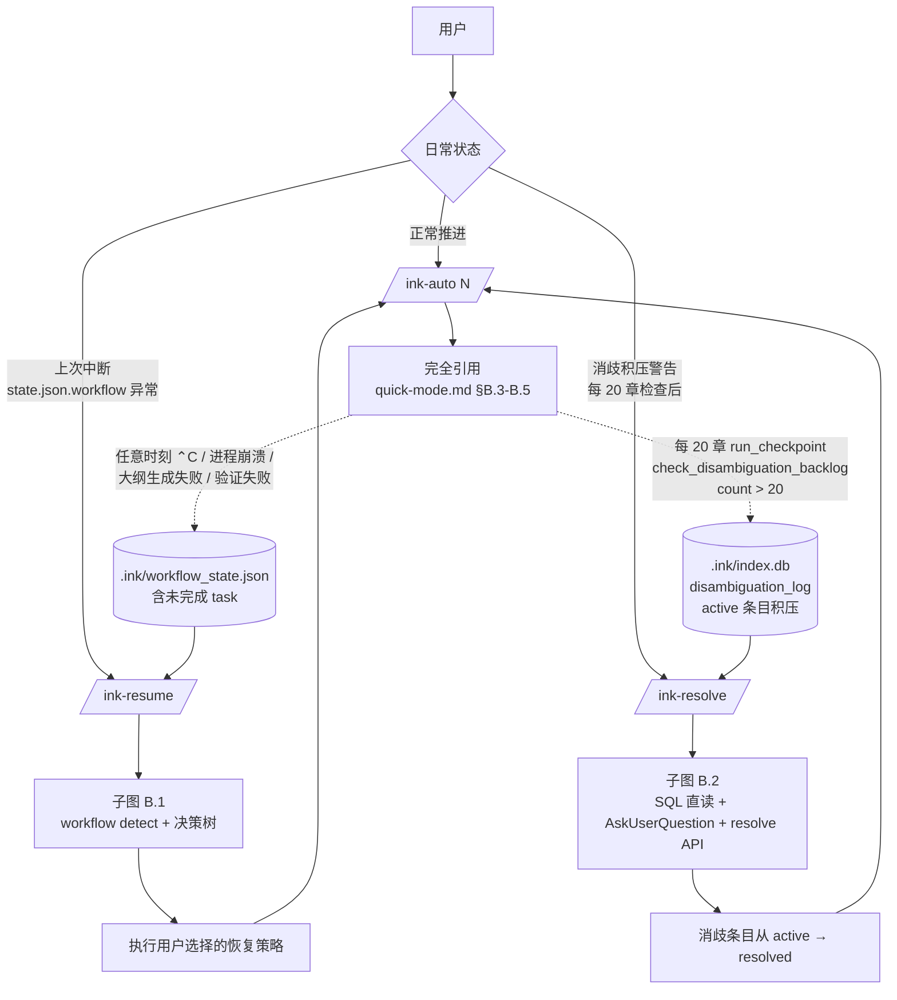
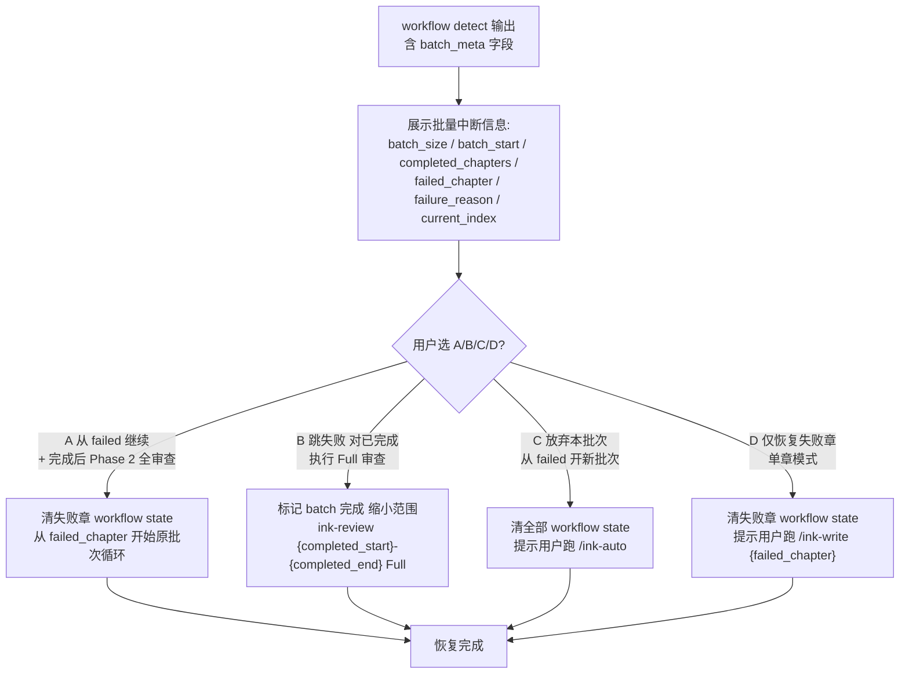
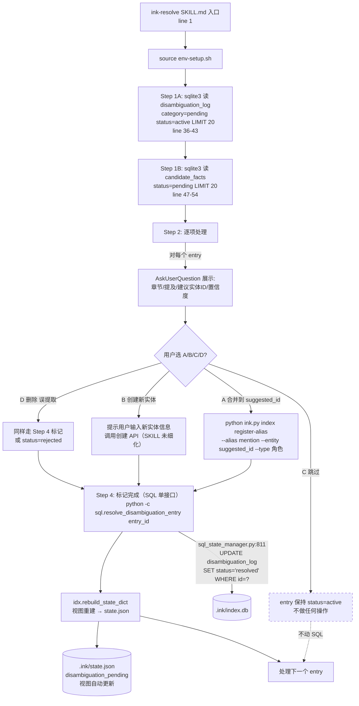

# 日常工作流（Daily Workflow） — 函数级精确分析

> 来源：codemap §6-A.3。本文档基于 commit `268f2e1`（master 分支）的源码逐行核对。
> 触发链：`/ink-auto 5~10` + 中断时 `/ink-resume` + 积压时 `/ink-resolve`。

---

## ⚠️ 阅读前必读：与 quick/deep mode 的关系

日常工作流的 `/ink-auto N` 与 quick/deep mode 中的 `/ink-auto 20` **完全相同**（同一个 `ink-auto.sh` + checkpoint_utils）。本文档**完全引用** [quick-mode.md §B.3-B.5 + §C.3-C.4 + §E.3-E.7](./quick-mode.md#b3-子图ink-auto-20-主循环ink-autosh)，不重复列。

**本文档新写**的是两个"应急工具"：
1. **`/ink-resume`** — 中断恢复（最常用）
2. **`/ink-resolve`** — 消歧条目人工审核

这两个 skill 的设计目标是"让 ink-auto 24×7 跑得更稳"。`/ink-resume` 在 ink-auto 主循环失败 / Ctrl+C 后被用户调用；`/ink-resolve` 在每 20 章 `check_disambiguation_backlog` 输出 ⚠️ 警告后被用户调用。

---

## A. 模式概述

### A.1 触发命令（完整示例）

```bash
# 主循环（用户只需要跑这一条，与 quick/deep mode 等价）
/ink-auto 5      # 默认 5 章
/ink-auto 10     # 10 章
/ink-auto --parallel 4 20  # 4 章并发写 20 章

# 应急 1：中断恢复（任意时刻 Ctrl+C / 进程崩溃 / 字数验证失败 → 用户手动调用）
/ink-resume

# 应急 2：消歧积压处理（每 20 章自动检查；count > 20 警告 / > 100 强烈警告）
/ink-resolve
```

### A.2 最终达到的效果（用户视角）

`/ink-auto N` 让用户晚上挂 30 章睡觉，早上起来看 `auto-<ts>.md` 报告即知全部执行情况。中途任何故障都能：
- **章节级失败 → ink-auto 内置 1-3 轮 retry（自动）**
- **整批中断（Ctrl+C / 系统崩溃 / 大纲生成失败）→ 用户手动 `/ink-resume`，逐 step 决策树判断**
- **消歧积压（低置信度实体识别）→ 用户在某次完成后 `/ink-resolve` 处理**

### A.3 涉及文件清单（增量）

#### `/ink-auto N` 全部文件 → 引用 [quick-mode.md §A.3](./quick-mode.md#a3-涉及文件清单)

#### `/ink-resume` 独有

| 路径 | 行 | 角色 |
|---|---:|---|
| `ink-writer/skills/ink-resume/SKILL.md` | 308 | LLM 编排（决策树 + 7 个 step 恢复策略 + 批量恢复） |
| `ink-writer/skills/ink-resume/references/workflow-resume.md` | — | L1 必读：恢复协议 |
| `ink-writer/skills/ink-resume/references/system-data-flow.md` | — | L2 按需：状态字段/恢复策略核对 |
| `ink-writer/scripts/workflow_manager.py` | 1027 | 真正的 `workflow detect / cleanup / clear / fail-task / start-task / start-step / complete-step / complete-task` 8 子命令实现 |

#### `/ink-resolve` 独有

| 路径 | 行 | 角色 |
|---|---:|---|
| `ink-writer/skills/ink-resolve/SKILL.md` | 119 | LLM 编排（SQL 直读 + AskUserQuestion 4 选项） |
| `ink_writer/core/state/sql_state_manager.py` | （含 disambiguation_log 表 CRUD） | `resolve_disambiguation_entry(entry_id)`、`get_disambiguation_entries(category, status)` |
| `ink_writer/core/index/index_manager.py` | 2336 | `register-alias` 子命令（合并实体）；`disambiguation_log` 表建表 SQL |

#### 共享底层

| 路径 | 角色 |
|---|---|
| `ink_writer/core/cli/ink.py` | `workflow` 子命令转发到 `workflow_manager.py` |
| `<project>/.ink/workflow_state.json` | 当前任务的 step-by-step 状态机 |
| `<project>/.ink/index.db` (SQLite) | 含 `disambiguation_log`、`candidate_facts`、`entities` 等表 |
| `<project>/.ink/recovery_backups/` | cleanup 前章节文件备份目录（自动建） |
| `<project>/.ink/call_trace.jsonl` | 每个 workflow 操作的审计日志（append） |

---

## B. 执行流程图

### B.0 主图（日常工作流的三入口分布）



### B.1 子图：/ink-resume

```mermaid
flowchart TD
    Start[ink-resume SKILL.md 入口<br>line 1] --> Env["source env-setup.sh<br>导出 PROJECT_ROOT 等"]
    Env --> S1["Step 1: cat workflow-resume.md<br>L1 必读 line 56-66"]
    S1 --> S2["Step 2: cat system-data-flow.md<br>L2 line 67-71"]
    S2 --> S3[Step 3: 4 项检查清单 line 73-81]
    S3 --> S4["Step 4: python ink.py workflow detect"]
    S4 -->|"workflow_manager.py:detect_interruption"| LoadState[load_state<br>读 .ink/workflow_state.json]

    LoadState --> Has{current_task<br>非 null<br>且 status ≠ COMPLETED?}
    Has -->|否| NoIntr["✅ 无中断任务<br>print 提示 → 退出"]
    Has -->|是| BuildInfo["构造 interrupt_info dict:<br>command / args / current_step / completed_steps /<br>elapsed_seconds / artifacts / retry_count"]
    BuildInfo -->|"safe_append_call_trace<br>'interruption_detected'"| Trace[(.ink/call_trace.jsonl)]
    BuildInfo --> Tree[analyze_recovery_options<br>:609 按 step_id 分发决策树]

    Tree --> Step{current_step<br>step_id?}
    Step -->|None / Step 1 / 1.5| L["A) 从头开始<br>风险 low"]
    Step -->|Step 2 / 2A / 2B<br>含 batch_meta?| ABM["子树 B.1.1<br>批量决策"]
    Step -->|Step 3| LMid["A) 重新审查 <span style='color:orange'>medium</span><br>B) 跳过审查 low"]
    Step -->|Step 4| LMid2["A) 继续润色 low<br>B) 删润色稿 medium"]
    Step -->|Step 5| LSole["A) 重跑 Data Agent low<br>幂等"]
    Step -->|Step 6| LMid3["A) 继续 Git 提交 low<br>B) 回滚 Git 改动 medium"]
    Step -->|"其他"| L

    L --> S5
    ABM --> S5
    LMid --> S5
    LMid2 --> S5
    LSole --> S5
    LMid3 --> S5

    S5["Step 5: AskUserQuestion 选项展示<br>含 任务命令/中断时间/已完成 step/恢复选项"] --> S5C{用户选?}
    S5C -->|A 删除重来| OptA["python ink.py workflow cleanup --chapter N --confirm<br>+ workflow clear"]
    S5C -->|B Git 回滚| OptB["git -C reset --hard ch{N-1:04d}<br>+ workflow clear"]

    OptA -->|"cleanup_artifacts<br>:784"| Backup["备份章节文件 →<br>.ink/recovery_backups/<br>chNNNN-原名.YYYYMMDD_HHMMSS.bak"]
    Backup --> Delete[删 章节正文 .md]
    Delete --> Reset["git reset HEAD .<br>清暂存区"]
    Reset --> Clear[clear_current_task<br>state.current_task = null]

    OptB -->|"git reset --hard"| GitReset[回滚到 ch{N-1} tag]
    GitReset --> Clear

    Clear -->|"safe_append_call_trace<br>'task_cleared'"| Trace
    Clear --> S7[Step 7 可选: /原命令 原参数<br>用户决定是否立即继续]

    S5C -.->|批量分支 含 batch_meta| Batch[子图 B.1.1<br>批量恢复 4 选项]

    style NoIntr stroke-dasharray: 5 5
    style ABM stroke:#0a0,stroke-width:2px
```

### B.1.1 子图：批量恢复（v7.0.5 新增）



### B.2 子图：/ink-resolve



### B.3 ink-auto 部分

**完全引用** [quick-mode.md §B.3 / §B.4 / §B.5](./quick-mode.md#b3-子图ink-auto-20-主循环ink-autosh)。

---

## C. 函数清单

### C.1 /ink-resume 阶段

| # | 函数 / 节点 | 文件:行 | 输入 | 输出 | 副作用 | 调用者 | 被调用者 |
|---:|---|---|---|---|---|---|---|
| RM1 | ✦ LLM 入口 | ink-resume/SKILL.md:1 | 用户 prompt | 编排 7 步 | — | Claude Code 框架 | LLM |
| RM2 | ✦ source env-setup.sh | SKILL.md:17 | INK_SKILL_NAME=ink-resume | env vars | 与其他 skill 同 | LLM via Bash | env-setup.sh |
| RM3 | ✦ cat workflow-resume.md / system-data-flow.md | SKILL.md:59-71 | path | 内容 | 📖 L1/L2 reference | LLM | Read tool |
| RM4 | ✦ python ink.py workflow detect | SKILL.md:153 | — | stdout interrupt_info JSON + recovery options JSON | 📖 `.ink/workflow_state.json`；📂 append `.ink/call_trace.jsonl` | LLM via Bash | workflow_manager.detect_interruption |
| RM5 | `detect_interruption` | workflow_manager.py:570 | — | dict\|None | 📖 load_state；调 safe_append_call_trace | CLI / `_run_script` | load_state, safe_append_call_trace |
| RM6 | `load_state` | workflow_manager.py:895 | — | dict | 📖 `.ink/workflow_state.json`；缺失返回 `{current_task: None, ...}` | detect_interruption / clear_current_task / fail_current_task | json.load |
| RM7 | `analyze_recovery_options` | workflow_manager.py:609 | interrupt_info dict | list[option dict] | **按 step_id 分发 6 种决策树**：`Step 1/1.5` (1 选项 A) / `Step 2/2A/2B` (1-2 选项，含文件存在性判断) / `Step 3` (2 选项) / `Step 4` (2 选项) / `Step 5` (1 选项幂等) / `Step 6` (2 选项含 git 分支) / 其他 (兜底 A) | detect CLI | find_project_root, find_chapter_file, default_chapter_draft_path |
| RM8 | ✦ AskUserQuestion 选项 | SKILL.md:160-189 | 选项列表 | 用户选 A/B/C/D | — | LLM | AskUserQuestion |
| RM9 | ✦ python ink.py workflow cleanup --chapter N --confirm | SKILL.md:196 | --chapter, --confirm | stdout cleanup 列表 | 见 RM10 | LLM via Bash | workflow_manager.cleanup_artifacts |
| RM10 | `cleanup_artifacts` | workflow_manager.py:784 | chapter_num, confirm | list[cleanup item] | **不带 --confirm 时只预览**；带 `--confirm` 时：①📂 备份 `.ink/recovery_backups/chNNNN-原名.YYYYMMDD_HHMMSS.bak`；②📂 删 `正文/第NNNN章*.md`；③ `git reset HEAD .`；④ append call_trace | cleanup CLI | _backup_chapter_for_cleanup, find_chapter_file, subprocess git reset |
| RM11 | `_backup_chapter_for_cleanup` | workflow_manager.py:772 | project_root, chapter_num, chapter_path | backup_path | 📂 mkdir `.ink/recovery_backups/`；shutil.copy 章节文件 | cleanup_artifacts | create_secure_directory |
| RM12 | ✦ python ink.py workflow clear | SKILL.md:197 | — | stdout 提示 | 见 RM13 | LLM via Bash | workflow_manager.clear_current_task |
| RM13 | `clear_current_task` | workflow_manager.py:854 | — | None | 📂 `state["current_task"] = None`；save_state（atomic_write_json）；append call_trace | clear CLI | load_state, save_state |
| RM14 | ✦ git -C "$PROJECT_ROOT" reset --hard ch{N-1:04d} | SKILL.md:202 | — | git 操作 | 📂 git 工作树回滚到上一章 tag | LLM via Bash | git |
| RM15 | `safe_append_call_trace` | workflow_manager.py:216 | event, payload | None | 📂 append `.ink/call_trace.jsonl`；异常吞掉 | 全文 6+ 处 | append_call_trace |
| RM16 | `append_call_trace` | workflow_manager.py:202 | event, payload | None | 📂 append jsonl 一行 | safe_append_call_trace | json.dumps |
| RM17 | `save_state` | workflow_manager.py:912 | state dict | None | 📂 atomic_write_json `.ink/workflow_state.json`（含文件锁） | clear / cleanup / start_task / start_step / complete_step / complete_task / fail_current_task | atomic_write_json |
| RM18 | `find_project_root` | workflow_manager.py:51 | override Path | Path | 📖 向上找 `.ink/state.json`；缺失抛 SystemExit | analyze_recovery_options / cleanup_artifacts | — |
| RM19 | `find_chapter_file` | workflow_manager（imports from chapter_paths_lib）| project_root, chapter_num | Path\|None | 📖 ls `正文/第NNNN章*.md` | analyze_recovery_options / cleanup_artifacts | — |
| RM20 | `default_chapter_draft_path` | 同上 | project_root, chapter_num | Path | — | analyze_recovery_options / cleanup_artifacts | — |

### C.2 /ink-resolve 阶段

| # | 函数 / 节点 | 文件:行 | 输入 | 输出 | 副作用 | 调用者 | 被调用者 |
|---:|---|---|---|---|---|---|---|
| RV1 | ✦ LLM 入口 | ink-resolve/SKILL.md:1 | 用户 prompt | 编排 4 步 | — | Claude Code 框架 | LLM |
| RV2 | ✦ source env-setup.sh | SKILL.md:20 | — | env | 同 | LLM via Bash | env-setup.sh |
| RV3 | ✦ sqlite3 SELECT disambiguation_log | SKILL.md:36-43 | category=pending status=active LIMIT 20 | rows | 📖 `.ink/index.db` 直读 | LLM via Bash | sqlite3 CLI |
| RV4 | ✦ sqlite3 SELECT candidate_facts | SKILL.md:47-54 | status=pending LIMIT 20 | rows | 同上 | LLM via Bash | sqlite3 CLI |
| RV5 | ✦ AskUserQuestion 展示消歧项 | SKILL.md:60-73 | mention/suggested_id/confidence | A/B/C/D 选 | — | LLM | AskUserQuestion |
| RV6 | ✦ ink.py index register-alias | SKILL.md:77 | --alias --entity --type | exit | 📂 INSERT `entity_aliases` 表 | LLM via Bash（选 A 时） | index_manager:_handle_register_alias :2286 |
| RV7 | ✦ python -c resolve_disambiguation_entry loop | SKILL.md:88-105 | entry_ids list | None | 见 RV8 | LLM via Bash python | sql_state_manager 等 |
| RV8 | `SQLStateManager.resolve_disambiguation_entry` | sql_state_manager.py:811 | entry_id int | bool | 📂 `UPDATE disambiguation_log SET status='resolved', resolved_at=datetime('now') WHERE id=?` | RV7 调用 | sqlite3 conn |
| RV9 | `IndexManager.rebuild_state_dict` | index_manager.py（行号未深入） | — | None | 📂 重生成 `.ink/state.json` 中 disambiguation_warnings / disambiguation_pending 字段（视图） | RV7 调用 | get_disambiguation_entries |
| RV10 | `SQLStateManager.get_disambiguation_entries` | sql_state_manager.py:796 | category, status="active" | list[Any] | 📖 `SELECT payload FROM disambiguation_log WHERE category=? AND status=? ORDER BY created_at` | rebuild_state_dict + RV3 间接 | sqlite3 conn |
| RV11 | `IndexManager._handle_register_alias` | index_manager.py:2286 | --alias, --entity, --type | exit | 📂 注册 alias → entity 映射 | ink.py index 子命令 | sqlite3 INSERT |

### C.3 ink-auto 阶段

**完全引用** [quick-mode.md §C.3 (41 个函数) + §C.4 (4 个 v27 bootstrap 函数)](./quick-mode.md#c-函数清单按-slash-command-分段)。

### C.4 workflow_manager.py 完整子命令清单（与 ink-auto 间接挂钩）

ink-auto.sh:1476-1477 是日常工作流中**唯一**主动调用 workflow 子命令的位置，仅调 `workflow clear`（每章前清残留）。其他 workflow 子命令的调用方：

| workflow 子命令 | 调用方 | 时机 |
|---|---|---|
| `start-task` | ink-write SKILL.md:769 | 每章 Step 0 入口 |
| `start-step` | ink-write SKILL.md:770 等 7 处 | 每个 step 启动前 |
| `complete-step` | ink-write SKILL.md:771 + Step 5 mini-audit 等 | 每个 step 完成时 |
| `complete-task` | ink-write SKILL.md:772 | 每章 Step 6 完成时 |
| `detect` | ink-write SKILL.md:783 + ink-resume Step 4 | 每章 Step 0.6 复检 + ink-resume 主流程 |
| `cleanup --chapter N --confirm` | **仅** ink-resume Step 6 选项 A | 用户选删除重来 |
| `clear` | ink-auto.sh:1477 + ink-resume Step 6 收尾 | 每章前 + 恢复后 |
| `fail-task` | ink-write SKILL.md:791 | 状态冲突时显式标失败 |

---

## D. IO 文件全景表

### D.1 /ink-resume 与 /ink-resolve 独有 IO

| 文件路径 | 操作 | 触发函数 | 时机 | 格式 |
|---|---|---|---|---|
| `<project>/.ink/workflow_state.json` | 读 | `load_state` (workflow_manager.py:895) | 每个 workflow 子命令开头 | JSON, atomic write |
| `<project>/.ink/workflow_state.json` | 写 | `save_state` (workflow_manager.py:912) | clear / cleanup / start_*/complete_*/fail_* 等 | JSON, atomic_write_json + filelock |
| `<project>/.ink/call_trace.jsonl` | append | `append_call_trace` (workflow_manager.py:202) | 8 个 workflow 命令各自的关键节点（detect / cleanup / cleared / failed 等） | JSONL |
| `<project>/.ink/recovery_backups/chNNNN-<原名>.YYYYMMDD_HHMMSS.bak` | ★新建 | `_backup_chapter_for_cleanup` (workflow_manager.py:772) | cleanup --confirm 删除前 | binary copy |
| `<project>/正文/第NNNN章*.md` | 删除 | `cleanup_artifacts` (workflow_manager.py:830) | cleanup --confirm 路径 | — |
| `<project>/.ink/index.db` | 读（SELECT） | RV3 / RV4 (sqlite3 CLI) | ink-resolve Step 1 | SQL |
| `<project>/.ink/index.db` | 写（UPDATE） | `resolve_disambiguation_entry` (sql_state_manager.py:811) | ink-resolve Step 4 | SQL |
| `<project>/.ink/index.db` | 写（INSERT） | `_handle_register_alias` (index_manager.py:2286) | ink-resolve 选项 A 合并 | SQL |
| `<project>/.ink/state.json` | 写（视图重建） | `rebuild_state_dict` | ink-resolve Step 4 末尾 | JSON |
| Git 工作树 | reset HEAD . | `cleanup_artifacts:834` | cleanup --confirm | git |
| Git 工作树 | reset --hard ch{N-1:04d} | LLM via Bash | ink-resume Step 6 选项 B | git |

### D.2 ink-auto 部分

**完全引用** [quick-mode.md §D.1 / §D.2 / §D.3 / §D.4](./quick-mode.md#d-io-文件全景表)。

### D.3 网络

无（resume 与 resolve 都是本地操作；不调 LLM；不调外部 API）。

### D.4 环境变量

无新增。仅 `INK_PROJECT_ROOT` / `CLAUDE_PROJECT_DIR` 影响 PROJECT_ROOT 解析（与其他 skill 共用）。

---

## E. 关键分支与边界

### E.1 /ink-resume 决策树（按 current_step.id 分发）

| step_id | 选项数 | 选项内容 | 风险 |
|---|---:|---|---|
| `None`（task 已存在但无活跃 step） | 1 | A 从头开始 | low |
| `Step 1` / `Step 1.5` | 1 | A 从 Step 1 重新开始 | low |
| `Step 2` / `Step 2A` / `Step 2B`（章节文件不存在） | 1 | A 删除半成品 + Step 1 重启 | low |
| `Step 2` / `Step 2A` / `Step 2B`（章节文件存在） | 2 | A 删除重启 / B 回滚到上一章 | low / medium |
| `Step 3` | 2 | A 重新审查 / B 跳过审查直接润色 | medium / low |
| `Step 4` | 2 | A 继续润色 / B 删润色稿从 Step 2A 重写 | low / medium |
| `Step 5` | 1 | A 重跑 Data Agent（幂等） | low |
| `Step 6` | 2 | A 继续 Git 提交 / B 回滚 Git 改动 | low / medium |
| 其他（兜底） | 1 | A 从头开始 | low |
| 含 `batch_meta`（v7.0.5 批量分支） | 4 | A 从 failed 继续 / B 跳失败 + Full 审 / C 放弃批次 / D 单章模式 | mixed |

### E.2 /ink-resume Step 2A 自动决策树（line 87-105，与 ink-write Step 0.6 对齐）

```
IF 章节文件不存在 OR < 200 字 → 从 Step 1 重新开始（视为未实质性开始）
ELIF 200-1500 字 → 删除已有内容，从 Step 1 重新开始（重建上下文后重写）
ELIF > 1500 字 AND 距上次写入 < 2 小时 → 重建上下文后追写（**必须先执行 Step 1**）
ELIF > 1500 字 AND >= 2 小时 → 用 AskUserQuestion 询问 A) 重建上下文后追写 / B) 删除重写
ELSE → 从 Step 1 重新开始
```

**铁律（line 107）**：无论选续写还是重写，**必须先执行 Step 1（上下文构建）** — 新会话中 Claude 无任何前序上下文，直接续写会导致风格突变 / 设定遗忘 / 角色 OOC。

### E.3 /ink-resume cleanup 安全边界

| 边界 | 触发 | 后果 |
|---|---|---|
| 不带 `--confirm` | 用户/LLM 默认调 | 仅打印 `[预览]` 列表，**不实际删除**；append `'artifacts_cleanup_preview'` 到 call_trace |
| 带 `--confirm` 但章节备份失败 | OSError | 打印 `❌ 章节备份失败，已取消删除`；append `'artifacts_cleanup_backup_failed'`；**不删原文件**（防数据丢失）|
| 带 `--confirm` 备份成功 | 正常路径 | 1. 备份到 `.ink/recovery_backups/`；2. unlink 原文件；3. `git reset HEAD .`；4. append `'artifacts_cleaned'` |
| `git reset` 失败 | git 异常 | 打印 `⚠️ Git 暂存区清理失败: <error>`；**不回滚**已删除的章节文件（备份仍在 `.ink/recovery_backups/`） |

### E.4 /ink-resolve SQL 单源边界（v13 US-011）

| 规则 | 来源 | 后果 |
|---|---|---|
| 所有读写必须走 `SQLStateManager` API | SKILL.md:11-15 + line 108 | 直读 `state.json.disambiguation_pending` 会被 `rebuild_state_dict()` 覆盖（多进程并发风险） |
| `state.json.disambiguation_pending` 仅为视图 | sql_state_manager.py:905 | 用户在 state.json 看到的内容不可信任为最新；必须以 `disambiguation_log` 表为准 |
| `disambiguation_log.status` 状态机 | index_manager.py:937 + sql_state_manager.py:811 | active → resolved（resolve_disambiguation_entry）/ active → rejected（手动 SQL） |
| `category` 区分 | sql_state_manager.py:791 | `pending` / `warning` 等多种 category 共表 |

### E.5 /ink-resolve 选项 C "跳过" 的累积效应

**问题**：选 C 时 entry 保持 `status='active'`，**不写任何状态变更**。如果用户长期反复跑 `/ink-resolve` 但都选 C，`disambiguation_log.active` 会无限累积，触发 `check_disambiguation_backlog` 反复警告但永远清不掉。**SKILL.md 没有提供"批量标记 C 为 已知拒绝"的路径**。

### E.6 ink-auto 部分分支

**完全引用** [quick-mode.md §E.3 / §E.4 / §E.5 / §E.6](./quick-mode.md#e-关键分支与边界)。

### E.7 日常工作流独有 / 加重的 Bug 与风险

| # | 严重度 | 现象 | 证据 | Daily Workflow 独有 / 加重 |
|---:|---|---|---|---|
| **W-R1** | 🟡 中 | `cleanup_artifacts` 路径上 git reset 失败但章节文件已删除时**没有自动恢复机制** | workflow_manager.py:834-839 | **本流程独有** — 用户需手动从 `.ink/recovery_backups/` 拷回；备份目录路径不在 stderr 提示中显式打印 |
| **W-R2** | 🟡 中 | `analyze_recovery_options` 对 `Step 5` 只给"幂等重跑"一个选项，**忽略了 mini-audit 中断** | workflow_manager.py:732-741 vs ink-write SKILL.md:2000 | **本流程独有** — Step 5 子内部还有 mini-audit + 多个 complete-step 调用，单纯"重跑 Data Agent"不一定能恢复 mini-audit 部分状态 |
| **W-R3** | 🟡 中 | ink-resume SKILL.md 描述"批量恢复 4 选项"但 `analyze_recovery_options` **没有读取 `batch_meta`** | workflow_manager.py:609-769 全部 step 分支均不引用 `interrupt_info["batch_meta"]` | **本流程独有** — 批量恢复决策树仅在 SKILL.md 描述，实际 Python 代码未实现；用户选择批量恢复时 LLM 会按 SKILL 描述操作但缺乏 Python 校验 |
| **W-R4** | 🟢 低 | `clear_current_task` 不写 `last_stable_state` 快照，恢复后无法回到中断前状态 | workflow_manager.py:854-869 | **本流程独有** — 与 `extract_stable_state:929` 的设计意图不一致 |
| **W-R5** | 🟢 低 | ink-resolve 选项 C 累积效应（见 §E.5） | SKILL.md:79 | **本流程独有** — 缺批量"已知拒绝"路径 |
| **W-R6** | 🟢 低 | `register-alias` 在 ink-resolve 选项 A 之后**没有自动调** `resolve_disambiguation_entry` 收尾 | SKILL.md:77 描述了顺序但未在同一 Bash 命令链 | **本流程独有** — LLM 必须连续两步操作，漏跑第二步会导致 alias 已注册但 disambiguation_log 仍 active |
| R1-R10 | 同 quick | （ink-auto 全部风险） | 见 quick-mode.md §E.7 | **完全继承** |

---

## 附录：日常工作流时序速查

```
正常路径（无中断）：
  T=0     用户 /ink-auto 5 → 与 quick-mode 等价 → ~1.5h（5 章 + 检查点）
  T+1.5h  完成 → auto-<ts>.md 报告

中断路径（Ctrl+C）：
  T=0      /ink-auto 30 启动
  T+5h     第 12 章 Step 4 中用户 ⌃C
           → on_signal trap (ink-auto.sh:565)
           → write_report exit 130
  T+5h+1m  用户决定恢复 → /ink-resume
           → 加载 L1/L2 references
           → workflow detect → 输出 interrupt_info + recovery_options
           → AskUserQuestion: A 继续润色 / B 删润色稿
           → 用户选 A
           → 执行 git/state cleanup（不需要，因 Step 4 不删）
           → 用户跑 /ink-write 12 继续，或 /ink-auto 19 接续

消歧积压路径：
  T=0      第 20 章完成 → run_checkpoint
  T+xx     check_disambiguation_backlog → 检测到 count=35 → 输出 ⚠️ 警告
  T+xx     用户某次空闲时 → /ink-resolve
           → sqlite3 SELECT 20 条 active entry
           → 逐条 AskUserQuestion → 用户选 A/B/C/D
           → resolve_disambiguation_entry × N
           → rebuild_state_dict → state.json 视图更新
           → 5 分钟处理 20 条
```
