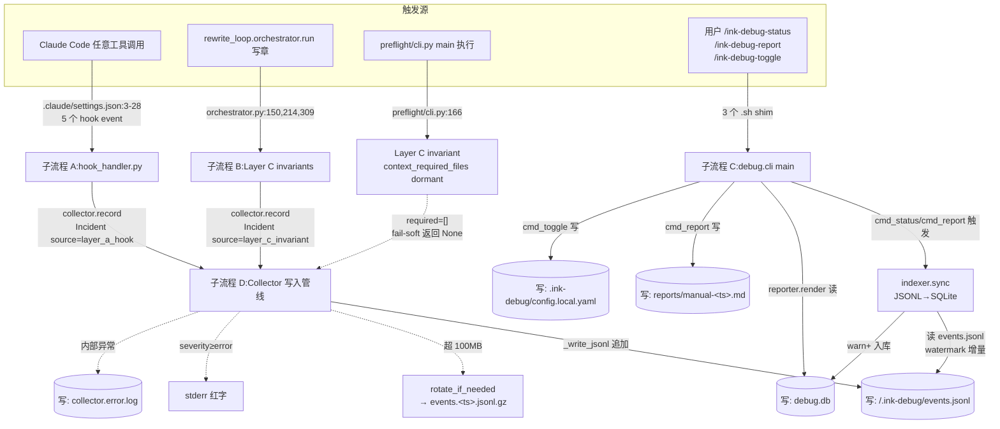
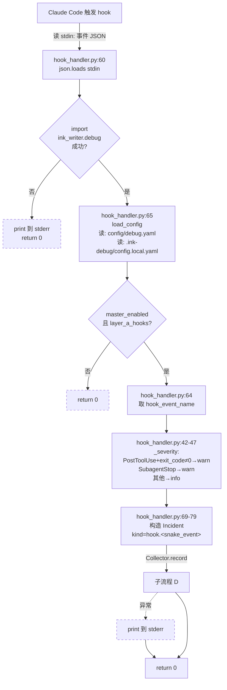
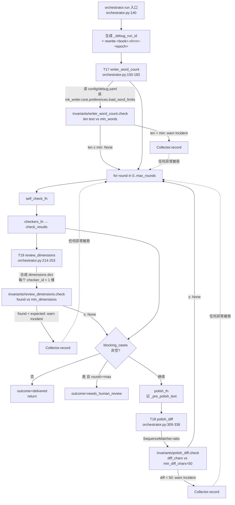
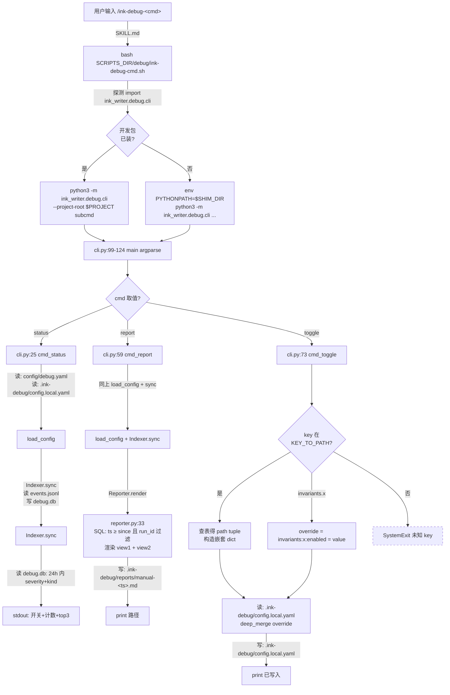
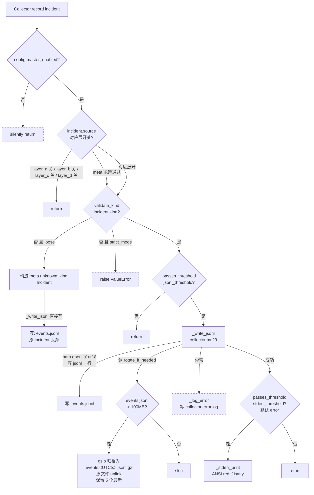

# Debug Mode (v0.5) — 函数级精确分析

> 来源：codemap §6-B.1 隐式模式。本文档基于 commit `268f2e1` (master 分支) 的源码逐函数核对。
> 跨平台说明：本文以 macOS/Linux 路径与 `.sh` 入口为主；Windows 走 `.ps1` 等价物（见 §A.3 文件清单）。

---

## A. 模式概述

### A.1 触发命令（完整示例）

Debug Mode 不是单条命令，而是一个**默认开、零侵入**的旁路观测层。共有 4 类触发入口：

| 触发类型 | 完整命令 / 触发条件 | 说明 |
|---|---|---|
| **隐式触发 1：Hook（Layer A）** | 任意 Claude Code 工具调用 | `.claude/settings.json:1-29` 注册了 `PreToolUse / PostToolUse / SubagentStop / Stop / SessionEnd` 5 个事件 → `python3 scripts/debug/hook_handler.py` |
| **隐式触发 2：写章 Invariant（Layer C）** | 任何走 `rewrite_loop.orchestrator.run()` 的章节生成 | 内嵌 3 个 invariant 检查（writer 字数 / polish diff / review 维度） |
| **隐式触发 3：preflight Invariant（Layer C）** | `python3 ink-writer/scripts/ink.py preflight` | `preflight/cli.py:166-190` 嵌入 `context_required_files` 检查（**目前 dormant**） |
| **显式触发 4：3 个 slash command** | `/ink-debug-status`、`/ink-debug-report [--since 1d --run-id ... --severity warn]`、`/ink-debug-toggle <key> on\|off` | 用户主动查看/导出/切换开关 |
| **总开关** | `INK_DEBUG_OFF=1` 环境变量 → `master_enabled=false` | `config.py:130-131`；`/ink-debug-toggle master off` 等价 |

### A.2 最终达到的效果（用户视角）

把"AI 偷懒、契约脱节、工作流偏航"等事件**自动落到 `<project>/.ink-debug/events.jsonl`（全量，info+）+ `debug.db` SQLite 索引（warn+）**，error 级别同步红字 stderr，错误**永不打断主流程**（fail-soft 原则贯穿）。用户可随时 `/ink-debug-status`（24h 摘要）、`/ink-debug-report`（双视图 markdown）、`/ink-debug-toggle`（切层）。

### A.3 涉及文件清单（38 个；对应 codemap §2-A）

#### Python 实现（14 个 .py，全部 byte-identical 出现在 `_pyshim/` 中除 invariants/）

| 路径 | 行 | 职责 |
|---|---:|---|
| `ink_writer/debug/__init__.py` | 5 | 包标记 + spec 链接 |
| `ink_writer/debug/collector.py` | 119 | **核心**：单写入口；Incident → JSONL；fail-soft |
| `ink_writer/debug/config.py` | 133 | yaml + 项目 override + 环境变量 三层加载 |
| `ink_writer/debug/schema.py` | 105 | `Incident` dataclass + `KIND_WHITELIST` + `validate_kind()` |
| `ink_writer/debug/indexer.py` | 125 | JSONL → SQLite 增量（watermark）同步，warn+ 入库 |
| `ink_writer/debug/reporter.py` | 90 | SQLite → 双视图 markdown 渲染 |
| `ink_writer/debug/rotate.py` | 36 | events.jsonl 超 100MB 自动 gzip 归档，保留 5 个 |
| `ink_writer/debug/cli.py` | 129 | `python3 -m ink_writer.debug.cli` 入口（status/report/toggle 3 子命令） |
| `ink_writer/debug/alerter.py` | 81 | per-chapter 摘要 + per-batch 报告（**未在生产接线**，见 §E.5） |
| `ink_writer/debug/checker_router.py` | 61 | Layer B：checker 报告 → Incident 适配（**未在生产接线**） |
| `ink_writer/debug/invariants/__init__.py` | 0 | 空包标记 |
| `ink_writer/debug/invariants/writer_word_count.py` | 32 | C1：writer 字数 < 平台下限 |
| `ink_writer/debug/invariants/polish_diff.py` | 40 | C2：polish 前后 diff 字符数过小 |
| `ink_writer/debug/invariants/review_dimensions.py` | 33 | C3：review 报告维度数 < 阈值 |
| `ink_writer/debug/invariants/context_required_files.py` | 33 | C4：context-agent 漏读必读文件（**目前 dormant**） |
| `ink_writer/debug/invariants/auto_step_skipped.py` | 31 | C5：ink-auto 漏跑工作流步骤（**未在生产接线**） |

#### 配置（1 个 + 1 个项目 override）

| 路径 | 说明 |
|---|---|
| `config/debug.yaml` | 全局默认（`master_enabled: true`、5 invariants 默认全开） |
| `<project>/.ink-debug/config.local.yaml` | 项目级 override；`/ink-debug-toggle` 写入此文件 |
| `.claude/settings.json` | Claude Code hook 注册（仅与 Layer A 相关） |

#### Shell / SKILL 入口（9 个）

| 路径 | 职责 |
|---|---|
| `scripts/debug/hook_handler.py` | Claude Code hook → Collector 适配器，89 行 |
| `scripts/debug/ink-debug-{toggle,status,report}.sh` | bash 入口（顶层 + 插件目录各一份） |
| `ink-writer/scripts/debug/ink-debug-{toggle,status,report}.sh` | **同名 sibling**（插件 bundle，与顶层等价） |
| `scripts/debug/ink-debug-{toggle,status,report}.ps1` | PowerShell 等价物（Windows） |
| `ink-writer/scripts/env-setup.sh` | 共享环境初始化（`source` 引入，导出 `SCRIPTS_DIR` 等） |
| `ink-writer/skills/ink-debug-{toggle,status,report}/SKILL.md` | 3 个 slash command 入口（`allowed-tools: Bash`） |

#### 间接接线点（生产代码中调用 debug 的非 debug 文件）

| 路径:行 | 调用了什么 |
|---|---|
| `ink_writer/rewrite_loop/orchestrator.py:150-183` | T17 writer_word_count |
| `ink_writer/rewrite_loop/orchestrator.py:214-253` | T19 review_dimensions |
| `ink_writer/rewrite_loop/orchestrator.py:309-338` | T18 polish_diff |
| `ink_writer/preflight/cli.py:161-190` | context_required_files（dormant） |

#### 同名字节级一致的 shim（codemap §7 待确认项 #2 的答案）

| `_pyshim/ink_writer/debug/` 下 9 个 .py | **与源码全部 byte-identical**，无漂移 |
| `_pyshim/ink_writer/debug/invariants/` | **目录不存在** — 5 个 invariant 文件**未打入 shim**（见 §E.10 风险） |

---

## B. 执行流程图

> 节点超过 25，按 4 个子流程拆分 + 1 张主图串联。

### B.0 主图（4 路径汇聚到 Collector → 双层存储）



### B.1 子流程 A — Hook handler（Layer A，每次工具调用）



### B.2 子流程 B — Layer C invariants（写章主循环）



### B.3 子流程 C — CLI（status / report / toggle）



### B.4 子流程 D — Collector 写入管线（最关键）



---

## C. 函数清单（按调用顺序）

> 注：**未在生产代码接线**的函数在"调用者"列标注 `<未接线>` 并归到表末，与已接线的分开。

### C.1 已接线（28 个函数 / 方法）

| # | 函数 | 文件:行 | 输入 | 输出 | 副作用 | 调用者 | 被调用者 |
|---:|---|---|---|---|---|---|---|
| 1 | `hook_handler.main` | scripts/debug/hook_handler.py:50 | stdin (hook 事件 JSON) | int (always 0) | **读 stdin**；**读 env**: INK_PROJECT_ROOT, INK_DEBUG_RUN_ID, INK_DEBUG_SKILL；**写 stderr**（异常时） | `.claude/settings.json` 5 hook event | `_now_iso`, `_run_id`, `_hook_kind`, `_severity`, `load_config`, `Collector.record` |
| 2 | `hook_handler._project_root` | scripts/debug/hook_handler.py:21 | — | Path | **读 env**: INK_PROJECT_ROOT, cwd | `main` | — |
| 3 | `hook_handler._run_id` | scripts/debug/hook_handler.py:26 | — | str | **读 env**: INK_DEBUG_RUN_ID | `main` | — |
| 4 | `hook_handler._hook_kind` | scripts/debug/hook_handler.py:30 | event_name str | str | 无 | `main` | — |
| 5 | `hook_handler._severity` | scripts/debug/hook_handler.py:41 | event_name, payload | str (info/warn) | 无 | `main` | — |
| 6 | `config.load_config` | ink_writer/debug/config.py:103 | global_yaml_path, project_root | DebugConfig | **读文件**: `config/debug.yaml`、`<project_root>/.ink-debug/config.local.yaml`；**读 env**: INK_DEBUG_OFF；失败写 stderr | hook_handler / cli / orchestrator / preflight | `_safe_load_yaml`, `deep_merge` |
| 7 | `config._safe_load_yaml` | ink_writer/debug/config.py:87 | path | dict\|None | **读文件** path；**写 stderr**（YAML 错误时） | `load_config` | yaml.safe_load |
| 8 | `config.deep_merge` | ink_writer/debug/config.py:76 | base, override dicts | dict | 无 | `load_config`, `cmd_toggle` | self (recursive) |
| 9 | `DebugConfig.passes_threshold` | ink_writer/debug/config.py:67 | severity str, threshold_field str | bool | 无 | Collector / Indexer / Reporter | — |
| 10 | `DebugConfig.base_path` | ink_writer/debug/config.py:72 | — | Path | 无 | Collector/Indexer/Reporter/Alerter/CLI | — |
| 11 | `Incident.__post_init__` | ink_writer/debug/schema.py:81 | self | — | **可能 raise** ValueError（非法 source/severity） | `Incident()` 构造时 | — |
| 12 | `Incident.to_dict` | ink_writer/debug/schema.py:94 | self | dict | 无 | `to_jsonl_line` | dataclasses.asdict |
| 13 | `Incident.to_jsonl_line` | ink_writer/debug/schema.py:103 | self | str (单行 JSON+\n) | 无 | Collector._write_jsonl 调用前 | json.dumps |
| 14 | `schema.validate_kind` | ink_writer/debug/schema.py:50 | kind str | bool | 无 | Collector.record | regex `_CHECKER_IDENT.fullmatch` |
| 15 | `Collector.__init__` | ink_writer/debug/collector.py:17 | DebugConfig | — | 无 | hook_handler / orchestrator | — |
| 16 | `Collector.record` | ink_writer/debug/collector.py:62 | Incident | None | 总开关/层/kind/threshold 4 道闸；**fail-soft** 调 _write_jsonl + _stderr_print | hook_handler / orchestrator (×3) | `validate_kind`, `_write_jsonl`, `_stderr_print`, `_log_error` |
| 17 | `Collector._write_jsonl` | ink_writer/debug/collector.py:29 | line str | None | **写文件**：`<project>/.ink-debug/events.jsonl`（追加 a+，UTF-8）；调 rotate_if_needed | `record` | `_ensure_dir`, `rotate_if_needed`, `_log_error` |
| 18 | `Collector._ensure_dir` | ink_writer/debug/collector.py:26 | — | None | **创建目录**：`<project>/.ink-debug/`（含 parents） | `_write_jsonl`, `_log_error` | — |
| 19 | `Collector._stderr_print` | ink_writer/debug/collector.py:55 | Incident | None | **写 stderr**；ANSI 红色仅当 isatty 且 NO_COLOR 未设 | `record`（severity≥error 时） | — |
| 20 | `Collector._log_error` | ink_writer/debug/collector.py:45 | exc | None | **写文件**：`<project>/.ink-debug/collector.error.log`（追加） | `_write_jsonl` 等任何异常路径 | — |
| 21 | `rotate.rotate_if_needed` | ink_writer/debug/rotate.py:10 | events_path, max_bytes, archive_keep | Path\|None | **若超限**：1) `gzip.open` 写 `events.<ts>.jsonl.gz`；2) `events.jsonl.unlink()`；3) glob 同名 `*.gz`，**unlink 多余的**（保留 archive_keep=5 个最新） | `Collector._write_jsonl` | shutil.copyfileobj |
| 22 | `invariants.writer_word_count.check` | ink_writer/debug/invariants/writer_word_count.py:9 | text, run_id, chapter, min_words, skill | Incident\|None | 无；返回 warn Incident kind=writer.short_word_count | orchestrator.py:173 | — |
| 23 | `invariants.review_dimensions.check` | ink_writer/debug/invariants/review_dimensions.py:10 | report dict, skill, run_id, chapter, min_dimensions | Incident\|None | 无；kind=review.missing_dimensions | orchestrator.py:243 | — |
| 24 | `invariants.polish_diff.check` | ink_writer/debug/invariants/polish_diff.py:18 | before, after, run_id, chapter, min_diff_chars | Incident\|None | 无；kind=polish.diff_too_small；用 SequenceMatcher.ratio 估算 | orchestrator.py:328 | `_approx_diff_chars` |
| 25 | `invariants.polish_diff._approx_diff_chars` | ink_writer/debug/invariants/polish_diff.py:10 | before str, after str | int | 无；O(n²) SequenceMatcher autojunk=False | `check` | difflib.SequenceMatcher |
| 26 | `invariants.context_required_files.check` | ink_writer/debug/invariants/context_required_files.py:9 | required, actually_read, run_id, chapter | Incident\|None | 无；kind=context.missing_required_skill_file；**当 required=[] 立即返回 None** | preflight/cli.py:181（**目前总传 [] → 永远 None**） | — |
| 27 | `Indexer.__init__` | ink_writer/debug/indexer.py:39 | DebugConfig | — | 无 | cli.cmd_status / cli.cmd_report / Alerter | — |
| 28 | `Indexer.sync` | ink_writer/debug/indexer.py:68 | — | int (插入条数) | **创建/更新文件**：`<project>/.ink-debug/debug.db`（建表+索引）；**读文件** events.jsonl（从 watermark 偏移到 EOF）；**INSERT** 满足 sqlite_threshold (warn+) 行；**UPDATE watermark** | `cli.cmd_status`, `cli.cmd_report`, `Alerter._ensure_synced` | `_connect`, `_watermark`, `_save_watermark`, sqlite3 |
| 29 | `Indexer._connect` | ink_writer/debug/indexer.py:48 | — | sqlite3.Connection | **创建目录**+ **executescript SCHEMA**（CREATE IF NOT EXISTS） | `sync` | sqlite3.connect |
| 30 | `Indexer._watermark` | ink_writer/debug/indexer.py:54 | conn, jsonl_path | int (字节偏移) | **读 SQL** `indexer_watermark` 表 | `sync` | — |
| 31 | `Indexer._save_watermark` | ink_writer/debug/indexer.py:61 | conn, path, offset, ts | None | **写 SQL** INSERT OR REPLACE | `sync` | — |
| 32 | `Reporter.render` | ink_writer/debug/reporter.py:33 | since, run_id, severity | str (markdown) | **读文件** `<project>/.ink-debug/debug.db`（SQL: WHERE ts ≥ cutoff [AND run_id]） | `cli.cmd_report`, `Alerter.batch_report` | `_parse_since`, sqlite3 |
| 33 | `reporter._parse_since` | ink_writer/debug/reporter.py:15 | since str (e.g. 1d/3h/7w/2m) | datetime | 无；regex 解析；解析失败默认 1 天 | `Reporter.render` | re |
| 34 | `cli.main` | ink_writer/debug/cli.py:99 | argv | int (0) | argparse 解析 | `__main__` 入口 | cmd_status/report/toggle |
| 35 | `cli.cmd_status` | ink_writer/debug/cli.py:25 | project_root, global_yaml | None | **写 stdout** 状态摘要；间接产生 indexer 副作用 | `main` | `load_config`, `Indexer.sync`, sqlite3 |
| 36 | `cli.cmd_report` | ink_writer/debug/cli.py:59 | project_root, global_yaml, since, run_id, severity | Path | **创建目录**: `.ink-debug/reports/`；**写文件**: `manual-<UTCts>.md`；写 stdout | `main` | `load_config`, `Indexer.sync`, `Reporter.render` |
| 37 | `cli.cmd_toggle` | ink_writer/debug/cli.py:73 | project_root, global_yaml, key, value(bool) | None | **创建目录** `.ink-debug/`；**读+写文件**: `config.local.yaml`（deep_merge 后覆盖写） | `main` | `deep_merge`, yaml.safe_load/safe_dump |

### C.2 已定义但**未在生产接线**（5 个，仅测试调用）

| # | 函数 | 文件:行 | 现状 | 期望接线点（spec 注释） |
|---:|---|---|---|---|
| U1 | `Alerter.chapter_summary` | ink_writer/debug/alerter.py:45 | 仅 `tests/debug/test_alerter.py` 调用 | 应在 ink-write 每章结束时调用，stdout 打印本章 warn/error 计数 |
| U2 | `Alerter.batch_report` | ink_writer/debug/alerter.py:69 | 同上 | 应在 ink-auto 批次结束时调用，写 `reports/<ts>-<run_id>.md` |
| U3 | `Alerter._ensure_synced / _query_run_counts / _color_supported / _enabled` | alerter.py:23/29/42/20 | 同上（Alerter 私有方法集体未接线） | — |
| U4 | `checker_router.route` | ink_writer/debug/checker_router.py:27 | 仅 `tests/debug/test_checker_router.py` 调用；orchestrator.py:255 留 TODO | 应在 review 阶段把 5 个 checker（consistency/continuity/live-review/ooc/reader-simulator）的 violations → Incident |
| U5 | `invariants.auto_step_skipped.check` | invariants/auto_step_skipped.py:9 | 仅 `tests/debug/test_invariants_auto_step_skipped.py` 调用 | config/debug.yaml:40-47 已声明 expected_steps，但**没有任何代码读取 expected_steps 配置或调用 check** |

---

## D. IO 文件全景表

| 文件路径（相对项目根） | 操作 | 触发函数 | 时机 | 格式 |
|---|---|---|---|---|
| `config/debug.yaml` | **读** | `config.load_config` | 每次 hook 触发 / 每次 invariant 触发 / 每次 CLI 调用 | YAML |
| `<project>/.ink-debug/config.local.yaml` | **读** | `config.load_config` (line 114-117) | 同上（紧跟全局 yaml） | YAML |
| `<project>/.ink-debug/config.local.yaml` | **写**（覆盖） | `cli.cmd_toggle` (line 95) | `/ink-debug-toggle` 执行时 | YAML，UTF-8 |
| `<project>/.ink-debug/` 目录 | **创建** | `Collector._ensure_dir` / `Indexer._connect` / `cli.cmd_toggle` / `cli.cmd_report` | 任何写入前（mkdir parents=True, exist_ok=True） | dir |
| `<project>/.ink-debug/events.jsonl` | **追加** | `Collector._write_jsonl` (line 32) | 每个通过 4 道闸的 Incident | JSONL（一行一事件，UTF-8，紧凑分隔） |
| `<project>/.ink-debug/events.<UTCts>.jsonl.gz` | **新建** | `rotate.rotate_if_needed` (line 24-27) | events.jsonl 超 100MB 时 | gzip(JSONL) |
| `<project>/.ink-debug/events.<UTCts>.jsonl.gz`（旧） | **删除** | `rotate.rotate_if_needed` (line 32-34) | 同上，归档总数超 5 个时（删最旧） | — |
| `<project>/.ink-debug/events.jsonl`（rotate 后） | **删除** | `rotate.rotate_if_needed` (line 27) | 归档完成后 | — |
| `<project>/.ink-debug/collector.error.log` | **追加** | `Collector._log_error` (line 48-50) | 任何 Collector 内部异常 | text（ts + 异常类型 + traceback） |
| `<project>/.ink-debug/debug.db` | **创建+建表** | `Indexer._connect` (line 50-51) | cli.status / cli.report / Alerter 任一首次调用时 | SQLite（incidents + indexer_watermark 两表，3 索引） |
| `<project>/.ink-debug/debug.db` | **INSERT** | `Indexer.sync` (line 98) | 每次 sync 调用，对每行 warn+ JSONL 行 | SQL row |
| `<project>/.ink-debug/debug.db` | **INSERT OR REPLACE** | `Indexer._save_watermark` (line 62) | sync 结束时（每文件） | SQL row |
| `<project>/.ink-debug/debug.db` | **SELECT** | `cli.cmd_status` (line 42) / `Reporter.render` (line 49) / `Alerter._query_run_counts` (line 34) | status / report / per-run summary 时 | SQL query |
| `<project>/.ink-debug/reports/` 目录 | **创建** | `cli.cmd_report` (line 65) / `Alerter.batch_report` (line 75) | 写报告前 | dir |
| `<project>/.ink-debug/reports/manual-<UTCts>.md` | **新建** | `cli.cmd_report` (line 67-68) | `/ink-debug-report` 执行时 | Markdown，UTF-8 |
| `<project>/.ink-debug/reports/<UTCts>-<run_id>.md` | **新建** | `Alerter.batch_report` (line 76-78) | `<未接线>` | Markdown，UTF-8 |
| stdin | **读** | `hook_handler.main` (line 60) | 每次 hook 触发 | 单行 JSON |
| stdout | **写** | `cli.cmd_status/report/toggle` 结果回显；`Alerter.chapter_summary`（未接线） | 各 CLI 执行时 | text（含 ANSI 色） |
| stderr | **写** | `Collector._stderr_print`（severity≥error 时）；`config._safe_load_yaml`（YAML 错误）；`hook_handler.main`（异常时） | 异常 / 高 severity 时 | text，ANSI 红 |

**网络请求**：**无**。Debug Mode 完全本地，零外部依赖。

**读取的环境变量（5 个）**：

| 变量 | 读取位置 | 默认 | 作用 |
|---|---|---|---|
| `INK_DEBUG_OFF` | config.py:130 | unset | "1" → master_enabled=false |
| `INK_PROJECT_ROOT` | hook_handler.py:23 | cwd | 项目根（决定 .ink-debug/ 位置） |
| `INK_DEBUG_RUN_ID` | hook_handler.py:27 | `cc-<UTCts>` | 跨 hook 关联 ID |
| `INK_DEBUG_SKILL` | hook_handler.py:73 | `claude-code` | Incident.skill 字段值 |
| `NO_COLOR` | collector.py:58, alerter.py:43 | unset | 设了就不输出 ANSI 色 |

---

## E. 关键分支与边界

> 「分支测试覆盖」列暂统一标"待阶段3确认"，按用户指示。

### E.1 总开关与层开关（5 道闸的前 2 道）

| 分支 | 触发条件 | 走该分支后果 | 测试覆盖 |
|---|---|---|---|
| `if not self.config.master_enabled: return` | `master_enabled=false`（含 `INK_DEBUG_OFF=1`） | **完全静默**：所有 Incident 被丢弃，不写文件，不刷 stderr。`tests/debug/test_disabled_mode.py` 应覆盖 | 待阶段3确认 |
| `source == "layer_a_hook" and not layers.layer_a_hooks: return` | layer_a 关 | layer_a 事件丢弃，但其他层不受影响 | 待阶段3确认 |
| `source == "layer_b_checker" and not layers.layer_b_checker_router: return` | layer_b 关 | 同上（**注意**：layer_b 当前**没有**生产调用，所以这条闸事实上不触发） | 待阶段3确认 |
| `source == "layer_c_invariant" and not layers.layer_c_invariants: return` | layer_c 关 | 3 个已接线 invariant 全部静默 | 待阶段3确认 |
| `source == "layer_d_adversarial" and not layers.layer_d_adversarial: return` | layer_d 关（**默认就是关**） | layer_d 事件丢弃；当前**无**生产代码产生 layer_d Incident | 待阶段3确认 |
| **meta source 永不被层开关拦截** | `source="meta"` | 即使所有层关，meta.unknown_kind / meta.collector_error / meta.invariant_crashed 仍能写出 — 设计意图：debug 系统自身的故障必须可见 | 待阶段3确认 |

### E.2 kind 校验分支（第 3 道闸）

| 分支 | 触发条件 | 走该分支后果 | 测试覆盖 |
|---|---|---|---|
| `validate_kind == True` → 继续 | 在 KIND_WHITELIST 或匹配 `checker.<snake>.<snake>...` 模式 | 进入 threshold 检查 | 待阶段3确认 |
| `validate_kind == False and strict_mode` → `raise ValueError` | 非法 kind 且 strict_mode=true | **抛异常**（仅测试用） | 待阶段3确认 |
| `validate_kind == False and not strict_mode` → 合成 meta.unknown_kind | 非法 kind 且 strict_mode=false（默认） | **原 Incident 被丢弃**；改写一条 `meta.unknown_kind` 入库（直接走 `_write_jsonl` 绕过递归调用） | 待阶段3确认 |

### E.3 severity threshold 分支（第 4、5 道闸）

| 分支 | 触发条件 | 走该分支后果 | 测试覆盖 |
|---|---|---|---|
| `passes_threshold(sev, "jsonl_threshold")` False | sev rank < jsonl_threshold rank（默认 info=0，所以 info 已通过） | 不写 JSONL，整个 record 静默 return | 待阶段3确认 |
| 通过 jsonl，但 `passes_threshold(sev, "stderr_threshold")` False | 默认 stderr_threshold=error，sev=info/warn 时 | 写了 JSONL 但**不刷 stderr** | 待阶段3确认 |
| 通过 stderr_threshold | sev=error | **写 JSONL + 红字 stderr 双发**（红字仅 isatty 且 NO_COLOR 未设） | 待阶段3确认 |

### E.4 SQLite 入库分支（Indexer.sync 内部）

| 分支 | 触发条件 | 走该分支后果 | 测试覆盖 |
|---|---|---|---|
| `events.jsonl 不存在` → return 0 | 项目从未触发任何 Incident | sync 直接 commit + close 返回 0 | 待阶段3确认 |
| watermark 已读到 EOF | 上次 sync 后无新行 | 读不到内容，offset 不变，0 条插入 | 待阶段3确认 |
| `not passes_threshold(sev, "sqlite_threshold")` → continue | 默认 sqlite_threshold=warn，行 sev=info | **info 行不入库**（仅 JSONL 留底） | 待阶段3确认 |
| `json.JSONDecodeError` → continue | events.jsonl 行损坏 | **跳过该行**，watermark 仍前进，不阻塞后续 | 待阶段3确认 |
| 空行 → continue | 空白/结尾换行 | 跳过 | 待阶段3确认 |

### E.5 rotate 分支（rotate_if_needed）

| 分支 | 触发条件 | 走该分支后果 | 测试覆盖 |
|---|---|---|---|
| `not exists or stat.st_size <= max_bytes` → return None | 文件不存在 或 ≤100MB | 不归档 | 待阶段3确认 |
| 超限 → 归档 | st_size > 100MB | gzip 压缩为 `events.<UTCts>.jsonl.gz`；**unlink 原文件**；保留最新 5 个归档（删旧的） | 待阶段3确认 |
| **数据丢失风险**：rotate 与 _write_jsonl 同进程串行；**多进程并发写时 archive_keep 删除可能误删**（codemap 未标，但 glob 排序按文件名 = UTC ts，并发写同秒级时序错乱可能误删） | 多进程同时写 events.jsonl 且都触发 rotate | **潜在 bug**：未加锁（不像 `_compat/locking.py` 提供的文件锁）；同进程下 OK，跨进程不安全 | 待阶段3确认 |

### E.6 fail-soft 边界（"debug 永不打断主流程"原则）

| 位置 | 失败原因 | 兜底行为 |
|---|---|---|
| `Collector._write_jsonl` 任何 IO/磁盘异常 | OS 层错误 | `_log_error` 写 collector.error.log；不向上抛 |
| `Collector._log_error` 自身失败 | 连 error.log 都写不进 | 兜底 `print` 到 stderr，吞掉 |
| `rotate_if_needed` 异常 | 归档失败 | 在 `_write_jsonl:42-43` 被 try/except 捕获后调 `_log_error` |
| `hook_handler.main` import 失败 | ink_writer 未安装且 PYTHONPATH 未设 | print 到 stderr 后 **return 0**（不阻塞 hook） |
| `hook_handler.main` Collector.record 异常 | 任何 record 内部错误 | print 到 stderr 后 **return 0** |
| `orchestrator.py` 3 处 `try: ... except: pass` | 任何 debug 代码异常 | **完全吞掉**——comment "Debug must never break the writing loop" |
| `preflight/cli.py` debug 块异常 | 同上 | 同上 |
| `Alerter._ensure_synced` 异常 | sync 失败 | `try: Indexer(self.config).sync(); except: pass`（alerter.py:24-27） |
| `config._safe_load_yaml` YAML 错误 | yaml 损坏/IO 错 | 写 stderr 警告 + 返回 None；上层 `or {}` 兜底为空 dict |

### E.7 CLI cmd_toggle 的 key 解析分支

| 分支 | 输入示例 | 走该分支后果 |
|---|---|---|
| key 在 `KEY_TO_PATH`（5 个固定 key） | `master`, `layer_a..d` | 查表得 path tuple，构造嵌套 dict |
| key 形如 `invariants.<x>` | `invariants.polish_diff` | 构造 `{"invariants": {x: {"enabled": value}}}` |
| 其他 | `foobar` | `raise SystemExit(f"unknown key: {key}")` — **退出码非 0**，shell 入口的 `set -euo pipefail` 会传播 |

### E.8 Reporter 时间窗解析分支（`_parse_since`）

| 分支 | 输入 | 解析结果 |
|---|---|---|
| `1h / 3d / 2w / 6m` | 合法 | now - {hours/days/weeks/30天\*n} |
| `xyz` / `1day` / `7D`（大写） | 不匹配 regex | **静默回退为 now - 1d**（无警告） |
| 解析后 SQL 无命中 | 时间窗内无数据 | render 返回 `# Debug Report (since {since})\n\n无数据。\n` |

### E.9 hook_handler severity 分支

| 事件 | 条件 | severity |
|---|---|---|
| `PostToolUse` + `error` 字段非空 OR `exit_code != 0` | 工具执行失败 | warn |
| `SubagentStop` | 任意 subagent 停止 | warn |
| 其他所有 hook | 默认 | info |

### E.10 已识别的 Bug / 风险（向 codemap §7 第 6 项补充）

| # | 风险 | 证据 | 严重度 |
|---|---|---|---|
| R1 | **5 个 invariant 中有 1 个完全未接线（auto_step_skipped）** | grep 显示生产代码无任何 import auto_step_skipped；config/debug.yaml:38-47 声明 expected_steps 但无 reader | 中 — 文档承诺但功能缺失 |
| R2 | **Layer B（checker_router）完全未接线** | orchestrator.py:255 留 TODO；spec §13 Q2 已知 | 中 — Layer B 列在 SKILL.md 但事实上不工作 |
| R3 | **Alerter 完全未接线** | grep 显示 Alerter 仅 tests/ 引用 | 高 — README 第 19 行强调"全链路自动记录"但 per-chapter 摘要不会出现 |
| R4 | **context_required_files invariant 处于 dormant** | preflight/cli.py:179-180 写死 `_required: list[str] = []`；invariant 见空 list 返回 None | 中 — TODO 注释已标 |
| R5 | **`_pyshim/ink_writer/debug/invariants/` 目录不存在** | 9 个 .py 已字节级 shim，**5 个 invariant 未 shim**；当 plugin 用户没有 dev 环境装 ink_writer 时，invariant 会 ImportError → orchestrator 的 try/except 吞掉 → **invariant 静默失效** | 高 — 用户感知不到，调试无线索 |
| R6 | **rotate 多进程并发不安全** | rotate.py 无文件锁；项目其他地方有 `_compat/locking.py` 但 rotate 没用 | 低 — 单 ink-write 进程顺序写时不会触发 |
| R7 | **review_dimensions invariant 的 dimensions 是合成的** | orchestrator.py:237-242 把 `check_results` 的每个 checker_id 当 1 维；这与 Reporter 期待的"真实维度数"语义不一致 | 中 — 报告数据语义可能不准 |
| R8 | **stderr 红字阈值 default=error，但当前生产代码没有任何路径产生 error severity** | 全部 invariant.check 硬编码 severity="warn"；hook_handler 也只产 info/warn；checker_router 通过 `SEVERITY_MAP` 可产 error，但 router 未接线（R2） | 低 — 红字提示设计存在但当前不可达 |

### E.11 codemap §7 待确认项的本次答复

| codemap 待确认项 | 本次结论 |
|---|---|
| #2 `_pyshim/ink_writer/debug/*` 是否字节漂移 | **否，9 个 .py 全部 byte-identical**（`cmp -s` 验证） |
| #3 `${SCRIPTS_DIR}/debug/*.sh` 是否存在 | **存在**：`scripts/debug/` 与 `ink-writer/scripts/debug/` 双份共 6 个 .sh + 6 个 .ps1（codemap 漏扫） |

---

## 附录：Layer 与 Severity / Source 对照速查

```
source ∈ {layer_a_hook, layer_b_checker, layer_c_invariant, layer_d_adversarial, meta}
severity ∈ {info, warn, error}
SEVERITY_RANK = {info: 0, warn: 1, error: 2}

writer.short_word_count       → layer_c (warn)
polish.diff_too_small         → layer_c (warn)
review.missing_dimensions     → layer_c (warn)
context.missing_required_skill_file → layer_c (warn) [dormant]
auto.skill_step_skipped       → layer_c (warn) [未接线]
hook.{pre,post}_tool_use      → layer_a (info|warn)
hook.{subagent_stop,stop,session_end} → layer_a (info|warn)
checker.<name>.<problem>      → layer_b (warn|error) [未接线]
meta.{invariant_crashed, unknown_kind, collector_error} → meta（不受层闸限制）
```
