# 深度模式（Deep Mode） — 函数级精确分析

> 来源：codemap §6-A.2。本文档基于 commit `268f2e1`（master 分支）的源码逐行核对。
> 触发链：`/ink-init`（**不带任何 flag**） → `/ink-plan 1` → `/ink-auto 20`。
> Windows 等价：见 quick-mode.md §A。

---

## ⚠️ 阅读前必读：与 Quick Mode 的关系

**Deep Mode 与 Quick Mode 共享 80% 的执行链**。三个 slash command 中，只有 `/ink-init` 的内部逻辑分叉，`/ink-plan` 与 `/ink-auto` 完全一致。本文档的策略是：

- `/ink-init`（Deep Mode 分支）— **本文档详细列出**（差异密集，单独成段）
- `/ink-plan 1` — **完全引用** [quick-mode.md §B.2 / §C.2 / §E.2](./quick-mode.md#b2-子图ink-plan-1llm-编排第-1-卷生成)
- `/ink-auto 20` — **完全引用** [quick-mode.md §B.3 / §B.4 / §B.5 / §C.3 / §C.4 / §E.3 / §E.4 / §E.7](./quick-mode.md#b3-子图ink-auto-20-主循环ink-autosh)

**完全等价**的执行物（不重复列）：
- `init_project.py` 的 30+ CLI 参数与 11 目录 + 9 文件产出（Deep 与 Quick 都调它）
- Step 99 `python -m ink_writer.planning_review.ink_init_review`（Deep 与 Quick 都跑）
- Step 99.5 live-review `check_genre`（Deep 与 Quick 都跑，触发时机不同）
- 整个 ink-auto.sh 主循环、检查点编排、v27 自动 bootstrap、79 个 bash 函数 + Python 入口
- §E.7 R1-R10 风险（**全部继承到 Deep Mode**，特别是 R1 `auto_plan_volume` 未定义）

**仅本文档新写**的内容：
- §A.1 触发命令格式差异
- §B.1 Deep Mode 子图（替换 quick-mode.md §B.1）
- §C.1 Deep Mode 函数清单（替换 quick-mode.md §C.1）
- §D.1 Deep Mode 独有 IO（在 quick-mode.md §D 基础上**追加 5 项**）
- §E.1 Deep Mode 独有分支（含 6 个充分性闸门）
- §E.2 Deep Mode 独有 / 加重的 Bug 与风险

---

## A. 模式概述

### A.1 触发命令（完整示例）

```bash
# Step ①：深度初始化（苏格拉底式，6 步问答 + 6 个充分性闸门）
/ink-init                # 不带 --quick 即进入 Deep
# 期间会有大量 AskUserQuestion 弹窗：
#   Step 1   — 书名/题材/规模/一句话故事/核心冲突/钩子/读者
#   Step 1.5 — 平台 qidian/fanqie（必收）
#   Step 2   — 主角姓名/欲望/缺陷/结构/感情线/反派分层
#   Step 2+  — 角色 voice_profile（5 字段 × 主角 + 1 配角）
#   Step 3   — 金手指 type/dimension/main_cost/side_costs/...
#   Step 3+  — 爽点前置 first_payoff/visual_signature/ladder
#   Step 3++ — 读者爽感自检（必答）
#   Step 3+++ — ch1_cool_point_spec 4 字段 Y/N 确认
#   Step 4   — 世界规模/力量体系/势力/社会阶层
#   Step 5   — 创意约束包（2-3 套候选 + 三问筛选 + 五维评分）
#   Step 6   — 一致性复述 + 用户最终确认
#   RAG 配置 — 三选一引导（不阻断）

# Step ② / ③：与 Quick Mode 完全相同
/ink-plan 1
/ink-auto 20
```

### A.2 最终达到的效果（用户视角）

与 Quick Mode 产出**字节级等价**（同样 11 目录 + 9 文件 + 后续 plan/auto 全套），但**信息来源不同**：
- **Quick** 由 LLM 从 12+ 数据文件 + WebSearch 自动生成 3 套方案，用户选
- **Deep** 由用户逐字段回答（可借助 references），系统增量校验，最终走同一个 `init_project.py`

时间成本：Deep 的初始化交互约 **20-40 分钟**（vs Quick 的 5-8 分钟），但产出语义更可控。

### A.3 涉及文件清单（与 Quick Mode 增量对比）

#### 完全相同（已在 quick-mode.md §A.3 列出，不重复）
- 4 个 SKILL.md / ink-auto.sh / env-setup.sh / ink.py / init_project.py / checkpoint_utils.py / blueprint_to_quick_draft.py / blueprint_scanner.py / state_detector.py / ink_init_review.py / ink_plan_review.py / dry_run.py / live_review.init_injection / parallel.pipeline_manager
- 7 个 checker（4 init + 3 plan）
- ink-init Quick 专用校验器：`python -m ink_writer.creativity validate` 与 `python -m ink_writer.creativity.cli` — **Deep 不调用**

#### Deep 独有的 SKILL 段落（约 540 行）

`ink-writer/skills/ink-init/SKILL.md`:
- Line 546-619：Deep Mode 总入口 + 引用加载等级 (L0-L3) + 工具策略
- Line 621-865：Step 0-6 苏格拉底问答 + Step 5 三问筛选/五维评分 + RAG 配置
- Line 867-877：内部数据模型（7 个 dataclass schema）
- Line 879-917：6 个充分性闸门（其中 5 个硬阻断）

#### Deep 独有的 Reference 文件（lazy 按需加载，**不预加载**）

| 路径 | 等级 | Step 触发 |
|---|---|---|
| `references/genre-tropes.md` | L1 | Step 1（必读，与 Quick 共用） |
| `references/system-data-flow.md` | L1 | Step 0 |
| `references/worldbuilding/character-design.md` | L2 | Step 2 角色信息抽象时 |
| `references/worldbuilding/faction-systems.md` | L2 | Step 4 默认 |
| `references/worldbuilding/world-rules.md` | L2 | Step 4 默认 |
| `references/worldbuilding/power-systems.md` | L2 | Step 4 仅修仙/玄幻/高武/异能 |
| `references/worldbuilding/setting-consistency.md` | L2 | Step 6 默认 |
| `references/creativity/creativity-constraints.md` | L1 | Step 5 必读 |
| `references/creativity/category-constraint-packs.md` | L1 | Step 5 必读 |
| `references/creativity/selling-points.md` | L1 | Step 5 必读 |
| `references/creativity/creative-combination.md` | L2 | Step 5 复合题材 |
| `references/creativity/inspiration-collection.md` | L2 | Step 1/5 卡顿时 |
| `references/creativity/market-positioning.md` | L2 | Step 1/5 平台/商业目标 |
| `references/creativity/market-trends-2026.md` | L3 | 仅用户明确要求 |
| `references/creativity/anti-trope-{xianxia,urban,game,rules-mystery,romance,history,apocalypse,suspense,realistic}.md` | L2 | 按题材路由 |
| `templates/golden-finger-templates.md` | L2 | Step 3 |
| `templates/genres/{genre}.md` | L2 | Step 1 题材确定后 |

#### Deep 独有的 Bash 命令（仅 Step 0 1 个）

```bash
# Step 0（line 627）— 与 ink-plan/SKILL.md Step 1 完全相同
source "${CLAUDE_PLUGIN_ROOT}/scripts/env-setup.sh"
python3 "${SCRIPTS_DIR}/ink.py" --project-root "${WORKSPACE_ROOT}" where
```

注意：Deep Mode 全程**不调用 `python -m ink_writer.creativity validate`**（Quick Step 1.5/1.6/1.7 专用）。Deep 的字段校验完全由 LLM 在交互中按 SKILL.md 描述的 6 个充分性闸门规则手工执行。

---

## B. 执行流程图

### B.0 主图

主图与 quick-mode.md §B.0 **结构相同**，仅 `/ink-init` 节点的子图替换为本文档 §B.1。

### B.1 子图：/ink-init（Deep Mode，LLM 苏格拉底式编排）

```mermaid
flowchart TD
    Start[ink-init SKILL.md 入口<br>line 1] --> Mode{解析参数}
    Mode -->|"含 --quick / --blueprint"| Quick[Quick Mode<br>见 quick-mode.md §B.1]
    Mode -->|"无任何 flag"| Step0[Step 0 预检<br>line 623-650]

    Step0 -->|"source env-setup.sh<br>python ink.py where<br>L1 read genre-tropes.md + system-data-flow.md"| KnownList[输出已知/待收集清单]
    KnownList --> Step1[Step 1 故事核与商业定位<br>line 652-671]

    Step1 -->|"AskUserQuestion: 书名/题材/规模/一句话/核心冲突/钩子/读者<br>L1 read genre-tropes.md (题材归一化)<br>L2 按题材 read templates/genres/{genre}.md"| Step15[Step 1.5 平台选择<br>line 673-690 必收]

    Step15 -->|"AskUserQuestion: qidian/fanqie<br>fanqie → 自动设 800ch/1.2M字/1500字每章/35-55岁下沉市场男性<br>qidian → 600ch/2M字/3000字每章"| Step2[Step 2 角色骨架<br>line 692-728]

    Step2 -->|"AskUserQuestion: 主角姓名/欲望/缺陷/结构/感情线/反派分层<br>L2 (信息抽象时) read character-design.md"| Step2P[Step 2+ voice_profile<br>line 706-727 必收 US-002]

    Step2P -->|"为主角 + 1 配角 收集 5 字段:<br>speech_vocabulary_level / preferred_sentence_length<br>verbal_tics / emotional_tell / taboo_topics<br>用户'不知道' → 系统按 性格+年龄+职业 自动推荐 → Y/N 确认"| Step3[Step 3 金手指基础<br>line 729-749]

    Step3 -->|"L2 read templates/golden-finger-templates.md<br>L2 read worldbuilding/power-systems.md (玄幻类)<br>read data/golden-finger-cost-pool.json (8大类~120条)<br>AskUserQuestion: type/name/style/visibility<br>+ dimension (8 类非战力维度选 1)<br>+ main_cost/side_costs (用户描述方向 → 系统从 cost-pool 匹配 3-5 候选)"| Step3P[Step 3+ 爽点前置<br>line 750-767 必收 US-001]

    Step3P -->|"first_payoff (≥80字 不含抽象词)<br>visual_signature (≥50字)<br>escalation_ladder ch1/ch10/late_game<br>每段 main_cost_tier T1-T4 + scene_anchor ≥30字 严格递增"| Step3PP[Step 3++ 读者爽感自检<br>line 768-776 必答]

    Step3PP -->|"必答问题:<br>'读者看完第一章不知道金手指如何爽,你怎么改?'<br>空洞回答 → 系统给 2-3 强化建议"| Step3PPP[Step 3+++ ch1_cool_point_spec<br>line 778-803 派生 US-003]

    Step3PPP -->|"系统派生 4 字段草案:<br>scene_description (≥100字 合并 first_payoff+visual_signature)<br>involved_characters (默认抽 protagonist+heroine_names+co_protagonists)<br>payoff_form (枚举 5 选 1 自动匹配)<br>reader_emotion_target (≥30字 由 payoff_self_check 衍生)<br>必经 Y/N 确认 N → 逐字段修改最多 3 轮"| Step4[Step 4 世界观<br>line 805-816]

    Step4 -->|"L2 default read faction-systems.md + world-rules.md<br>L2 玄幻 read power-systems.md<br>AskUserQuestion: 世界规模/力量体系/势力/社会阶层"| Step5[Step 5 创意约束<br>line 818-843]

    Step5 -->|"L1 read creativity-constraints + category-constraint-packs + selling-points<br>L2 复合题材 read creative-combination<br>L2 卡顿 read inspiration-collection<br>L2 平台/商业 read market-positioning<br>L3 显式请求 read market-trends-2026<br>按题材路由 L2 read anti-trope-{genre}.md"| Step5Sub["子流程:<br>1) 加载反套路库 ≤2 主相关<br>2) 生成 2-3 套创意包<br>3) 询问核心主题 1-3 关键词 → state.themes<br>4) 三问筛选 (题材必要性/常规主角是否塌/卖点一句话)<br>5) 五维评分展示<br>6) 用户选 / 拒绝并给原因"]

    Step5Sub --> Step6[Step 6 一致性复述<br>line 844-855]

    Step6 -->|"L2 read setting-consistency.md<br>输出初始化摘要草案 7 维:<br>故事核/主角核/金手指核/世界核/创意约束核"| Confirm{用户最终<br>确认?}
    Confirm -->|否 改局部| MinRedo[回到对应 Step 最小重采集]
    MinRedo --> Step6
    Confirm -->|是| Gates{6 充分性闸门<br>line 879-917 全过?}

    Gates -->|"1. 书名+题材<br>2. 规模可计算<br>2a. 平台 ∈ qidian/fanqie (硬阻断)<br>3. 主角 姓名+欲望+缺陷<br>3a. voice_profile US-002 (硬阻断)<br>4. 世界 规模+体系<br>5. 金手指 type 已确定<br>5a. US-001 first_payoff/visual_sig/ladder/dimension/main_cost (硬阻断)<br>5b. US-003 ch1_cool_point_spec user_confirmed=true (硬阻断)<br>6. 创意约束 反套路 1+ 硬约束 ≥2"| GatesPass{全过?}
    GatesPass -->|否| BlockGate[阻断 提示具体 Gate]
    BlockGate --> Step6
    GatesPass -->|是| Exec[执行生成<br>line 924-1042]

    Exec -->|"python ink.py init <项目目录> <书名> <题材> + 30+ kwargs<br>转发 init_project.py 写 9 文件 + 11 目录<br>(与 Quick Mode Step 3.2 完全等价)"| InitDone[init_project 完成]
    InitDone -->|"line 949: 写 .ink/idea_bank.json<br>line 971: Patch .ink/golden_three_plan.json (US-003)<br>line 997: Patch 大纲/总纲.md"| Verify[验证与交付<br>line 1006-1025]

    Verify -->|"test -f 6 个关键文件<br>不通过 → 失败处理 line 1027 最小回滚"| RAG[RAG 配置引导<br>line 857-865 不阻断]

    RAG -->|"AskUserQuestion 三选一:<br>ModelScope 免费 / OpenAI / 跳过 (BM25 降级)"| Step99[Step 99 策划期审查<br>line 1044-1106 与 Quick 共享]
    Step99 --> Step995[Step 99.5 live-review<br>line 1110-1158 与 Quick 共享<br>注: Deep 中触发时机为 Step 1 题材锁定后]
    Step995 --> Done[INK_INIT_DONE]

    style BlockGate stroke-dasharray: 5 5
    style Step99 stroke-dasharray: 5 5
    style Step995 stroke-dasharray: 5 5
```



### B.2 / B.3 / B.4 / B.5 子图

**完全引用 quick-mode.md 同名子图**：
- B.2 — `/ink-plan 1` 子图 → [quick-mode.md §B.2](./quick-mode.md#b2-子图ink-plan-1llm-编排第-1-卷生成)
- B.3 — `/ink-auto 20` 主循环 → [quick-mode.md §B.3](./quick-mode.md#b3-子图ink-auto-20-主循环ink-autosh)
- B.4 — 检查点编排器 → [quick-mode.md §B.4](./quick-mode.md#b4-子图检查点编排器每-510205020-章触发)
- B.5 — v27 自动 bootstrap → [quick-mode.md §B.5](./quick-mode.md#b5-子图v27-自动-bootstrapproject_root-为空时)

**Deep Mode 在 ink-auto B.5 v27 bootstrap 路径上的微小差异**：v27 自动 init 走子进程 prompt 是 `--quick --blueprint`，所以**不会触发 Deep Mode**；只有用户**手动**调 `/ink-init` 才进 Deep。这意味着 Deep Mode 与 v27 bootstrap **不会在同一个流程内同时出现**。

---

## C. 函数清单（按 slash command 分段）

### C.1 /ink-init Deep Mode 阶段（约 12 个真实函数 + 30+ AskUserQuestion + 大量 Read）

> 与 quick-mode.md §C.1 完全不重叠的部分。Deep 没有 `python -m ink_writer.creativity` 校验器；**所有字段校验由 LLM 按 SKILL.md 描述手动执行**。

| # | 函数 / 节点 | 文件:行 | 输入 | 输出 | 副作用 | 调用者 | 被调用者 |
|---:|---|---|---|---|---|---|---|
| D1 | ✦ LLM 入口 | SKILL.md:1 | 用户 prompt（无 flag） | 编排 Deep Mode | — | Claude Code 框架 | LLM |
| D2 | ✦ source env-setup.sh | SKILL.md:627 | — | env vars | 与 quick 同 | LLM via Bash | env-setup.sh |
| D3 | ✦ python ink.py where | SKILL.md:643 | — | stdout PROJECT_ROOT | 📖 ink_writer.core.cli.ink:cmd_where | LLM via Bash | `_resolve_root` |
| D4 | ✦ L1 Read references/genre-tropes.md + system-data-flow.md | SKILL.md:644-645 | path[] | 内容 | 📖 见 §A.3 表 | LLM | Read tool |
| D5 | ✦ Step 1: AskUserQuestion 7 字段 | SKILL.md:652-671 | 候选选项 | 用户输入 | — | LLM | AskUserQuestion |
| D6 | ✦ Step 1.5: AskUserQuestion 平台 | SKILL.md:677-688 | qidian/fanqie | 选项；fanqie 自动设 800/1.2M/1500 | — | LLM | AskUserQuestion |
| D7 | ✦ L2 按题材 Read templates/genres/{genre}.md | SKILL.md:578 | path | 内容 | 📖 lazy load | LLM | Read |
| D8 | ✦ Step 2 + Step 2+: AskUserQuestion 角色骨架 + voice_profile（必收 US-002） | SKILL.md:692-727 | — | 5 字段 × N 角色 | — | LLM | AskUserQuestion + 自动推荐生成 |
| D9 | ✦ Step 3: Read cost-pool.json + AskUserQuestion 金手指 + dimension + main/side_costs | SKILL.md:729-749 | cost-pool 候选 | 系统从 8 类 ~120 条 cost 中匹配 3-5 候选给用户单选 | 📖 `data/golden-finger-cost-pool.json` | LLM | Read + AskUserQuestion |
| D10 | ✦ Step 3+ / 3++ / 3+++: 爽点前置 + 自检 + ch1_cool_point_spec | SKILL.md:750-803 | LLM 推理 | first_payoff / visual_signature / escalation_ladder / payoff_self_check / ch1_cool_point_spec 4 字段 | LLM 内部反复校验长度与黑名单词 | LLM | AskUserQuestion |
| D11 | ✦ Step 4: AskUserQuestion 世界观 + L2 Read worldbuilding/{faction-systems, world-rules, power-systems}.md | SKILL.md:805-816 | — | scale/factions/power/social_class | 📖 lazy load | LLM | Read + AskUserQuestion |
| D12 | ✦ Step 5: L1 Read 3 文件 + L2 按需 + 生成 2-3 套创意包 + 三问筛选 + 五维评分 | SKILL.md:818-843 | references | 用户选 1 套 | 📖 `references/creativity/{creativity-constraints, category-constraint-packs, selling-points}.md` 必读；按需 L2 / L3；anti-trope-{genre}.md 路由 | LLM | Read + AskUserQuestion |
| D13 | ✦ Step 6: L2 Read setting-consistency.md + 输出 7 维摘要草案 + 用户最终确认 | SKILL.md:844-855 | — | Y/N | — | LLM | Read + AskUserQuestion |
| D14 | ✦ 6 充分性闸门校验 | SKILL.md:879-917 | 内部数据模型 | pass/block | LLM 手动检查 5 个硬阻断 + 1 个软门 | LLM | — |
| D15 | ✦ python ink.py init <30+ args>（与 Quick 等价） | SKILL.md:929 | 30+ kwargs | exit | 📂 与 Quick Step 3.2 完全相同：调 `init_project.py:243` 写 11 目录 + 9 文件（详见 quick-mode.md §C.1 #15） | LLM via Bash | init_project.py |
| D16 | ✦ 写 .ink/idea_bank.json（手动 LLM 生成） | SKILL.md:949-969 | 内部数据模型 | JSON | 📂 写 `.ink/idea_bank.json` | LLM via Bash heredoc | — |
| D17 | ✦ Patch .ink/golden_three_plan.json（写入 ch1_cool_point_spec） | SKILL.md:971-995 | 内部数据模型 ch1_cool_point_spec | JSON | 📂 patch `.ink/golden_three_plan.json` 的 `chapters["1"].ch1_cool_point_spec` | LLM via Bash | — |
| D18 | ✦ Patch 大纲/总纲.md（补齐 5 类字段） | SKILL.md:997-1004 | 内部数据模型 | Markdown | 📂 patch `大纲/总纲.md` | LLM via Bash | — |
| D19 | ✦ test -f 6 个文件 | SKILL.md:1010-1017 | path[] | exit 0/1 | 📖 验证 | LLM via Bash | — |
| D20 | ✦ 失败处理（最小回滚） | SKILL.md:1027-1040 | 缺失项 | 仅补缺失 / 仅重跑最小步骤 | 重新走最小步骤 | LLM | — |
| D21 | ✦ RAG 配置引导（不阻断） | SKILL.md:857-865 | — | 三选一 | 用户选 ModelScope/OpenAI → 提示写 `~/.claude/ink-writer/.env`；选跳过 → BM25 降级 | LLM | AskUserQuestion |
| 19 | `run_ink_init_review` | …:92 | （与 Quick 完全相同，跑 4 个 checker） | result | 📂 写 `data/<book>/planning_evidence_chain.json` | （与 quick-mode.md §C.1 #19 等价） | — |
| 20-22 | （Step 99 全部函数） | （同 quick-mode.md §C.1 #20-22） | | | | | |

**Deep 与 Quick 在 init_project.py 调用上的差异**：

| 字段 | Quick 来源 | Deep 来源 |
|---|---|---|
| `--protagonist-name` | Quick Step 3 自动从方案抽取 | Step 2 用户答 |
| `--protagonist-desire / --protagonist-flaw` | 同上 | Step 2 用户答 |
| `--golden-finger-name / type / style` | Quick Step 3 抽取 | Step 3 用户答 |
| `--core-selling-points` | Quick Step 3 抽取 | Step 5 用户最终选 |
| `--platform` | Quick Step 0.4 弹询问 | Step 1.5 弹询问 |
| `--meta-rules-hit / --perturbation-pairs / --gf-checks / --style-voice / --market-avoid`（v13 US-010 创意指纹 5 字段） | **Quick 必传**（Step 1 生成） | **Deep 通常不传**（Deep 走 idea_bank.json 写约束，不走创意指纹） |
| 其他 ~20 个 kwarg | Quick 与 Deep 相同采集策略 | 同 |

注：Deep Mode 不调用 `python -m ink_writer.creativity validate` 这条命令链 — 全部硬约束由 LLM 按 SKILL.md 6 个充分性闸门 + 5 个硬阻断 + Step 99 上游 4 个 checker 串行兜底。

### C.2 / C.3 / C.4 阶段

**完全引用** [quick-mode.md §C.2 (12 个 plan 函数) / §C.3 (41 个 auto 函数) / §C.4 (4 个 v27 bootstrap 函数)](./quick-mode.md#c-函数清单按-slash-command-分段)。

---

## D. IO 文件全景表

### D.1 Deep Mode 独有的 IO（在 quick-mode.md §D 基础上**追加 5 项**）

| 文件路径 | 操作 | 触发 | 时机 | 备注 |
|---|---|---|---|---|
| `references/system-data-flow.md` | 读 | Step 0 | Deep 必读，Quick 不读 | L1 |
| `references/worldbuilding/{character-design,faction-systems,world-rules,power-systems,setting-consistency}.md` | 读 | Step 2/4/6 按条件 | Deep 才走 lazy load 路径 | L2 |
| `references/creativity/{creativity-constraints,category-constraint-packs,selling-points}.md` | 读 | Step 5 必读 | Deep 必读，Quick 不读 | L1 |
| `references/creativity/{creative-combination,inspiration-collection,market-positioning}.md` | 读 | Step 1/5 按条件 | Deep 才走 | L2 |
| `references/creativity/anti-trope-{genre}.md` | 读 | 按题材路由 | Deep 与 Quick 都按需，但 Deep 在 Step 5、Quick 在 Step 0 一次性预读 | L2 |
| `references/creativity/market-trends-2026.md` | 读 | 仅显式请求 | Deep 才走 | L3 |
| `~/.claude/ink-writer/.env` | （RAG 配置引导，**用户手动 echo 追加**，非系统写） | RAG 配置 | Deep 引导，Quick 不引导 | text |

### D.2 Deep Mode **不读取**的 IO（与 Quick 区别）

| 路径 | Quick 是否读 | Deep 是否读 |
|---|---|---|
| `data/naming/{blacklist,surnames,given_names,nicknames,book-title-patterns}.json` | ✅ Quick Step 0 一次性 read | ❌ Deep 完全不读（命名由用户提供） |
| `data/market-trends/cache-YYYYMMDD.md` | ✅ Quick Step 0 检查 + 写入 | ⚪ Deep 仅在 Step 5 用户明确要求时触发 WebSearch |
| `${SKILL_ROOT}/references/genre-tropes.md` | ✅ Quick Step 0 | ✅ Deep Step 0/1（同样必读） |
| `${SKILL_ROOT}/references/creativity/meta-creativity-rules.md` | ✅ Quick Step 0（10 条元规则） | ❌ Deep 不读（Deep 的"元规则"由 Step 5 三问筛选替代） |
| `${SKILL_ROOT}/references/creativity/anti-trope-seeds.json` | ✅ Quick Step 0（Layer 2 种子库） | ❌ Deep 不读（Deep 由用户主导反套路设计） |
| `${SKILL_ROOT}/references/creativity/perturbation-engine.md` | ✅ Quick Step 0（扰动引擎规格） | ❌ Deep 不读（Deep 不走扰动算法） |
| `${SKILL_ROOT}/references/creativity/golden-finger-rules.md` (v2.0) | ✅ Quick Step 0 + Step 1.5 校验依据 | ✅ Deep Step 3（人工对照规则） |
| `${SKILL_ROOT}/references/creativity/style-voice-levels.md` | ✅ Quick Step 0 + Step 1.6 分配标尺 | ⚪ Deep 隐式（Step 2+ voice_profile 字段对齐 V1/V2/V3 档但不读源文件） |
| `data/golden-finger-cost-pool.json` | ✅ Quick Step 0（自动抽样） | ✅ Deep Step 3（询问用户后系统匹配候选） |

### D.3 其余 IO

**完全引用** [quick-mode.md §D.1 / §D.2 / §D.3 / §D.4](./quick-mode.md#d-io-文件全景表)。即：
- `.ink/state.json` 等 9 个核心产出文件（Deep 与 Quick 字节级等价）
- `.ink/logs/auto/*` 全套日志
- `data/<book>/planning_evidence_chain.json`（Step 99 输出）
- 10 个环境变量
- WebSearch / Anthropic API / Claude Code 子进程

---

## E. 关键分支与边界

### E.1 Deep Mode 独有分支（含 6 个充分性闸门）

#### E.1.1 充分性闸门（line 879-917，5 个硬阻断 + 1 个软门）

| # | Gate 名 | 触发条件 | 不通过后果 | 测试覆盖 |
|---:|---|---|---|---|
| Gate 1 | 书名 + 题材已确定 | Step 1 完成 | 阻断回 Step 1 | 待阶段 3 |
| Gate 2 | 规模可计算（字数或章数 ≥ 1） | Step 1 完成 | 阻断回 Step 1 | 待阶段 3 |
| **Gate 2a** | **平台 ∈ {qidian, fanqie}（v26.2 硬阻断）** | Step 1.5 完成 | **阻断回 Step 1.5**；提示"项目未标记平台" | 待阶段 3 |
| Gate 3 | 主角 姓名 + 欲望 + 缺陷 完整 | Step 2 完成 | 阻断回 Step 2 | 待阶段 3 |
| **Gate 3a** | **角色 voice_profile 齐备（US-002 硬阻断）** | Step 2+ 完成 | `protagonist.voice_profile` 中 3 个关键字段非空 + ≥1 配角同结构条目；未通过 → **阻断进入 /ink-plan 阶段** | 待阶段 3 |
| Gate 4 | 世界规模 + 力量体系类型完整 | Step 4 完成 | 阻断回 Step 4 | 待阶段 3 |
| Gate 5 | 金手指 type 已确定（允许"无金手指"） | Step 3 完成 | 阻断回 Step 3 | 待阶段 3 |
| **Gate 5a** | **金手指爽点前置字段 + v2.0 cost 字段齐备（US-001 硬阻断）** | Step 3+ 完成 | first_payoff ≥ 80 字 + visual_sig ≥ 50 字 + escalation_ladder 三段递增 + dimension/main_cost/side_costs；未通过 → **阻断进入 /ink-plan**；可跑 `python -m ink_writer.creativity validate --input <draft.json> --check-cost` 自检 | 待阶段 3 |
| **Gate 5b** | **第一章爽点规格 ch1_cool_point_spec 已确认（US-003 硬阻断）** | Step 3+++ Y/N 确认 | 4 字段达标 + `user_confirmed=true`；未通过 → **阻断写入 .ink/golden_three_plan.json** | 待阶段 3 |
| Gate 6 | 创意约束已确定（反套路 1 + 硬约束 ≥2 OR 用户拒绝并记录） | Step 5 完成 | 阻断回 Step 5 | 待阶段 3 |

#### E.1.2 引用加载等级 L0-L3 边界

| 等级 | 加载时机 | 不加载的后果 |
|---|---|---|
| L0 | 任务未确认前 | 不预加载（节省 context） |
| L1 | 每个 Step 启动前必读 | 缺 L1 → LLM 缺乏题材归一化 / data-flow 一致性参考，可能产生不规范输出 |
| L2 | 触发条件满足时（题材路由 / 信息抽象 / 复合题材 / 卡顿）| 缺 L2 → LLM 自行推断（可能漂移） |
| L3 | 仅显式请求（市场趋势类） | 缺 L3 → 无市场参考（设计如此，不算 bug） |

**潜在风险**：L2 触发条件依赖 LLM 自行判断（如"信息抽象时加载 character-design.md"），LLM 漏判会导致 reference 缺失但流程不阻断 — 静默降级。

#### E.1.3 Step 5 五维评分 / 三问筛选

来源：`references/creativity/creativity-constraints.md` 的 `8.1 五维评分`（本文档未读源）。
LLM 必须基于五维评分输出辅助用户决策；评分缺失会导致 Step 5 输出退化为单维度推荐。

#### E.1.4 Step 6 一致性复述与最终确认

```
用户未明确确认 → 不执行 init_project.py
用户仅改局部 → 回到对应 Step 最小重采集
```

这是 Deep Mode 与 Quick Mode 最大的体验差异：Quick 在 Step 2 选方案即视为"已确认"，Deep 必须显式 Y/N。

#### E.1.5 失败处理（最小回滚，line 1027）

```
触发条件：关键文件缺失 / 总纲关键字段缺失 / idea_bank 不一致
恢复流程：
  1. 仅补缺失字段，不全量重问
  2. 仅重跑最小步骤：
       文件缺失 → 重跑 init_project.py
       总纲缺字段 → 只 patch 总纲
       idea_bank 不一致 → 只重写该文件
  3. 重新验证，全部通过后结束
```

注意：这是 LLM 按描述执行的"应当如此"流程，**没有自动化验证**。LLM 漏跑某步用户也察觉不到。

### E.2 / E.3 / E.4 / E.7 分支

**完全引用** [quick-mode.md §E.2 (ink-plan 分支) / §E.3 (ink-auto 分支) / §E.4 (checkpoint 5 档) / §E.5 (字数 hard 区间) / §E.6 (fail-soft) / §E.7 (R1-R10 风险)](./quick-mode.md#e-关键分支与边界)。

### E.8 Deep Mode 独有 / 加重的 Bug 与风险

| # | 严重度 | 现象 | 证据 | Deep 独有 vs 加重 |
|---:|---|---|---|---|
| **D-R1** | 🟡 中 | 6 个充分性闸门**完全由 LLM 手动按 SKILL.md 描述执行**，无任何 Python validator 兜底 | SKILL.md:879-917 + grep 显示 Deep 无 `python -m creativity validate` 调用 | **Deep 独有** — Quick 走 Step 1.5/1.6/1.7 三个真实 validator；Deep 漏验证字段不会被代码层捕获 |
| **D-R2** | 🟡 中 | Gate 3a / 5a / 5b 标注"未通过 → 阻断进入 /ink-plan"，但**没有跨 skill 的状态校验机制** | 三个 gate 描述都说"阻断"但 ink-plan SKILL.md / ink-plan-review checker 中**未引用**这些字段 | **Deep 独有** — 用户跳过 Gate 3a / 5a / 5b 后直接 `/ink-plan` 不会被自动拦截；只能依靠 Step 99 的 4 个 checker 间接发现部分问题 |
| **D-R3** | 🟢 低 | RAG 配置引导（line 857）说"用户选择跳过后不再提醒" — 但**没有持久化"已跳过"标记** | SKILL.md:865 描述行为但未指明落盘字段 | **Deep 独有** — 重复跑 `/ink-init` 会反复提示 |
| **D-R4** | 🟢 低 | Step 5 三问筛选 / 五维评分依赖 `creativity-constraints.md §8.1`，**未实际加载该文件时**输出退化 | SKILL.md:838 引用文件但 Step 5 未硬性 Read | **Deep 独有** — 五维评分缺失时用户察觉不到 |
| **D-R5** | 🟢 低 | Step 6 "用户仅改局部，回到对应 Step 最小重采集" — 但**LLM 自行判断"哪个 Step 受影响"**，可能漏改下游字段 | SKILL.md:855 | **Deep 独有** — 比如改主角姓名不会自动重生成 voice_profile |
| **R1-R10** | 同 quick | （`auto_plan_volume` 未定义 等 10 项） | 见 quick-mode.md §E.7 | **完全继承** — Deep 走 ink-auto 阶段时同样命中所有 ink-auto.sh 风险 |

### E.9 Deep Mode 与 Quick Mode 的"产出等价性"边界

理论上 Deep 与 Quick 产出**字节级等价**（同走 init_project.py），但实践中存在 3 处微差异：

| 字段 | Quick | Deep |
|---|---|---|
| `state.json.project_info.creative_fingerprint`（v13 US-010 5 字段） | 必填（Quick Step 1 生成） | **空数组 / null**（Deep 不走扰动引擎） |
| `state.json.project_info.themes`（v? Step 5 核心主题数组） | 通常空 | Deep Step 5.3 询问后填 1-3 关键词 |
| `idea_bank.json` 的 `selected_idea` 字段语义 | Quick 来自 3 套方案中选 1 套 | Deep 来自 Step 5 创意约束包 |

**对后续阶段的影响**：
- `creative_fingerprint` 缺失 → ink-plan / ink-write 不会因此失败（只是审查工具读到 null 跳过相关检测）
- `themes` 缺失 → 主题追踪功能不启用（line 832 明示）
- `idea_bank` 语义差异 → ink-plan Step 1 都按"读 idea_bank 继承约束"处理，无可见差异

---

## 附录：Deep Mode 完整生命周期时序速查（vs Quick）

```
T=0     用户 /ink-init（无 flag）
T+30s   Step 0 source env-setup.sh + Read L1 文件
T+1m    Step 1 AskUserQuestion 7 字段（书名/题材/规模/...）
T+2m    Step 1.5 平台选择 qidian/fanqie
T+5m    Step 2 + 2+ 角色骨架 + voice_profile（5 字段 × 主角 + 1 配角）
T+10m   Step 3 + 3+ + 3++ + 3+++ 金手指 + 爽点前置 + 自检 + ch1 spec Y/N
T+15m   Step 4 世界观（按题材 lazy load worldbuilding/*.md）
T+20m   Step 5 创意约束（L1 read 3 文件 + 2-3 套候选 + 三问 + 五维评分 + 用户选）
T+25m   Step 6 一致性复述 7 维 + 用户最终 Y/N
T+25m   6 充分性闸门校验
T+25m   ink.py init <30+ args> → init_project.py（与 Quick 等价）
T+26m   写 idea_bank.json + Patch golden_three_plan.json + 总纲.md
T+26m   验证与交付 test -f 6 文件
T+26m   RAG 配置引导（不阻断）
T+27m   Step 99 ink-init 4 checker（与 Quick 等价）
T+28m   Step 99.5 live-review check_genre（与 Quick 等价，时机不同）
T+28m   /ink-init 完成 → 用户 /ink-plan 1
        ↓ (后续与 Quick Mode 时序速查完全相同，引用 quick-mode.md 附录)
T+~6h   /ink-auto 20 完成
```

**对比 Quick Mode**：
- Init 阶段 Deep 比 Quick 多 ~22 分钟（Quick 约 5-8 分钟 → Deep 约 25-30 分钟）
- Plan + Auto 阶段两者**完全相同**，时间不增加
- 总耗时差异：~22 分钟（在 N=20 章约 6 小时的总流程里 ≈ 6%）
