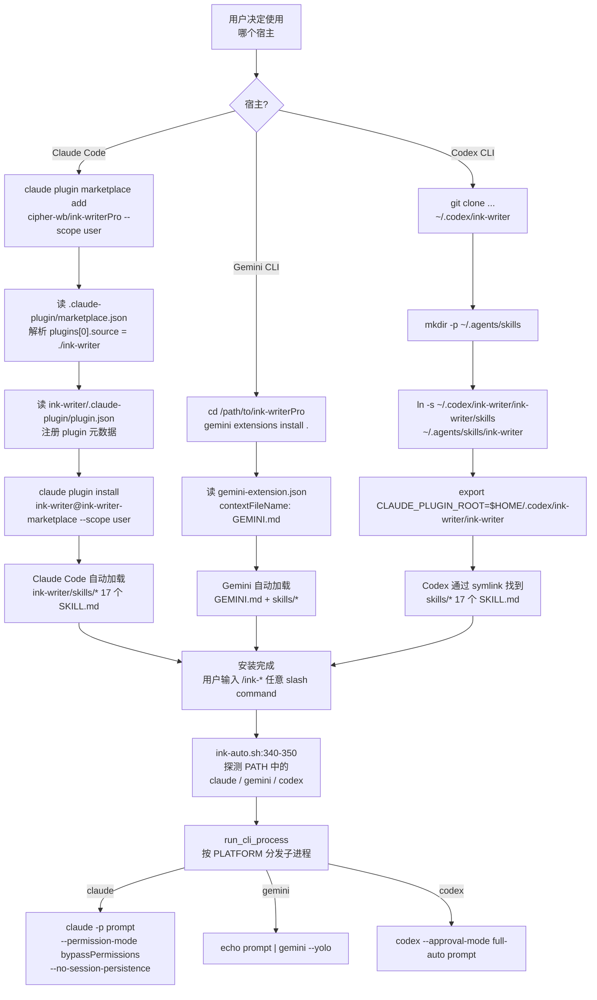

# 外部环境模式（External Environments） — 函数级精确分析

> 来源：codemap §6-C。本文档基于 commit `268f2e1`（master 分支）的源码 + README 第 38-86 行逐字核对。
> 这不是独立的"运行模式"，而是 **3 种 CLI 宿主的安装入口差异**。安装完成后，**业务代码完全相同**——同一套 17 个 skill / 5 个 shell 脚本 / 268 个 Python 文件。

---

## A. 模式概述

### A.1 三种宿主的安装命令

| 宿主 | 安装命令（macOS / Linux）| 关键差异 |
|---|---|---|
| **Claude Code（主推荐）** | `claude plugin marketplace add cipher-wb/ink-writerPro --scope user` + `claude plugin install ink-writer@ink-writer-marketplace --scope user` | 走 marketplace 协议；版本号管理 |
| **Gemini CLI** | `cd /path/to/ink-writerPro && gemini extensions install .` | 走 extension 协议；contextFileName=GEMINI.md |
| **Codex CLI** | `git clone ... ~/.codex/ink-writer` + 手动 `ln -s ink-writer/skills ~/.agents/skills/ink-writer` + `export CLAUDE_PLUGIN_ROOT=...` | **手动 symlink**；无 manifest 协议 |

### A.2 最终达到的效果（用户视角）

三种宿主下，用户体验**完全相同**：输入 `/ink-init`、`/ink-plan`、`/ink-auto N` 等 17 个 slash command 都能正常工作，产出同结构的 `<project>/.ink/` + `设定集/` + `大纲/` + `正文/` 目录。差异仅在：
- **Claude Code** 自动检测 marketplace 更新
- **Gemini CLI** 用 `GEMINI.md` 作为 context（而非 `CLAUDE.md`）
- **Codex CLI** 手动维护 symlink，更新需自己 `git pull`

### A.3 涉及文件清单（全部为 manifest / 配置）

| 路径 | 行 | 角色 | 宿主 |
|---|---:|---|---|
| `.claude-plugin/marketplace.json` | 23 | marketplace 元数据（含 plugin 引用 `./ink-writer`）| Claude Code |
| `ink-writer/.claude-plugin/plugin.json` | 19 | plugin 自身元数据（name / version 26.3.0 / license / keywords） | Claude Code |
| `gemini-extension.json` | 7 | Gemini extension 描述（含 `contextFileName: GEMINI.md`）| Gemini CLI |
| `GEMINI.md` | — | Gemini context（与 CLAUDE.md 平行，**Gemini 专用**） | Gemini CLI |
| `CLAUDE.md` | — | Claude Code context | Claude Code |
| `AGENTS.md` | — | （README 第 56 行黑名单；可能是 Codex 用的）| Codex |
| `requirements.txt` | — | Python 依赖（三宿主都装） | 所有 |

**注意**：ink-auto.sh 第 340-350 行**不区分宿主，自动探测 PATH 中的 `claude / gemini / codex`**：

```bash
PLATFORM=""
if command -v claude &>/dev/null; then PLATFORM=claude
elif command -v gemini &>/dev/null; then PLATFORM=gemini
elif command -v codex &>/dev/null; then PLATFORM=codex
else echo "❌ 未找到 claude / gemini / codex" exit 1
fi
```

并且 `run_cli_process` (ink-auto.sh:773-820) 按 `$PLATFORM` 分发不同子进程命令：
- `claude -p "$prompt" --permission-mode bypassPermissions --no-session-persistence`
- `echo "$prompt" | gemini --yolo`
- `codex --approval-mode full-auto "$prompt"`

---

## B. 执行流程图

### B.0 主图：三宿主的安装与执行差异



---

## C. 函数清单

> 外部环境模式本身**不调用任何 ink-writer 内部函数**——它的全部"代码"是 3 个 manifest + ink-auto.sh:340-350 + ink-auto.sh:773-820。

| # | 节点 | 文件:行 | 行为 |
|---:|---|---|---|
| E1 | marketplace.json 解析 | `.claude-plugin/marketplace.json:9-21` | Claude Code 客户端解析；`source: ./ink-writer` 指向 plugin 子目录 |
| E2 | plugin.json 注册 | `ink-writer/.claude-plugin/plugin.json:1-18` | name=ink-writer / version=26.3.0 / license=GPL-3.0 |
| E3 | gemini-extension.json | `gemini-extension.json:1-6` | name=ink-writer / version=26.2.0 / contextFileName=GEMINI.md |
| E4 | Codex symlink | 用户手动 `ln -s` | 把 `ink-writer/skills/` 链接到 `~/.agents/skills/ink-writer` |
| E5 | `ink-auto.sh:340-350` 平台探测 | ink-auto.sh:340-350 | `command -v` 顺序探测，写入 `PLATFORM` 变量 |
| E6 | `run_cli_process` 平台分发 | ink-auto.sh:779-808 | 根据 `$PLATFORM` 选择 claude / gemini / codex 子进程命令 |

---

## D. IO 文件全景表

| 文件路径 | 操作 | 触发 | 时机 | 格式 |
|---|---|---|---|---|
| `.claude-plugin/marketplace.json` | 读 | Claude Code marketplace add 时 | 安装时一次 | JSON |
| `ink-writer/.claude-plugin/plugin.json` | 读 | Claude Code plugin install 时 | 安装时一次 + 加载时 | JSON |
| `gemini-extension.json` | 读 | Gemini extensions install 时 | 安装时一次 + 加载时 | JSON |
| `~/.codex/ink-writer/ink-writer/skills` | symlink 源 | 用户手动 ln -s | 安装时一次 | dir |
| `~/.agents/skills/ink-writer` | symlink 目标 | 同上 | 同上 | symlink |
| **运行时无任何差异 IO**（业务代码读写完全相同的 `<project>/.ink/*`） | — | — | — | — |

**读取的环境变量**：

| 变量 | 来源 | 作用 |
|---|---|---|
| `CLAUDE_PLUGIN_ROOT` | Codex 用户手动 export；Claude Code 自动注入；Gemini 由 extension 协议推断 | 三宿主都用同一个变量名解析插件根 |
| `CLAUDE_PROJECT_DIR` | Claude Code 自动注入 | env-setup.sh:19 兜底 WORKSPACE_ROOT |

**网络请求**：仅 `claude plugin marketplace add cipher-wb/ink-writerPro` 时拉取 GitHub repo（一次性安装阶段）。

---

## E. 关键分支与边界

### E.1 平台探测优先级

`ink-auto.sh:340-350` 按 `claude → gemini → codex` 顺序探测；**用户同时装了 3 个 CLI 时，自动选第一个**。无环境变量可强制覆盖（**潜在小坑**：用户希望用 codex 但 PATH 里也有 claude 时，会自动走 claude，需要临时修改 PATH 或卸载 claude）。

### E.2 子进程命令差异

| 宿主 | run_cli_process 命令 | 含义 |
|---|---|---|
| Claude Code | `claude -p "$prompt" --permission-mode bypassPermissions --no-session-persistence` | 单次 prompt 模式；跳过权限提示；不保留会话 |
| Gemini | `echo "$prompt" \| gemini --yolo` | stdin 喂 prompt；--yolo 跳过所有确认 |
| Codex | `codex --approval-mode full-auto "$prompt"` | 全自动审批模式 |

**三种 prompt 都通过同一个 `parse_progress_output` pipe**（ink-auto.sh:672）解析 `[INK-PROGRESS]` 行。

### E.3 关键差异/限制

| # | 严重度 | 现象 | 证据 |
|---:|---|---|---|
| **X-R1** | 🟢 低 | Codex 安装**完全手动**，没有 manifest；用户必须手动维护 symlink + export | README 第 76-84 行 + 无 `codex.json` 等文件 |
| **X-R2** | 🟢 低 | gemini-extension.json **版本号 26.2.0** 落后 plugin.json 的 26.3.0 | `cat gemini-extension.json` vs `cat ink-writer/.claude-plugin/plugin.json` | **版本不一致**，Gemini 用户看到的版本号过期 |
| **X-R3** | 🟢 低 | `marketplace.json` 与 `plugin.json` 版本号都是 26.3.0，但**没有自动一致性校验** | 项目内有 `scripts/maintenance/check_plugin_version_consistency.{py,sh,ps1,cmd}`（gitstatus 显示是新增未提交的）— 说明已意识到该问题但未自动化 |
| **X-R4** | 🟢 低 | 平台探测无 fallback 用环境变量强制（如 `INK_FORCE_PLATFORM=codex`） | ink-auto.sh:340-350 仅 `command -v` | 多 CLI 共存时无法精细控制 |
| **X-R5** | 🟢 低 | **Codex 路径下 SKILL.md 中的 `${CLAUDE_PLUGIN_ROOT}` 仍生效**（README 第 81 行 export），变量名虽然带 "CLAUDE" 但与宿主无关，纯命名巧合 | env-setup.sh 全文使用此变量名 | 命名上有误导性，但功能等价 |

### E.4 三宿主实际共享的 100% 内容

| 内容 | 体量 |
|---|---|
| 17 个 SKILL.md | ~12000 行 |
| 5 个 shell 脚本（.sh + .ps1 + .cmd） | ~5000 行 |
| 268 个 Python 文件（ink_writer/ 包） | 80,333 行 |
| 23 个 YAML 配置 | — |
| 数据资源（references / templates / data） | — |

**唯一的差异**：3 个 manifest 文件（49 行总和） + ink-auto.sh 中 11 行平台探测代码。

---

## 附录：从 codemap §6-C 修正的 1 处不准确

codemap 第 854 行的 Codex 入口写的是 `(使用同一 ink-writer/)`，实际更准确的描述是：**Codex 通过 symlink** 把 `~/.codex/ink-writer/ink-writer/skills/` 链接到 `~/.agents/skills/ink-writer`，并 export `CLAUDE_PLUGIN_ROOT` 让 env-setup.sh 能找到 plugin 根。
