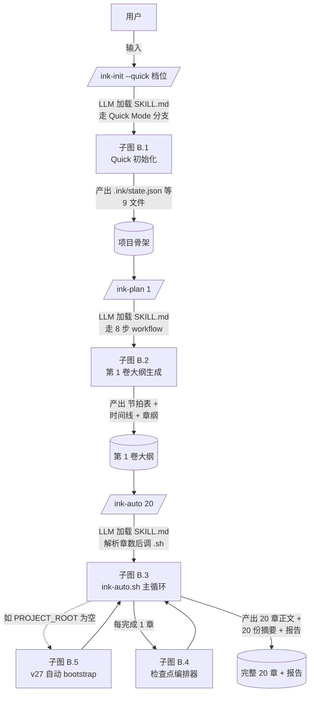
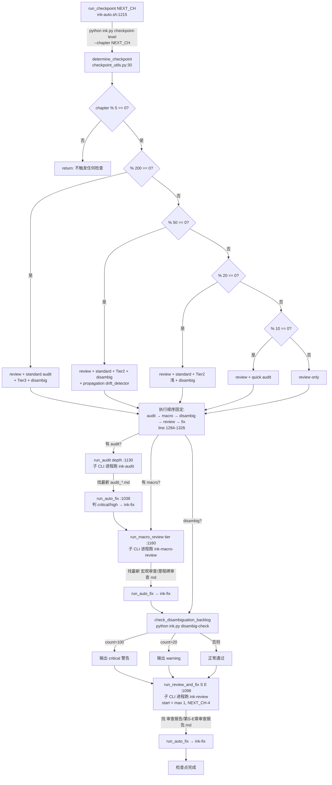
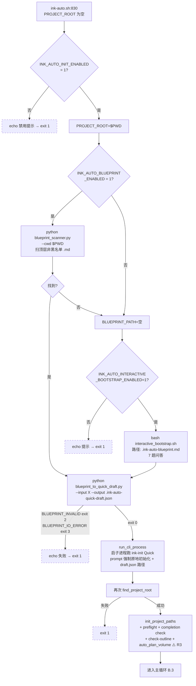

# 快速模式（Quick Mode） — 函数级精确分析

> 来源：codemap §6-A.1。本文档基于 commit `268f2e1`（master 分支）的源码逐行核对。
> 触发链：`/ink-init --quick [档位]` → `/ink-plan 1` → `/ink-auto 20`。
> Windows 等价：每个 `.sh` 都有 `.ps1` sibling，行为字节级对等（参见 `runtime_compat.py`）。

---

## A. 模式概述

### A.1 触发命令（完整示例）

```bash
# Step ①：初始化项目（生成 3 套方案 → 用户选 1 套 → 落盘骨架）
/ink-init --quick 2          # 档位=2 平衡（默认推荐）
# 等价：/ink-init --quick --档位=2 / /ink-init --quick 平衡
# 不带档位：会弹 AskUserQuestion 二次确认

# Step ②：为第 1 卷生成完整大纲（节拍表 + 时间线 + 章纲）
/ink-plan 1

# Step ③：批量写 20 章（含每 5/10/20 章自动检查点）
/ink-auto 20
```

### A.2 最终达到的效果（用户视角）

3 条命令、约 8-15 分钟交互（不含 LLM 实际写章时间），从空目录变成：**1 个完整初始化项目（设定集 6 文件 + 总纲 + 状态 JSON 3 份）+ 第 1 卷完整大纲（节拍表 / 时间线 / 章纲 3 文件）+ 20 章正文 + 20 份摘要 + 中途自动 4 次审查（5/10/15/20 章）+ 2 次审计（10/20 章）+ 1 次 Tier2 宏观审查（20 章）+ 1 次消歧检查（20 章）+ 1 份 ink-auto 运行报告**。整个流程跨 **N+1 个 CLI 子进程**（N = 章数；每章一个新进程；外加初始化时 1 个）。

### A.3 涉及文件清单

#### 三个 SKILL.md 入口（LLM 编排提示词）

| 路径 | 行 | 在本流程中的角色 |
|---|---:|---|
| `ink-writer/skills/ink-init/SKILL.md` | 1158 | LLM 走 Quick Mode 分支（line 50-544） + Step 99 / 99.5（line 1044-1158） |
| `ink-writer/skills/ink-plan/SKILL.md` | 1005 | LLM 走 8 步 workflow + Step 99 |
| `ink-writer/skills/ink-auto/SKILL.md` | 312 | 解析参数后调 `bash ink-auto.sh N` |
| `ink-writer/skills/ink-write/SKILL.md` | 2441 | 由 ink-auto.sh 通过 `claude -p / gemini --yolo / codex --approval-mode full-auto` 子进程拉起 |

#### Shell 入口

| 路径 | 行 | 入口角色 |
|---|---:|---|
| `ink-writer/scripts/ink-auto.sh` | 1588 | `/ink-auto N` 唯一真实执行器 |
| `ink-writer/scripts/env-setup.sh` | 99 | source 加载，导出 `WORKSPACE_ROOT/CLAUDE_PLUGIN_ROOT/SCRIPTS_DIR/PROJECT_ROOT/PYTHON_LAUNCHER` |
| `ink-writer/scripts/interactive_bootstrap.sh` | — | v27 空目录无蓝本时的 7 题 bootstrap（路径出现在 ink-auto.sh:863） |

#### 核心 Python 入口

| 模块 / 脚本 | 行 | 触发时机 |
|---|---:|---|
| `ink-writer/scripts/ink.py` | 41 | 转发包装器，调 `ink_writer.core.cli.ink:main` |
| `ink_writer/core/cli/ink.py` | 697 | 真正的 ink 子命令分发器（`init / preflight / state / where / check-outline / checkpoint-level / report-check / disambig-check / update-state / memory / workflow / ...`） |
| `ink-writer/scripts/init_project.py` | 1034 | `ink.py init` 转发的目标；写出 11 个目录 + 9 个核心文件 |
| `ink_writer/core/cli/checkpoint_utils.py` | 206 | `determine_checkpoint(chapter)` → 5 档判断；`report_has_issues` 判断报告是否需修复 |
| `ink_writer/core/auto/blueprint_to_quick_draft.py` | 218 | --blueprint 模式：blueprint .md → quick draft.json |
| `ink-writer/scripts/blueprint_to_quick_draft.py` | — | shim 转发到上面（v27 ink-auto 自动 init 路径） |
| `ink_writer/core/auto/blueprint_scanner.py` | 46 | v27 自动 init：扫 CWD 顶层非黑名单 .md |
| `ink-writer/scripts/blueprint_scanner.py` | — | 同上 shim |
| `ink_writer/core/auto/state_detector.py` | 43 | `detect_project_state(project_root)` → S0_NEW / S1_NO_OUTLINE / S2_WRITING |
| `ink_writer/planning_review/ink_init_review.py` | 302 | Quick Step 99 / Deep Step 99：4 个 checker 串行 |
| `ink_writer/planning_review/ink_plan_review.py` | 236 | ink-plan Step 99：3 个 checker 串行 |
| `ink_writer/planning_review/dry_run.py` | — | dry_run 计数器（前 5 次不阻断） |
| `ink_writer/live_review/init_injection.py` | — | Quick Step 99.5：题材接受度 D+B 信号 |
| `ink_writer/parallel/pipeline_manager.py` | — | `--parallel N` 模式入口（本文档不展开） |

#### Quick 路径专用 Python 校验器

| 模块 | 在 SKILL.md 中的触发 |
|---|---|
| `python -m ink_writer.creativity validate` | Quick Step 1.5 金手指五重校验、Step 1.6 语言风格分配 |
| `python -m ink_writer.creativity.cli validate --book-title` | Quick Step 1.7 书名 / 人名校验 |

#### Quick Step 0 必读的 12+ 个数据文件（LLM 用 Read 工具读）

```
data/naming/blacklist.json
data/naming/surnames.json (4 层稀缺度)
data/naming/given_names.json (5 风格 × 男女)
data/naming/nicknames.json (≥100 江湖绰号)
data/naming/book-title-patterns.json (V1/V2/V3 各 50+ 条)
data/golden-finger-cost-pool.json (8 大类 ~120 条)
data/market-trends/cache-YYYYMMDD.md (WebSearch 缓存)
${SKILL_ROOT}/references/genre-tropes.md
${SKILL_ROOT}/references/creativity/meta-creativity-rules.md
${SKILL_ROOT}/references/creativity/anti-trope-seeds.json
${SKILL_ROOT}/references/creativity/perturbation-engine.md
${SKILL_ROOT}/references/creativity/golden-finger-rules.md (v2.0)
${SKILL_ROOT}/references/creativity/style-voice-levels.md
```

#### 4 个 ink-init checker + 3 个 ink-plan checker

```
ink_writer/checkers/genre_novelty/checker.py             (ink-init Step 99 #1)
ink_writer/checkers/golden_finger_spec/checker.py        (ink-init Step 99 #2)
ink_writer/checkers/naming_style/checker.py              (ink-init Step 99 #3)
ink_writer/checkers/protagonist_motive/checker.py        (ink-init Step 99 #4)
ink_writer/checkers/golden_finger_timing/checker.py      (ink-plan Step 99 #1)
ink_writer/checkers/protagonist_agency_skeleton/checker.py (ink-plan Step 99 #2)
ink_writer/checkers/chapter_hook_density/checker.py      (ink-plan Step 99 #3)
```

---

## B. 执行流程图

> 节点超过 25，按 1 主图 + 5 子图拆分，每个 slash command 1 个子图 + 检查点子图 + v27 自动 bootstrap 子图。

### B.0 主图（3 个 slash command 串联）



### B.1 子图：/ink-init --quick（LLM 编排，单 CLI 进程内完成）

```mermaid
flowchart TD
    Start[ink-init SKILL.md 入口<br>line 1] --> Mode{解析参数}
    Mode -->|"含 --blueprint"| BP[Blueprint 路径<br>line 7-26]
    Mode -->|--quick + 档位 1-4| Q0[Quick Step 0<br>line 56-112]
    Mode -->|--quick 不带档位| Q05[Quick Step 0.5<br>弹 AskUserQuestion<br>line 128-187]
    Mode -->|空| Deep[进入 Deep Mode<br>line 546+,本文不展开]

    BP -->|"python -m blueprint_to_quick_draft<br>--input X --output draft.json"| BPDone[draft 落盘后强制走 Quick<br>跳过 Step 0.5 + Step 2 弹询问]
    BPDone --> Q1

    Q0 -->|"读 12+ 数据文件<br>WebSearch 双平台榜单"| Q04[Quick Step 0.4<br>平台选择 qidian/fanqie<br>line 113]
    Q04 --> Q05
    Q05 --> Q1[Quick Step 1<br>line 189-303<br>生成 3 套差异化方案]
    Q1 -->|金手指五重校验| Q15["Quick Step 1.5<br>python -m ink_writer.creativity<br>validate"]
    Q15 -->|失败→重抽或降档| Q1
    Q15 -->|通过| Q16[Quick Step 1.6<br>语言风格三档分配<br>同样调 creativity validate]
    Q16 --> Q17["Quick Step 1.7<br>python -m ink_writer.creativity.cli<br>validate --book-title"]
    Q17 -->|题材锁定后| Q995[Quick Step 99.5<br>line 1110<br>live-review 题材接受度]
    Q995 -->|"check_genre warn"| Confirm[用户 y/n 二次确认]
    Q995 -->|ok / no_data| Q2
    Confirm -->|n| Q1
    Confirm -->|y| Q2[Quick Step 2<br>line 450<br>方案输出 + 用户选择]

    Q2 -->|--blueprint 模式 自动选 1| Q3
    Q2 -->|交互模式: 选 1/2/3 / 混搭 / 重抽| Q3[Quick Step 3<br>line 500<br>映射到内部数据模型]
    Q3 -->|"3 套自动填充：US-001/US-003/US-002"| Q32[Quick Step 3.2<br>调用 init_project.py]
    Q32 -->|"python ink.py init<br>转发 init_project.py<br>30+ CLI 参数"| InitPy[init_project.py 跑]
    InitPy -->|"创建 11 目录<br>写 9 文件"| Disk[(.ink/state.json<br>.ink/preferences.json<br>.ink/golden_three_plan.json<br>.ink/idea_bank.json<br>设定集/世界观.md 力量体系.md 主角卡.md 金手指设计.md 反派设计.md<br>大纲/总纲.md 爽点规划.md<br>+可选 git init)]

    Disk --> Q4[Step 99 策划期审查<br>line 1044]
    Q4 -->|"4 checker 串行"| Q4a["python -m planning_review.ink_init_review<br>--book X --setting json"]
    Q4a --> CheckOk{4 checker<br>全过?}
    CheckOk -->|是| Done[INK_INIT_DONE]
    CheckOk -->|否 dry_run≤5| WarnOnly[写 evidence 但不阻断]
    WarnOnly --> Done
    CheckOk -->|否 real mode| Block[exit 1<br>必须修正后重跑]

    style Block stroke-dasharray: 5 5
    style WarnOnly stroke-dasharray: 5 5
```



### B.2 子图：/ink-plan 1（LLM 编排第 1 卷生成）

```mermaid
flowchart TD
    Start[ink-plan SKILL.md 入口<br>line 1] --> Env[执行 source env-setup.sh<br>导出 PROJECT_ROOT]
    Env --> S1[Step 1: Load project data<br>line 67-119]
    S1 -->|"cat state.json + 总纲.md<br>+ optional 设定集 +<br>idea_bank + golden_three_plan"| S15[Step 1.5: Load propagation debts<br>line 121-158]
    S15 -->|"读 .ink/propagation_debt.json<br>filter active debts"| S2[Step 2: Build setting baseline<br>line 160-179<br>仅增量补齐设定集]
    S2 --> S3[Step 3: Select volume<br>line 181-195<br>用户选第 1 卷]
    S3 -->|结局卷? line 186| FinalCheck{is_final?}
    FinalCheck -->|是| FinalRule[追加收线/决战/尾声规则]
    FinalCheck -->|否| S4
    FinalRule --> S4[Step 4: 节拍表<br>line 197-226]

    S4 -->|"cat 大纲-卷节拍表.md 模板<br>LLM 生成<br>cat &gt; 第N卷-节拍表.md"| S45[Step 4.5: 时间线表<br>line 228-252]
    S45 -->|"cat 大纲-卷时间线.md 模板<br>cat &gt; 第N卷-时间线.md"| S5[Step 5: 卷骨架<br>line 254-401]
    S5 -->|"cat 4 个 references<br>Strand Weave + 卖点 + genre-profile<br>cat 状态文件<br>LLM 生成卷骨架"| S6[Step 6: 章纲分批生成<br>line 447-708]
    S6 -->|"批次间衔接校验<br>line 686"| S6Pass{6 项校验<br>过?}
    S6Pass -->|否 必须修正| S6
    S6Pass -->|是| S7[Step 7: 设定集回写<br>line 710-738]

    S7 -->|"python sync_settings.py<br>--volume N"| S7Code{exit code?}
    S7Code -->|0 同步成功| S8
    S7Code -->|1 BLOCKER| Manual[7.2 手动模式<br>用户裁决]
    S7Code -->|脚本不存在| Manual
    Manual --> S8[Step 8: Validate + save<br>line 740-941]

    S8 -->|"先跑 0 黄金三章硬门禁<br>python verify_golden_three.py"| S80{exit?}
    S80 -->|1 违规| Halt[hard fail 必须修正章纲后重跑]
    S80 -->|0 通过| S81["1-7 串行 8 大类硬校验<br>每章 23+ 字段完整性"]
    S81 -->|任一 hard fail| Halt
    S81 -->|全过| S82["python ink.py update-state<br>--volume-planned N --chapters-range start-end"]
    S82 -->|"propagation: mark_debts_resolved<br>仅落盘成功后"| S99

    S99[Step 99: 策划期审查<br>line 943]
    S99 -->|"汇总 outline.json"| S99a["python -m planning_review.ink_plan_review<br>--book X --outline outline.json"]
    S99a -->|"3 checker:<br>golden-finger-timing<br>protagonist-agency-skeleton<br>chapter-hook-density"| S99b{全过?}
    S99b -->|是| PlanDone[INK_PLAN_DONE]
    S99b -->|否 dry_run≤5| Warn[写 evidence 不阻断]
    Warn --> PlanDone
    S99b -->|否 real mode| BlockPlan[exit 1<br>必须修正章纲]

    style Halt stroke-dasharray: 5 5
    style BlockPlan stroke-dasharray: 5 5
```



### B.3 子图：/ink-auto 20 主循环（ink-auto.sh）

```mermaid
flowchart TD
    Start[ink-auto.sh:1] --> Parse[行 33-55<br>解析 --parallel N / 章数<br>读 INK_AUTO_COOLDOWN<br>INK_AUTO_CHECKPOINT_COOLDOWN]
    Parse --> FindRoot[find_project_root :183<br>从 PWD 向上找 .ink/state.json]
    FindRoot --> RootExists{找到?}
    RootExists -->|否| V27[子图 B.5<br>v27 自动 bootstrap]
    RootExists -->|是| InitPaths[init_project_paths :202<br>设 LOG_DIR + REPORT_FILE<br>读 load_word_limits→<br>MIN_WORDS_HARD MAX_WORDS_HARD]
    V27 --> InitPaths

    InitPaths --> PlatDetect[行 340-350<br>探测 claude/gemini/codex<br>设 PLATFORM]
    PlatDetect --> PreFlight["python ink.py preflight"]
    PreFlight -->|失败| ExitFail[exit 1]
    PreFlight -->|通过| CompCheck["is_project_completed<br>读 state.json:progress.is_completed<br>+ 比较 current_chapter vs last volume"]
    CompCheck -->|completed| Bye[exit 0 全书已完结]
    CompCheck -->|in_progress| OutCheck[行 488-497<br>get_current_chapter + 计算 BATCH_START/END]

    OutCheck --> StateDet["行 503-509<br>python state_detector<br>→ S0/S1/S2"]
    StateDet --> CheckOut["python ink.py check-outline<br>--chapter S --batch-end E"]
    CheckOut -->|缺大纲| OutMiss{PROJECT_STATE?}
    OutMiss -->|S1_NO_OUTLINE| AutoPlan[行 532-542<br>auto_plan_volume 调用 ⚠️未定义<br>见 §E.10 R3]
    OutMiss -->|S2_WRITING| WarnSleep[警告 5 秒<br>按需自动生成]
    CheckOut -->|完整| Loop
    AutoPlan --> Loop
    WarnSleep --> Loop

    Loop[for i in 1..N<br>line 1450] --> Interrupt{INTERRUPTED?}
    Interrupt -->|是| Break[break → write_report]
    Interrupt -->|否| GetCh[get_current_chapter<br>NEXT_CH = CURRENT+1]

    GetCh -->|"逐章 check-outline"| OneCh{该章<br>大纲?}
    OneCh -->|缺| AGen[auto_generate_outline :985<br>调用 auto_plan_volume ⚠️ R3]
    AGen -->|失败| HaltAll[exit 1<br>EXIT_REASON=大纲生成失败]
    AGen -->|成功| Clear
    OneCh -->|有| Clear[python ink.py workflow clear<br>清残留状态]

    Clear --> MemChk["python ink.py memory<br>auto-compress --chapter NEXT --format json"]
    MemChk -->|needed=true| MemNotify[输出提示<br>由 ink-write Step 0 处理]
    MemChk -->|否| Run
    MemNotify --> Run

    Run[run_chapter NEXT_CH<br>:947] -->|"run_cli_process<br>启全新 CLI 子进程<br>prompt: 加载 ink-write skill"| ChildExit[等子进程退出 + watchdog 1200s]
    ChildExit --> Cool[sleep COOLDOWN 默认 10s]
    Cool --> Verify[verify_chapter NEXT_CH :591<br>4 项验证]
    Verify --> VerOk{通过?}
    VerOk -->|是| Comp[COMPLETED++<br>run_checkpoint NEXT_CH<br>子图 B.4]
    Comp --> FinalC{NEXT_CH ≥<br>最终章?}
    FinalC -->|是| MarkFin["python ink.py update-state<br>--mark-completed exit 0"]
    FinalC -->|否| Loop

    VerOk -->|否| WCFail[get_chapter_wordcount]
    WCFail --> Reason{字数 &gt; MAX?}
    Reason -->|是| Shrink[精简循环<br>MAX_RETRIES=SHRINK_MAX_ROUNDS=3]
    Reason -->|否| Pad[补写循环<br>MAX_RETRIES=1]
    Shrink --> Retry
    Pad --> Retry[retry_chapter :966<br>调 ink-resume]
    Retry -->|verify 通过| Comp
    Retry -->|N 轮仍失败| HaltAll

    Loop -->|i 用尽| Done[正常完成<br>print_summary + write_report]
    Comp -->|累积 i=N| Done

    style ExitFail stroke-dasharray: 5 5
    style HaltAll stroke-dasharray: 5 5
    style AutoPlan stroke:#f00,stroke-width:3px
    style AGen stroke:#f00,stroke-width:3px
```



### B.4 子图：检查点编排器（每 5/10/20/50/200 章触发）



### B.5 子图：v27 自动 bootstrap（PROJECT_ROOT 为空时）



---

## C. 函数清单（按 slash command 分段）

> 命名约定：`✦` = LLM 工具调用（不是函数，但是流程节点）；`📂` = 副作用涉及创建/写文件；`📖` = 读文件；`🌐` = 网络。
> 因函数总数 > 50，每段只列**实质副作用与跨段调用**的函数；纯 helper（如 cli.py 内的 `_strip_project_root_args`）合并入注释。

### C.1 /ink-init --quick 阶段（约 18 个真实函数 + 多个 LLM 工具调用）

| # | 函数 / 节点 | 文件:行 | 输入 | 输出 | 副作用 | 调用者 | 被调用者 |
|---:|---|---|---|---|---|---|---|
| 1 | ✦ LLM 入口（解析 SKILL.md） | ink-writer/skills/ink-init/SKILL.md:1 | 用户 prompt 参数 | 后续工具调用编排 | — | Claude Code 框架 | LLM 工具 |
| 2 | ✦ Read 12+ 数据文件 | SKILL.md:56-72 | path[] | 文件内容 | 📖 见 §A.3 | LLM | Read tool |
| 3 | ✦ WebSearch 4 条检索（按 platform 路由） | SKILL.md:74-99 | 4 hardcoded queries | results | 🌐 起点 + 番茄；📂 写 `data/market-trends/cache-YYYYMMDD.md` | LLM | WebSearch tool |
| 4 | ✦ AskUserQuestion 弹平台 / 档位 / 方案选择 | SKILL.md:113-187 等多处 | 选项列表 | 用户选项 | — | LLM | AskUserQuestion tool |
| 5 | `parse_blueprint` | ink_writer/core/auto/blueprint_to_quick_draft.py:50 | path | dict[str, str\|None] | 📖 读 path | `_main` / Quick --blueprint 入口 | `_normalise_field_name`, `_clean_body` |
| 6 | `validate` | ink_writer/core/auto/blueprint_to_quick_draft.py:106 | parsed dict | None | raise BlueprintValidationError（缺必填 5 字段或命中 GF_BLACKLIST 7 词） | `_main` | — |
| 7 | `to_quick_draft` | ink_writer/core/auto/blueprint_to_quick_draft.py:119 | parsed | dict | — | `_main` | `_coerce_aggression`, `_coerce_int` |
| 8 | `_main` of blueprint_to_quick_draft | …:181 | argv | exit 0/2/3 | 📂 写 `<output>` (--output 参数指定) | `__main__` 入口 | parse + validate + to_quick_draft |
| 9 | ✦ `python -m ink_writer.creativity validate` | SKILL.md:316/352 | — | exit 0/N | （未读源码，按 SKILL 描述：金手指 5 重 + 风格分配校验） | LLM via Bash | — |
| 10 | ✦ `python -m ink_writer.creativity.cli validate --book-title` | SKILL.md:412 | — | exit 0/N | 同上（书名 + 人名校验） | LLM via Bash | — |
| 11 | ✦ `python -m ink_writer.live_review.init_injection.check_genre` | SKILL.md:1118-1140 | user_genre_input, top_k=3 | dict {warning_level, similar_cases, render_text} | 📖 `data/live-review/vector_index/`；`enabled=false` 时早退；首次须先建索引 | LLM via Python -c | — |
| 12 | `ink.py main` 转发器 | ink-writer/scripts/ink.py:24 | — | exit | sys.path 兜底注入 repo_root；调 `enable_windows_utf8_stdio` | `__main__` | `ink_writer.core.cli.ink:main` |
| 13 | `ink_writer.core.cli.ink:main` | ink_writer/core/cli/ink.py:426 | sys.argv | exit | argparse 解析；按 `tool` 分发 | `ink.py:34` | 25+ 子命令 dispatcher |
| 14 | `_run_script` | ink_writer/core/cli/ink.py:128 | script_name, argv | exit | 📂 起子进程跑 `${SCRIPTS_DIR}/<script>.py` | `cmd_*` 各转发分支 | subprocess.run |
| 15 | `init_project` | ink-writer/scripts/init_project.py:243 | 30+ kwargs | None | 📂 **创建 11 目录**（.ink/backups, archive, summaries, 设定集/{角色库/主要,次要,反派,物品库,其他设定}, 大纲, 正文, 审查报告）；**写 9 文件**（state.json, preferences.json, golden_three_plan.json, 设定集/{世界观,力量体系,主角卡,反派设计,金手指设计}.md, 大纲/{总纲,爽点规划}.md, .env.example）；可选 `git init` + .gitignore | `init_project.py:main`（CLI） | atomic_write_json, build_default_preferences, build_golden_three_plan, _read_text_if_exists, _write_text_if_missing, subprocess git |
| 16 | `_ensure_state_schema` | init_project.py:136 | dict | dict | 增量补齐 schema 字段；幂等 | `init_project` | — |
| 17 | `build_default_preferences` | preferences 模块（未在本文档展开） | dict | dict | 写默认 platform-aware 字段（chapter_words ± 500 等） | `init_project:446` | — |
| 18 | `build_golden_three_plan` | golden_three 模块 | kwargs | dict | 生成第 1-3 章承诺卡 schema | `init_project:457` | — |
| 19 | `run_ink_init_review` | ink_writer/planning_review/ink_init_review.py:92 | book, setting dict, llm_client, base_dir, skip, ... | result dict | 📖 `config/m3_thresholds.yaml`（thresholds_loader）；📖 可选 `data/market_intelligence/qidian_top200.jsonl`；**串行调 4 checker**；写 evidence chain；可能 increment_counter（dry_run） | `main` CLI 入口 | `load_thresholds`, `_load_top200`, `is_dry_run_active`, `EvidenceChain`, 4 个 `check_*`, `_inject_cases`, `write_planning_evidence_chain`, `increment_counter` |
| 20 | `run_ink_init_review:main` | ink_init_review.py:271 | argv | exit 0 (passed) / 1 (effective_blocked) | 📖 setting json；初始化 anthropic.Anthropic()；📂 写 `<base_dir>/<book>/planning_evidence_chain.json`；📂 (dry_run) 累加 `data/.planning_dry_run_counter`；stdout 打印 result JSON | LLM via Bash | `_load_setting`, `run_ink_init_review` |
| 21 | `_load_top200` | ink_init_review.py:46 | path | list[dict] | 📖 jsonl；缺失/解析失败兜底 [] | `run_ink_init_review` | — |
| 22 | `_inject_cases` | ink_init_review.py:71 | report dict, section dict | None（mut report） | 阻断时把 case_ids 注入 `cases_hit` | `run_ink_init_review` | — |

### C.2 /ink-plan 1 阶段（约 12 个真实函数 + LLM 编排）

| # | 函数 / 节点 | 文件:行 | 输入 | 输出 | 副作用 | 调用者 | 被调用者 |
|---:|---|---|---|---|---|---|---|
| 23 | ✦ LLM 入口 | ink-writer/skills/ink-plan/SKILL.md:1 | 用户 prompt | 编排 8 步 | — | Claude Code 框架 | — |
| 24 | ✦ source env-setup.sh | SKILL.md:23 | — | env vars | 📖 ink.py where；导出 `WORKSPACE_ROOT/CLAUDE_PLUGIN_ROOT/SCRIPTS_DIR/PROJECT_ROOT/PYTHON_LAUNCHER` | LLM via Bash | env-setup.sh |
| 25 | ✦ Step 1: cat state.json + 总纲 + 可选 8 文件 | SKILL.md:67-119 | path[] | 文件内容 | 📖 多文件 | LLM via Bash cat | — |
| 26 | `propagation.load_active_debts` | ink_writer/propagation 模块 | PROJECT_ROOT | list[Debt] | 📖 `.ink/propagation_debt.json`（可选） | LLM via Python -c (SKILL.md:139) | — |
| 27 | `propagation.filter_debts_for_range` / `render_debts_for_plan` / `mark_debts_resolved` | propagation 模块 | debts, range / debts / debt_ids | filtered / str / None | mark_debts_resolved 写回 `propagation_debt.json` | 同上 | — |
| 28 | ✦ Step 4-7 LLM 写文件 | SKILL.md:197-738 | LLM 推理 | markdown | 📂 `大纲/第N卷-节拍表.md`、`第N卷-时间线.md`、`第N卷-详细大纲.md`；增量补 `设定集/*.md` | LLM via Bash heredoc | — |
| 29 | `sync_settings.py` | ink-writer/scripts/sync_settings.py | --project-root, --volume N | exit 0 / 1 | 📖+📂 设定集回写；冲突 → BLOCKER | LLM via Bash (Step 7.1) | — |
| 30 | `verify_golden_three.py` | ink-writer/scripts/verify_golden_three.py | --project-root | exit 0 / 1 | 📖 第 1-3 章 chapter outline；校对 ch1_cool_point_spec | LLM via Bash (Step 8.0) | — |
| 31 | `update_state.py`（经 ink.py 转发） | ink-writer/scripts/update_state.py | --volume-planned, --chapters-range | exit | 📂 写 `.ink/state.json` 增量字段 | LLM via Bash (Step 8.末) | — |
| 32 | `run_ink_plan_review` | ink_writer/planning_review/ink_plan_review.py:57 | book, outline dict, llm_client, ... | result dict | 与 ink_init_review 结构相同；**串行 3 checker**：golden_finger_timing / protagonist_agency_skeleton / chapter_hook_density；硬阻断阈值 1.0 / 0.55 / 0.70；📂 写/append `planning_evidence_chain.json` 的 `stage='ink-plan'` 段 | `main` CLI | 3 个 `check_*`, `EvidenceChain`, `write_planning_evidence_chain`, `increment_counter` |
| 33 | `ink_plan_review.main` | …:208 | argv | exit 0/1 | 同 ink_init_review:main 模式 | LLM via Bash | `_load_outline`, `run_ink_plan_review` |

### C.3 /ink-auto 20 阶段（ink-auto.sh + 子进程；约 30 个 bash 函数 + Python 调用）

> 此处不展开 ink-write SKILL.md 内部 27+ 步（属于 6-A.* 子模式范围之外，单独成文档）。本表只到 ink-auto 拉起子进程为止。

| # | 函数 / 节点 | 文件:行 | 输入 | 输出 | 副作用 | 调用者 | 被调用者 |
|---:|---|---|---|---|---|---|---|
| 34 | ink-auto SKILL.md 入口 | ink-writer/skills/ink-auto/SKILL.md:1 | 用户参数 | LLM 调一次 Bash | — | Claude Code 框架 | — |
| 35 | `bash ink-auto.sh N` | ink-writer/scripts/ink-auto.sh:1 | argv | exit code | 整个 .sh 进程 | LLM via Bash | 下表所有 bash 函数 |
| 36 | `format_duration` | ink-auto.sh:75 | secs | str | — | print_chapter_progress 等 | — |
| 37 | `print_chapter_progress` | ink-auto.sh:88 | done, total | stdout 进度条 | — | 主循环 | tput cols, format_duration |
| 38 | `print_checkpoint_progress` | ink-auto.sh:141 | scope, steps | stdout | — | run_checkpoint helpers | — |
| 39 | `find_python_launcher_bash` | ink-auto.sh:158 | — | 设 PY_LAUNCHER | OSTYPE 探测 | top-level | — |
| 40 | `find_project_root` | ink-auto.sh:183 | — | 项目根 path / 退出 1 | 📖 stat `<dir>/.ink/state.json`，向上找 | top-level + v27 bootstrap | — |
| 41 | `init_project_paths` | ink-auto.sh:202 | — | 设 LOG_DIR/REPORT_FILE/MIN_WORDS_HARD/MAX_WORDS_HARD/SHRINK_MAX_ROUNDS | 📂 mkdir `LOG_DIR + REPORT_DIR`；📖 `python -c load_word_limits` | top-level + bootstrap | inline Python（preferences） |
| 42 | `report_event` | ink-auto.sh:252 | status, event, detail | append REPORT_EVENTS（内存） | — | 全文 30+ 处 | — |
| 43 | `write_report` | ink-auto.sh:262 | — | 写报告文件 | 📂 写 `<PROJECT_ROOT>/.ink/reports/auto-<ts>.md`；📖 `ink.py index get-review-trends` 追加质量趋势 | print_summary 后 + on_signal | get_current_chapter, ink.py |
| 44 | `get_current_chapter` | ink-auto.sh:368 | — | int | 📖 `ink.py state get-progress` JSON | 主循环每轮 + verify_chapter | ink.py |
| 45 | `get_volume_for_chapter` | ink-auto.sh:385 | ch | volume_id | 📖 inline Python 读 `state.json` → 匹配 chapter_range | auto_generate_outline + S1 分支 | inline python |
| 46 | `is_project_completed` | ink-auto.sh:410 | — | "completed" / "in_progress" / "unknown" | 📖 inline Python 读 state.json | top-level preflight + bootstrap | inline python |
| 47 | `get_final_chapter` | ink-auto.sh:440 | — | int | 同上 | 主循环完结判断 | inline python |
| 48 | `get_total_volumes` | ink-auto.sh:461 | — | int | 同上 | auto_generate_outline | inline python |
| 49 | `on_signal` | ink-auto.sh:565 | SIGINT/SIGTERM | exit 130 | kill watchdog + child；调 print_summary + write_report | trap | — |
| 50 | `verify_chapter` | ink-auto.sh:591 | ch | 0/1 | 📖 ls `正文/第NNNN章*.md`；wc -m；📖 比对 `MIN_WORDS_HARD ≤ wc ≤ MAX_WORDS_HARD`；📖 `summaries/chNNNN.md` 存在 | 主循环 verify | get_current_chapter, find, wc |
| 51 | `get_chapter_wordcount` | ink-auto.sh:632 | ch | int | 📖 wc -m | verify 失败分流 | — |
| 52 | `get_step_name` | ink-auto.sh:650 | step_id | name | — | parse_progress_output | — |
| 53 | `parse_progress_output` | ink-auto.sh:672 | log_file（参数）+ stdin pipe | stdout 透传 | 📂 append log_file；解析 `[INK-PROGRESS]` 前缀事件 | run_cli_process 管道末端 | get_step_name, format_duration |
| 54 | `_start_cli_watchdog` / `_stop_cli_watchdog` | ink-auto.sh:745/765 | timeout, pid / — | 设 WATCHDOG_PID / kill | 后台 sleep + kill -TERM/-KILL | run_cli_process | — |
| 55 | `run_cli_process` | ink-auto.sh:773 | prompt, log_file | exit_code | 📂 起 `claude -p / gemini --yolo / codex --approval-mode full-auto` 子进程；输出经 parse_progress_output 落 log；watchdog 1200s（INK_AUTO_CHAPTER_TIMEOUT 可调） | run_chapter / retry_chapter / auto_generate_outline / 4 个 run_audit/macro/review/fix / v27 bootstrap | _start_cli_watchdog, parse_progress_output |
| 56 | `run_chapter` | ink-auto.sh:947 | ch | 0/1 | 📂 写 `LOG_DIR/chNNNN-<ts>.log`；起子进程跑 ink-write skill | 主循环 | run_cli_process |
| 57 | `retry_chapter` | ink-auto.sh:966 | ch | 0/1 | 同上但跑 ink-resume skill | verify 失败分支 | run_cli_process |
| 58 | `auto_generate_outline` | ink-auto.sh:985 | ch | 0/1 | 📂 写 `plan-vol<N>-<ts>.log`；调 ⚠️ `auto_plan_volume`（**未定义**，见 §E.10 R3）；增 PLAN_COUNT；sleep CHECKPOINT_COOLDOWN | 主循环 + S1 自动 plan | get_volume_for_chapter, get_total_volumes, run_cli_process(实际未走), `ink.py check-outline` |
| 59 | `run_auto_fix` | ink-auto.sh:1038 | report_path, fix_type, scope | 0 | 📖 调 `python -c "from ink_writer.core.cli.checkpoint_utils import report_has_issues"`；有问题 → 起子进程跑 ink-fix skill；增 FIX_COUNT；audit 类型还会 inline Python 检查 critical 是否仍存在 | run_review_and_fix / run_audit / run_macro_review | run_cli_process, checkpoint_utils.report_has_issues |
| 60 | `run_review_and_fix` | ink-auto.sh:1098 | start, end | — | 📂 写 review log；起 ink-review 子进程；增 REVIEW_COUNT；调 run_auto_fix(`审查报告/第S-E章审查报告.md`, "review", scope) | run_checkpoint | run_cli_process, run_auto_fix |
| 61 | `run_audit` | ink-auto.sh:1130 | depth | — | 📂 写 audit log；起 ink-audit 子进程；增 AUDIT_COUNT；调 run_auto_fix(latest `audit_*.md`, "audit", depth) | run_checkpoint | ls -t, run_auto_fix |
| 62 | `run_macro_review` | ink-auto.sh:1160 | tier | — | 📂 写 macro log；起 ink-macro-review 子进程；增 MACRO_COUNT；调 run_auto_fix(latest 宏观审查/里程碑审查 md, "macro", tier) | run_checkpoint | ls -t, run_auto_fix |
| 63 | `check_disambiguation_backlog` | ink-auto.sh:1190 | — | — | 📖 `ink.py disambig-check` JSON；按 urgency 输出不同警告 | run_checkpoint | ink.py, inline python |
| 64 | `run_checkpoint` | ink-auto.sh:1215 | ch | — | 📖 `ink.py checkpoint-level --chapter N`；按字段决定调用哪些 sub-step；执行顺序：audit → macro → disambig → review → fix | 主循环每章 verify 通过后 | ink.py, run_audit, run_macro_review, check_disambiguation_backlog, run_review_and_fix, helpers _cp_step_start/done |
| 65 | `print_summary` | ink-auto.sh:1336 | — | stdout 摘要 | 📖 `ink.py index get-review-trends` | 正常 / 异常退出前 | ink.py |
| 66 | `cli_checkpoint_level` | ink_writer/core/cli/checkpoint_utils.py:174 | args.chapter | stdout JSON | — | `ink.py checkpoint-level` | `determine_checkpoint`, `review_range` |
| 67 | `determine_checkpoint` | checkpoint_utils.py:30 | chapter int | CheckpointLevel | — | cli_checkpoint_level | — |
| 68 | `review_range` | checkpoint_utils.py:73 | chapter | (start, end) | — | cli_checkpoint_level | — |
| 69 | `report_has_issues` | checkpoint_utils.py:90 | path | bool | 📖 path；regex 扫 critical/high/严重/错误/不一致/漂移/失衡/逾期 | run_auto_fix | re.compile |
| 70 | `count_issues_by_severity` | checkpoint_utils.py:108 | path | dict | 📖 path；按行 regex 计数 4 级别 | （可选，CLI `--count` 触发） | — |
| 71 | `cli_report_check` | checkpoint_utils.py:188 | args | stdout JSON | — | `ink.py report-check` | report_has_issues, count_issues_by_severity |
| 72 | `cli_disambig_check` | checkpoint_utils.py:199 | args | stdout JSON | — | `ink.py disambig-check` | get_disambiguation_backlog, disambiguation_urgency |
| 73 | `get_disambiguation_backlog` | checkpoint_utils.py:144 | project_root | int | 📖 state.json | cli_disambig_check | — |
| 74 | `disambiguation_urgency` | checkpoint_utils.py:158 | count | "critical" / "warning" / "normal" | — | cli_disambig_check | — |

### C.4 v27 自动 bootstrap 阶段（仅当 PROJECT_ROOT 为空触发）

| # | 函数 / 节点 | 文件:行 | 副作用 |
|---:|---|---|---|
| 75 | `blueprint_scanner.py:_main` | ink_writer/core/auto/blueprint_scanner.py:46（行数估计） | 📖 扫 `--cwd` 顶层 .md，跳过黑名单（`README.md / CLAUDE.md / TODO.md / CHANGELOG.md / LICENSE.md / CONTRIBUTING.md / AGENTS.md / GEMINI.md / *.draft.md`），输出最大那份 path |
| 76 | `interactive_bootstrap.sh` | ink-writer/scripts/interactive_bootstrap.sh | 📂 写 `.ink-auto-blueprint.md`（7 题问答输出） |
| 77 | `blueprint_to_quick_draft.py:_main` | ink_writer/core/auto/blueprint_to_quick_draft.py:181 | 📂 `--output` 参数指定（v27 走 `.ink-auto-quick-draft.json`）；exit 0 / 2 BLUEPRINT_INVALID / 3 BLUEPRINT_IO_ERROR |
| 78 | `state_detector.detect_project_state` | ink_writer/core/auto/state_detector.py:43 行内 | 📖 `<root>/.ink/state.json` 与 `大纲/` 检测；返回 enum S0_NEW / S1_NO_OUTLINE / S2_WRITING |

---

## D. IO 文件全景表

> 标注 ★ = 本流程**新建**的关键产出；其他为读取或更新。

### D.1 项目内读写

| 文件路径（相对项目根） | 操作 | 触发函数 | 时机 | 格式 |
|---|---|---|---|---|
| `.ink/state.json` | ★新建 + 增量更新 | `init_project` (init_project.py:434-436) | Quick Step 3.2 init 调用时；`update-state` 子命令；ink-write Step 5 | JSON, atomic write |
| `.ink/preferences.json` | ★新建 | `init_project` (line 446-447) | 同上 | JSON |
| `.ink/golden_three_plan.json` | ★新建 + Patch | `init_project` (line 466) + Quick Step 3 SKILL 描述 Patch ch1_cool_point_spec | 同上 | JSON |
| `.ink/idea_bank.json` | ★新建（手动 LLM 生成） | Quick Step 3 SKILL.md:537（"写入"） | init 完成后 LLM 写 | JSON |
| `.ink/propagation_debt.json` | 读 | `propagation.load_active_debts` | ink-plan Step 1.5 | JSON（可选） |
| `.ink/summaries/chNNNN.md` | 读 + ★新建 | verify_chapter 读 + ink-write Step 5 写 | 每章 | Markdown |
| `.ink/logs/auto/chNNNN-<ts>.log` | ★新建 | run_cli_process via parse_progress_output | run_chapter | text 日志 |
| `.ink/logs/auto/chNNNN-retry-<ts>.log` | ★新建 | 同上 | retry_chapter | text |
| `.ink/logs/auto/plan-vol<N>-<ts>.log` | ★新建 | 同上 | auto_generate_outline | text |
| `.ink/logs/auto/review-ch<S>-<E>-<ts>.log` | ★新建 | 同上 | run_review_and_fix | text |
| `.ink/logs/auto/audit-<depth>-<ts>.log` | ★新建 | 同上 | run_audit | text |
| `.ink/logs/auto/macro-<tier>-<ts>.log` | ★新建 | 同上 | run_macro_review | text |
| `.ink/logs/auto/fix-<type>-<ts>.log` | ★新建 | 同上 | run_auto_fix | text |
| `.ink/logs/auto/checkpoint-utils-debug.log` | append | `run_auto_fix:1052/1083` 异常 stderr 重定向 | report_has_issues 出错时 | text |
| `.ink/reports/auto-<ts>.md` | ★新建 | `write_report` (ink-auto.sh:316) | print_summary 后 / on_signal | Markdown 含质量趋势 |
| `.ink/reports/auto-parallel-<ts>.json` | ★新建（仅 --parallel） | inline Python (ink-auto.sh:1429) | parallel 模式收尾 | JSON |
| `.ink/audit_reports/audit_*.md` | 读 + ★新建 | run_audit 读 latest（line 1145）；ink-audit skill 写 | audit checkpoint | Markdown |
| `.ink/backups/`、`.ink/archive/` | ★新建空目录 | init_project (line 294) | init | dir |
| `设定集/世界观.md` | ★新建（_write_text_if_missing） | init_project (line 537) | init | Markdown |
| `设定集/力量体系.md` | ★新建 | init_project (line 573) | init | Markdown |
| `设定集/主角卡.md` | ★新建 | init_project (line 613) | init | Markdown |
| `设定集/女主卡.md` | ★新建（仅当模板存在） | init_project (line 626) | init | Markdown |
| `设定集/主角组.md` | ★新建（仅当模板存在） | init_project (line 647) | init | Markdown |
| `设定集/金手指设计.md` | ★新建 | init_project (line 690) | init | Markdown |
| `设定集/反派设计.md` | ★新建 | init_project (line 737) | init | Markdown |
| `设定集/复合题材-融合逻辑.md` | ★新建（仅当模板存在） | init_project (line 697) | init | Markdown |
| `设定集/角色库/{主要,次要,反派}/`、`设定集/物品库/`、`设定集/其他设定/` | ★新建空目录 | init_project (line 298-302) | init | dir |
| `大纲/总纲.md` | ★新建 + Patch（LLM） | init_project (line 744) + Quick Step 3 §4 Patch | init | Markdown，含 volumes 表 |
| `大纲/爽点规划.md` | ★新建 | init_project (line 746) | init | Markdown |
| `大纲/第N卷-节拍表.md` | ★新建 | LLM via Bash heredoc | ink-plan Step 4 | Markdown |
| `大纲/第N卷-时间线.md` | ★新建 | 同上 | ink-plan Step 4.5 | Markdown |
| `大纲/第N卷-详细大纲.md` | ★新建（按批次 append） | LLM via Bash heredoc | ink-plan Step 6 | Markdown |
| `正文/第NNNN章<标题>.md` | ★新建 | ink-write Step 6（不在本文档展开） | 每章 run_chapter | Markdown |
| `审查报告/第S-E章审查报告.md` | ★新建 | ink-review skill | review checkpoint | Markdown |
| `审查报告/宏观审查*.md`、`里程碑审查*.md` | ★新建 | ink-macro-review skill | macro checkpoint | Markdown |
| `.env.example` | ★新建 | init_project (line 774-792) | init | text |
| `.git/`、`.gitignore` | ★新建（如可用） | init_project (line 802-810) | init | git repo |
| `.ink-auto-blueprint.md` | ★新建（v27 bootstrap） | interactive_bootstrap.sh | PROJECT_ROOT 为空 + 无蓝本 | Markdown |
| `.ink-auto-quick-draft.json` | ★新建（v27 bootstrap） | blueprint_to_quick_draft.py | --blueprint / v27 自动 init | JSON |
| `.ink-auto-init-<ts>.log` | ★新建（v27 bootstrap） | run_cli_process | v27 自动 init 子进程 | text |

### D.2 仓库内读取（全局共享数据）

| 路径 | 操作 | 触发 | 时机 |
|---|---|---|---|
| `config/debug.yaml` | 读 | hook + invariant + CLI（见 debug-mode.md） | hook 触发时 |
| `config/m3_thresholds.yaml`（或 thresholds_loader 默认） | 读 | `load_thresholds` | Step 99 ink-init/plan review |
| `data/market_intelligence/qidian_top200.jsonl` | 读 | `_load_top200` | ink-init Step 99 #1 genre-novelty |
| `data/market-trends/cache-YYYYMMDD.md` | 读 + 写 | LLM | Quick Step 0 缓存 |
| `data/naming/{blacklist,surnames,given_names,nicknames,book-title-patterns}.json` | 读 | LLM Read | Quick Step 0 |
| `data/golden-finger-cost-pool.json` | 读 | LLM Read | Quick Step 0 |
| `data/.planning_dry_run_counter` | 读 + ★新建 + 写 | `is_dry_run_active` + `increment_counter` | Step 99 dry_run 模式 |
| `data/<book>/setting.json` | ★新建（LLM） | LLM | ink-init Step 99 输入 |
| `data/<book>/outline.json` | ★新建（LLM） | LLM | ink-plan Step 99 输入 |
| `data/<book>/planning_evidence_chain.json` | ★新建 + append | `write_planning_evidence_chain` | Step 99 出口 |
| `data/live-review/vector_index/` | 读 | `live_review.init_injection.check_genre` | Quick Step 99.5 |
| `${CLAUDE_PLUGIN_ROOT}/templates/output/*.md` | 读 | `_read_text_if_exists` (init_project) + LLM cat | init + plan 模板 |
| `${CLAUDE_PLUGIN_ROOT}/templates/golden-finger-templates.md` | 读 | 同上 | init |
| `${CLAUDE_PLUGIN_ROOT}/templates/genres/{genre}.md` | 读 | 同上 | init（按题材） |
| `${SKILL_ROOT}/references/...` | 读 | LLM | 按 step 触发 |

### D.3 网络

| 调用 | 触发 | 时机 | 缓存 |
|---|---|---|---|
| WebSearch（Anthropic 内置工具） | LLM | Quick Step 0 双平台榜单（4 query 并行，15s 上限） | 缓存到 `data/market-trends/cache-YYYYMMDD.md` |
| `anthropic.Anthropic()` LLM 调用 | `run_ink_init_review` / `run_ink_plan_review` | Step 99（每个 checker 内部） | 无 |
| Claude Code / Gemini / Codex 子进程 | run_cli_process | 每章 + 每检查点 + v27 init | 无 |

### D.4 读取的环境变量（10 个）

| 变量 | 读取位置 | 默认 | 作用 |
|---|---|---|---|
| `INK_AUTO_COOLDOWN` | ink-auto.sh:54 | 10 | 章节间 sleep 秒数 |
| `INK_AUTO_CHECKPOINT_COOLDOWN` | ink-auto.sh:55 | 15 | 检查点子操作间 sleep 秒数 |
| `INK_AUTO_CHAPTER_TIMEOUT` | ink-auto.sh:777 | 1200 | 单子进程 watchdog 超时 |
| `INK_AUTO_INIT_ENABLED` | ink-auto.sh:826 | 1 | v27 自动 init 总开关 |
| `INK_AUTO_BLUEPRINT_ENABLED` | ink-auto.sh:827 | 1 | v27 蓝本扫描开关 |
| `INK_AUTO_INTERACTIVE_BOOTSTRAP_ENABLED` | ink-auto.sh:828 | 1 | v27 7 题交互开关 |
| `INK_PROJECT_ROOT` | env-setup.sh + hook_handler | unset | 显式覆盖 PROJECT_ROOT |
| `CLAUDE_PROJECT_DIR` | env-setup.sh:19 | — | Claude Code 自动注入 |
| `OSTYPE` | env-setup.sh:67 + ink-auto.sh:159 | — | Windows/Mac/Linux 路由 Python launcher |
| `INK_DEBUG_OFF` | （Debug Mode 文档已述） | — | Debug Mode 总开关 |

---

## E. 关键分支与边界

> 「测试覆盖」列暂统一标"待阶段3确认"。

### E.1 ink-init 路径分支

| 分支 | 触发 | 后果 |
|---|---|---|
| `--blueprint <path>` 存在 | 用户传或 v27 自动注入 | 跳过 Step 0.4 / 0.5 / Step 2 弹询问；强制选方案 1；blueprint 校验失败立刻报错不回退 |
| `--quick + 档位 1-4` | 位置参数或 `--档位=N` 或中文（保守/平衡/激进/疯批） | 直接进入 Quick Step 1；中文容错失败时**不报错而回退到 Step 0.5 弹询问** |
| `--quick` 不带档位 | — | Step 0.5 弹 AskUserQuestion |
| 不带 `--quick` | — | Deep Mode（不在本文档范围） |
| `init_project` 检测 `.claude` 在路径 | `project_path` 含 `.claude` | `raise SystemExit("Refusing to initialize a project inside .claude...")` |
| `init_project.state_path` 已存在 | 重复 init 同一目录 | 增量补齐 schema，不覆盖已有字段（_ensure_state_schema 幂等） |
| `init_project.platform` 不在 {qidian, fanqie} | 用户传错 | 兜底为 qidian |
| Quick Step 99 `--skip-planning-review` | 紧急绕过 | 写一条 `outcome=skipped` 的 stage，标 `skip_reason='--skip-planning-review'`；evidence 仍落盘 |
| Step 99 dry_run（前 5 次） | 默认开 | `effective_blocked=False`；阻断的 checker 写 evidence 但不 exit 1；`increment_counter` 累加 `data/.planning_dry_run_counter` |
| Step 99.5 live_review 索引缺失 | 首次未跑 `build_vector_index.py` | `check_genre` 抛 `FileNotFoundError`，提示重建命令 |

### E.2 ink-plan 路径分支

| 分支 | 触发 | 后果 |
|---|---|---|
| `progress.current_chapter > 0` | 已写过正文 | 必须执行"已写正文回顾"读 summaries / index / open_threads 后才规划 |
| 总纲缺卷名 / 范围 / 核心冲突 / 高潮 | Step 1 校验 | 阻断，要求用户先补总纲 |
| `is_final: true` 卷 | Step 3 检测 | 必须包含收线 + 决战 + 尾声章；最后章不设悬念钩子 |
| sync_settings.py exit 1 BLOCKER | Step 7.1 | 走 §7.2 手动模式裁决 |
| sync_settings.py 不存在 | 同上 | 同上 |
| verify_golden_three.py exit 1 | Step 8.0（v26.4） | hard fail，禁止进入 1. 卖点密度检查；用户必须修正章纲 |
| 8 大类 30+ 硬校验任一失败 | Step 8.1-7 | hard fail，停在该项；只重生成失败批次 |
| ink-plan Step 99 `golden-finger-timing` 阻断阈值 = 1.0 | 金手指未在前 3 章 summary 出现 | **硬阻断**（passed→1.0 / failed→0.0；无中间值） |

### E.3 ink-auto 路径分支（含 v27 bootstrap）

| 分支 | 触发 | 后果 |
|---|---|---|
| `set -euo pipefail` | 全脚本 | 任何未声明变量 / pipeline 中失败 / 未定义命令立即退出 |
| `PROJECT_ROOT` 为空 | find_project_root 失败 | 进入 v27 bootstrap（行 830-940） |
| `INK_AUTO_INIT_ENABLED ≠ 1` 且 PROJECT_ROOT 空 | 用户禁用 | exit 1，提示重启或切目录 |
| `INK_AUTO_BLUEPRINT_ENABLED ≠ 1` | 跳过 blueprint 扫描 | 直接走 interactive bootstrap 或失败 |
| `INK_AUTO_INTERACTIVE_BOOTSTRAP_ENABLED ≠ 1` 且无蓝本 | 用户禁用 | exit 1 |
| `claude / gemini / codex` 都不在 PATH | platform detect 失败 | exit 1 |
| `is_project_completed == "completed"` | 全书已写完 | exit 0 友好提示 |
| `PROJECT_STATE == "S1_NO_OUTLINE"` | 缺大纲 | 行 532 走 `auto_plan_volume`（**未定义** → §E.10 R3）|
| `PROJECT_STATE == "S2_WRITING"` 但 check-outline 失败 | 部分章节缺大纲 | 警告 5 秒，按需自动生成 |
| `verify_chapter` 失败且 wc > MAX_WORDS_HARD | 章节过长 | 精简循环 SHRINK_MAX_ROUNDS=3 |
| `verify_chapter` 失败且 wc < MIN_WORDS_HARD 或文件缺失 | 章节过短或缺产出 | 1 轮补写重试 |
| 重试 N 轮仍失败 | — | exit 1，EXIT_REASON 含 FAIL_REASON |
| `auto_generate_outline` 失败 | 大纲生成失败 | exit 1（**唯一阻断性 checkpoint 失败**） |
| `auto_generate_outline` PLANNED_VOLUMES 已含该卷 | 同卷第二次失败 | 立即 return 1，不再尝试 |
| `Ctrl+C / SIGTERM` | trap | 调 on_signal → kill watchdog + child → write report → exit 130 |
| `INK_AUTO_CHAPTER_TIMEOUT` 超时 | watchdog | TERM 后 8 秒再 KILL；run_cli_process 返回 124/137/143 |
| ink-review / audit / macro 失败 | 子进程异常 | `\|\| true` 包住，仅记 ⚠️，**不阻断写作** |
| 检查点报告未生成 | review/audit/macro 子进程未产报告 | 警告 ⚠️，跳过该步 fix |
| `report_has_issues == False` | 报告无 critical/high | 跳过 fix |

### E.4 checkpoint level 分支（5 档判定）

| chapter | review | audit | macro | disambig |
|---:|---|---|---|---|
| 1-4, 6-9, ... (% 5 ≠ 0) | 否 | 无 | 无 | 否 |
| 5, 15, 25, 35, ... (% 5=0 且其他 ≠ 0) | 是 | 无 | 无 | 否 |
| 10, 30, 70, ... (% 10=0 且 % 20 ≠ 0) | 是 | quick | 无 | 否 |
| 20, 60, 140, ... (% 20=0 且 % 50 ≠ 0) | 是 | standard | Tier2 | 是 |
| 50, 100, 150, 250, ... (% 50=0 且 % 200 ≠ 0) | 是 | standard | Tier2 + drift_detector | 是 |
| 200, 400, 600, ... (% 200=0) | 是 | standard | Tier3 | 是 |

### E.5 字数 hard 区间

| 平台 | MIN_WORDS_HARD | MAX_WORDS_HARD | 兜底（state.json 损坏） |
|---|---:|---:|---|
| qidian | 2200 | 5000 | 2200 / 5000 |
| fanqie | 1500 | 2000 | 同上 |

`load_word_limits` 异常时 `init_project_paths` 兜底 `2200 5000`；解析非数字也兜底；`MAX < MIN` 时 `MAX = MIN + 500`。

### E.6 fail-soft 边界（"debug 永不打断主流程"+ 业务 fail-soft）

| 位置 | 失败原因 | 兜底 |
|---|---|---|
| `report_event` 调用 | LOG_DIR 未初始化 | （依赖 init_project_paths 必须先跑；不跑会 silently 累积空字符串）|
| `write_report` 入口 | LOG_DIR / REPORT_FILE 为空 | 立刻 return |
| `print_summary` 入口 | 同上 | 立刻 return |
| `is_project_completed` 异常 | state.json 损坏 / 缺 | 输出 "unknown"（**注意：unknown 不是 completed，所以会继续写 — 等价于"不阻断"**） |
| `get_volume_for_chapter` 异常 | 同上 | 输出空字符串 |
| `get_chapter_wordcount` 文件缺失 | — | 输出 0 |
| `MemChk` python 失败 | — | 跳过记忆压缩提示 |
| `run_audit / macro / fix / review` 内部 `run_cli_process` 失败 | 子进程异常 | `\|\| true` 包住，sleep 后继续 |
| Step 99 review (init/plan) `effective_blocked` | dry_run 5 次内 | 写 evidence 但不 exit 1（关键设计：不阻塞推进） |

### E.7 ⚠️ 严重 / 中度 Bug 与风险

| # | 严重度 | 现象 | 证据 | 影响范围 |
|---:|---|---|---|---|
| **R1** | 🔴 高 | **`auto_plan_volume` 函数未定义** | `grep "auto_plan_volume" ink-writer/scripts/ink-auto.sh` → 仅 line 534 + 929 两次**调用**；全项目搜索（.sh / .py）**0 处定义** | <br>**Path A**：S1_NO_OUTLINE 自动 plan 路径（line 534）<br>**Path B**：v27 自动 init 后 + check-outline 失败路径（line 929）<br>**Path C**：每章主循环 → `auto_generate_outline:1017` 调 `run_cli_process` 实际跑 ink-plan skill（**这条路径活的**）<br>实际行为：`if auto_plan_volume ... ; then` 因 bash `set -e` 在条件语句中允许失败 → 走 else → `echo "❌ 失败"` + `exit 1`。**用户看到"大纲生成失败"，根因是函数缺失。** |
| R2 | 🟡 中 | `auto_generate_outline` 中调用 `run_cli_process`（line 1017）后**未检查返回值**就直接 `PLANNED_VOLUMES="${PLANNED_VOLUMES}${vol}:"` | ink-auto.sh:1017-1019 | run_cli_process 失败时仍标记该卷已尝试，第二次缺章会 line 1004-1007 立刻 return 1，不会重试 |
| R3 | 🟡 中 | `S1_NO_OUTLINE` 路径用了 `local _plan_vol _plan_vols ...`，但**所在不是函数体**（line 521）| ink-auto.sh:521 在 if 块内，不是函数 | bash 的 `local` 在非函数体外报 `local: can only be used in a function` → `set -e` 触发 exit 1 — **该分支整体不可达**；这进一步证明 R1 在 Path A 不会引爆，但 Path B（v27 后 line 928-929）的 `local` 也在非函数体外（line 928 `local _vol`）— 同样会 exit 1 |
| R4 | 🟡 中 | `init_project_paths` 中提到的 `load_word_limits` 用的是 inline Python；**没有处理 platform=fanqie 但 fanqie defaults 兜底用 qidian** | ink-auto.sh:212 注释说 "qidian: (2200, 5000) / fanqie: (1500, 2000) — 默认 qidian 兜底" | fanqie 项目 state.json 损坏时会被强制按 qidian 字数限制（更严苛）写章，可能导致 verify_chapter 误阻断 |
| R5 | 🟡 中 | `verify_chapter` 用 `MAX_WORDS_HARD` 做硬上限，但 ink-auto SKILL.md `__doc__` 说"高于上限走 3 轮精简循环 `SHRINK_MAX_ROUNDS=3`" | ink-auto.sh:611-613 直接 `return 1`；retry 路径（line 1538）才区分 wc > MAX | 看似一致，但 verify 第一次 `return 1` 后才进入 retry 区分，等价于"先报失败再分流"，**报告中可能误显示"字数超限"为 retry 原因，掩盖真实写章问题** |
| R6 | 🟡 中 | `run_cli_process` 的 watchdog 用 `kill -INT $CHILD_PID`（on_signal）但 watchdog 用 `kill -TERM` | line 573 vs line 754 | INT vs TERM 信号不一致；某些 child 进程对 INT 反应快、TERM 反应慢，可能导致 ⌃C 行为与 watchdog 行为不同 |
| R7 | 🟢 低 | Quick Step 99.5 live_review **首次必须先跑** `build_vector_index.py`（FAISS + bge-small-zh-v1.5 ~30s） | SKILL.md:1156-1158 | 用户 0 配置启动 Quick 模式，会在 Step 99.5 抛 FileNotFoundError；spec 中只是文档提示，无自动建索引 |
| R8 | 🟢 低 | `parse_progress_output` 的 `chapter_completed` 解析依赖固定字段顺序（ch wc score secs），任一字段含空格会错位 | ink-auto.sh:716-727 | ink-write Step 6 输出格式漂移会导致进度错乱 |
| R9 | 🟢 低 | `init_project` 写文件用 `_write_text_if_missing`（**只在缺失时写**） | init_project.py:59-63 | 重复 init 同一目录时不会更新设定集模板，但 state.json 走 `atomic_write_json` 会更新 — 可能导致两份语义不一致 |
| R10 | 🟢 低 | ink-init/SKILL.md 第 262-310 行（注：实际是 ink-auto/SKILL.md）描述了 `auto_step_skipped` invariant 和 `Alerter.batch_report` 的 Python 调用代码，但 **ink-auto.sh grep 0 处实际调用** | grep 验证（见 Debug Mode 文档 §E.10） | SKILL.md 是给 LLM 看的 prompt，但 ink-auto.sh 是真实编排器；这两段嵌入代码事实上**不会被执行** |

---

## 附录：Quick Mode 完整生命周期时序速查

```
T=0    用户 /ink-init --quick 2
T+5s   LLM Read 12+ 数据文件 + WebSearch 双平台榜单
T+30s  Quick Step 1 LLM 推理生成 3 套方案
T+45s  Step 1.5/1.6/1.7 校验（python -m ink_writer.creativity）
T+60s  Step 99.5 live-review check_genre（如索引未建则失败）
T+1m   Step 2 用户选方案
T+1m20 Step 3 LLM 自动填充 → ink.py init → init_project.py（创建 11 目录 + 9 文件）
T+1m30 Step 99 ink-init 4 checker 串行（dry_run 5 次内不阻断）
T+2m   /ink-init 完成 → 用户 /ink-plan 1
T+2m5  source env-setup.sh + Step 1-3 加载状态
T+2m20 Step 4 节拍表
T+3m   Step 4.5 时间线 + Step 5 卷骨架
T+5m   Step 6 章纲分批生成（25-30 章 × 多批）
T+10m  Step 7 sync_settings + Step 8 验证
T+11m  Step 99 ink-plan 3 checker
T+11m  /ink-plan 完成 → 用户 /ink-auto 20
T+11m5 ink-auto.sh 启动 + preflight + 大纲覆盖扫描
T+12m  for i in 1..20: run_chapter（每章子进程 ~5-15min；含 watchdog 1200s）
       每完成 1 章: cooldown 10s + verify + run_checkpoint
       第 5 章: review (Core) + ink-fix
       第 10 章: + audit (quick) + audit fix
       第 15 章: review only
       第 20 章: + audit (standard) + Tier2 macro + 消歧检查 + 全部 fix
       cooldown 15s × 各 sub-step
T+5h   /ink-auto 完成 → 写 .ink/reports/auto-<ts>.md
       print_summary 终端输出
```

总耗时（粗估，N=20，单章 5-15min）：**3-6 小时**，其中 init+plan ≈ 11min，ink-auto 主体 = N × (单章时间 + cooldown + 检查点摊销)。
