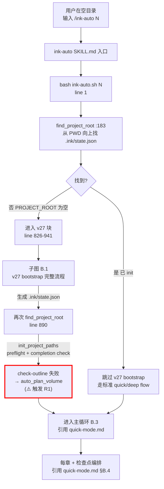
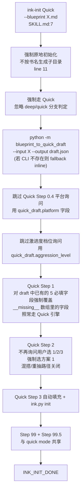

# v27 终极自动化模式（v27 Bootstrap Mode） — 函数级精确分析

> 来源：**codemap §6 漏列的第 4 主用户场景模式**。本文档基于 commit `268f2e1`（master 分支）的源码逐行核对。
> 触发链：在**只含蓝本.md 的空目录**（或完全空目录）执行 `/ink-auto N`，系统**自动**完成 init + plan + 写 N 章。
> ink-auto/SKILL.md 第 44-66 行原文称为"终极自动化模式（v27 新增）"。

---

## ⚠️ codemap 漏列说明

codemap §6-A "主用户场景模式（README 声明，3 个）" 仅列了：
- 6-A.1 快速模式 (`/ink-init --quick` → `/ink-plan 1` → `/ink-auto 20`)
- 6-A.2 深度模式 (`/ink-init` → `/ink-plan 1` → `/ink-auto 20`)
- 6-A.3 日常工作流 (`/ink-auto N` + `/ink-resume` + `/ink-resolve`)

**漏列**了：v27 终极自动化模式（应当作为 6-A.4）。该模式从用户视角是**单条命令 `/ink-auto N` + 1 个文件**就能从零开新书，与上述 3 模式平级。`quick-mode.md` 的 §B.5 + §C.4 已绘出代码路径，但作为"ink-auto 主流程的 if 分支"埋在 `/ink-auto 20` 内部，没有体现"用户视角的独立性"。本文档补齐。

---

## A. 模式概述

### A.1 触发命令（3 种触发条件）

```bash
# 触发 1：只放 1 份非黑名单蓝本.md 在空目录（用户最常用）
cd /path/to/empty-dir
echo "..." > my-blueprint.md   # 用户预先准备好 5 必填字段
/ink-auto 10

# 触发 2：完全空目录（无任何 .md）
cd /path/to/totally-empty-dir
/ink-auto 10
# → 自动启动 interactive_bootstrap.sh 弹 7 题问答
# → 落盘 .ink-auto-blueprint.md → 同触发 1 流程

# 触发 3：目录内只有黑名单 .md（README.md / CLAUDE.md / TODO.md / *.draft.md 等）
cd /path/with/only/README.md
/ink-auto 10
# → blueprint_scanner 跳过黑名单 → 同触发 2 流程（弹 7 题）
```

### A.2 最终达到的效果（用户视角）

**1 条命令 + 1 个文件 → 从零开新书 + 写 10 章**：

- 0-1 分钟：扫描蓝本、转换 quick draft
- 1-3 分钟：自动跑 ink-init Quick + --blueprint（强制原地初始化、跳过所有弹询问）
- 3-5 分钟：自动跑 ink-plan 第 1 卷
- 5-2.5 小时：写 10 章 + 检查点（与 quick mode 后半段等价）

用户**全程无任何交互**（除非走触发 2/3 的 7 题 bootstrap）。

### A.3 涉及文件清单

#### v27 bootstrap 路径独有的入口（5 个）

| 路径 | 行 | 角色 |
|---|---:|---|
| `ink-writer/scripts/ink-auto.sh:826-941` | 116 | v27 入口块；3 个开关检测 + 蓝本扫描 + 转换 + 子进程 init + 重新解析 root + 自动 plan |
| `ink_writer/core/auto/blueprint_scanner.py` | 46 | 包内主版本：扫 CWD 顶层非黑名单 .md，按 `st_size` 取最大那份 |
| `ink-writer/scripts/blueprint_scanner.py` | 62 | **plugin-internal copy**（与上面字节级几乎一致，差异：去掉 PEP 604 type hints + 加 `if __name__ == "__main__"` argparse 入口）|
| `ink-writer/scripts/interactive_bootstrap.sh` | 95 | 7 题快速 bootstrap；空目录 fallback |
| `ink_writer/core/auto/state_detector.py` | 43 | `detect_project_state(cwd)` → S0/S1/S2/S3 四态判定（**注意：codemap §6-D 写"S0/S1/S2"漏了 S3_COMPLETED**） |

#### v27 bootstrap 调用的已有入口（与 quick mode 共用，不重复列）

- `ink_writer/core/auto/blueprint_to_quick_draft.py` 218 行 — 已在 quick-mode.md §C.1 #5-8 详述
- `ink-writer/scripts/blueprint_to_quick_draft.py` — plugin-internal shim
- `ink-writer/skills/ink-init/SKILL.md` Quick Mode 分支 + `--blueprint` 子模式 (line 7-26)
- `ink-writer/skills/ink-plan/SKILL.md` 完整 8 步流程
- `ink-writer/scripts/ink-auto.sh` 主循环（line 1450+）
- 全套 init_project.py / 检查点 / 子进程编排

#### v27 bootstrap 产出的临时文件（在 PROJECT_ROOT 内）

| 路径 | 触发条件 | 用途 |
|---|---|---|
| `<PWD>/.ink-auto-blueprint.md` | 触发 2/3 | interactive_bootstrap.sh 落盘的蓝本 |
| `<PWD>/.ink-auto-quick-draft.json` | 触发 1/2/3 | blueprint → draft 转换产物 |
| `<PWD>/.ink-auto-init-<UTCts>.log` | 所有触发 | 子进程 ink-init Quick 的输出日志 |

---

## B. 执行流程图

### B.0 主图：用户视角的 v27 终极自动化（与 6-A.1/6-A.2/6-A.3 平级）



### B.1 子图：v27 bootstrap 完整 7 步

```mermaid
flowchart TD
    Empty[ink-auto.sh:830<br>PROJECT_ROOT 空] --> Switch1{INK_AUTO_INIT_ENABLED<br>= 1?}
    Switch1 -->|否 用户禁用| Exit1["echo 禁用提示<br>exit 1"]
    Switch1 -->|是默认| SetCwd["PROJECT_ROOT=$PWD<br>line 838"]

    SetCwd --> Switch2{INK_AUTO_BLUEPRINT_ENABLED<br>= 1?}
    Switch2 -->|是默认| Scan["python blueprint_scanner.py<br>--cwd $PROJECT_ROOT<br>line 848-850"]
    Switch2 -->|否| BPNone[BLUEPRINT_PATH=""]

    Scan -->|find_blueprint cwd| ScanLogic["遍历 cwd.iterdir<br>跳过 8 个黑名单<br>+ *.draft.md<br>按 st_size 取 max"]
    ScanLogic -->|找到| BPGot["echo 📄 找到蓝本: <path><br>line 854"]
    ScanLogic -->|无| BPNone

    BPNone --> Switch3{INK_AUTO_INTERACTIVE<br>_BOOTSTRAP_ENABLED = 1?}
    Switch3 -->|否| Exit2["echo 提示<br>exit 1"]
    Switch3 -->|是默认| Boot["bash interactive_bootstrap.sh<br>.ink-auto-blueprint.md<br>line 863"]

    Boot -->|"7 个 prompt_required/with_default"| Q7["1/7 题材方向 必填<br>2/7 主角一句话人设 必填<br>3/7 金手指类型 8 选 1 必填<br>4/7 金手指能力一句话 必填<br>5/7 核心冲突 必填<br>6/7 平台 默认 qidian<br>7/7 激进度 默认 2"]
    Q7 -->|"trap INT cleanup_on_interrupt<br>⌃C 删半成品 exit 130"| BPSave[".ink-auto-blueprint.md<br>5 段标准模板"]
    BPSave --> BPGot

    BPGot --> Convert["python blueprint_to_quick_draft.py<br>--input X --output .ink-auto-quick-draft.json<br>line 871-872"]
    Convert -->|"BLUEPRINT_INVALID exit 2<br>BLUEPRINT_IO_ERROR exit 3"| Exit3["echo 蓝本校验失败<br>exit 1"]
    Convert -->|exit 0| ConvertOk[".ink-auto-quick-draft.json 落盘"]

    ConvertOk --> SubInit[".ink-auto-init-<ts>.log = log<br>构造 INIT_PROMPT<br>含 强制原地初始化 + draft 路径"]
    SubInit --> RunCli["run_cli_process INIT_PROMPT log<br>启 claude/gemini/codex 子进程<br>跑 ink-init --quick --blueprint X<br>line 881"]

    RunCli -->|"watchdog 1200s + 子进程跑完整 ink-init Quick<br>含 Step 99 + Step 99.5"| InitDone{exit 0?}
    InitDone -->|否| Exit4["echo 自动初始化失败<br>提示手动重跑<br>exit 1"]
    InitDone -->|是| Reroot[find_project_root 重新调用<br>line 890]

    Reroot -->|缺 state.json| Exit5["echo init 后仍未找到<br>exit 1"]
    Reroot -->|找到| InitPaths["init_project_paths<br>设 LOG_DIR/REPORT_FILE/MIN_WORDS_HARD/MAX_WORDS_HARD"]
    InitPaths --> Preflight["python ink.py preflight<br>line 900"]
    Preflight -->|失败| Exit6[exit 1]
    Preflight -->|通过| CompCheck["is_project_completed"]
    CompCheck -->|completed| ExitDone[exit 0 全书已完结]
    CompCheck -->|继续| OutlineCheck["check-outline 第N章批量"]
    OutlineCheck -->|缺| AutoPlan["auto_plan_volume ⚠️<br>line 929 R1 路径 B"]
    OutlineCheck -->|完整| Loop[进入 ink-auto 主循环<br>引用 quick-mode.md §B.3]
    AutoPlan --> Loop

    style Exit1 stroke-dasharray: 5 5
    style Exit2 stroke-dasharray: 5 5
    style Exit3 stroke-dasharray: 5 5
    style Exit4 stroke-dasharray: 5 5
    style Exit5 stroke-dasharray: 5 5
    style Exit6 stroke-dasharray: 5 5
    style ExitDone stroke-dasharray: 5 5
    style AutoPlan stroke:#f00,stroke-width:3px
```



### B.2 ink-init --blueprint 子流程

ink-init Quick + `--blueprint` 模式（SKILL.md:7-26）：



---

## C. 函数清单

### C.1 v27 bootstrap 阶段独有函数

| # | 函数 / 节点 | 文件:行 | 输入 | 输出 | 副作用 | 调用者 | 被调用者 |
|---:|---|---|---|---|---|---|---|
| V1 | bash 入口主体 | ink-auto.sh:826-941 | argv N | 设置 PROJECT_ROOT 等 + 进主循环 | 全部 v27 副作用 | bash 顶层 | 见下表 |
| V2 | `find_blueprint` | ink_writer/core/auto/blueprint_scanner.py:31 | cwd Path | Path \| None | 📖 cwd.iterdir + entry.stat | shim CLI | _is_blacklisted |
| V3 | `_is_blacklisted` | blueprint_scanner.py:22 | name str | bool | 8 个固定黑名单 + `*.draft.md` 后缀检查 | find_blueprint | — |
| V4 | `blueprint_scanner.py` shim 入口 | ink-writer/scripts/blueprint_scanner.py:51-62 | --cwd path | stdout 蓝本 path | 与包内主版本字节级相似（去 PEP 604 hints + argparse） | LLM via Bash (ink-auto.sh:848) | find_blueprint |
| V5 | `interactive_bootstrap.sh` 主体 | ink-writer/scripts/interactive_bootstrap.sh:1-95 | argv `<output_path>` | 0/130/1 exit | 📂 写 `<output_path>`；trap INT 删半成品；7 个 prompt_required/with_default | LLM via Bash (ink-auto.sh:863) | prompt_required, prompt_with_default, cat heredoc |
| V6 | `prompt_required` | interactive_bootstrap.sh:20 | prompt str | echo 用户输入 | 📖 stdin；空值循环重问 | 5 次（Q1-Q5） | read |
| V7 | `prompt_with_default` | interactive_bootstrap.sh:33 | prompt str, default str | echo 用户输入或默认 | 📖 stdin；空值用默认 | 2 次（Q6 platform / Q7 aggression） | read |
| V8 | `cleanup_on_interrupt` (trap INT) | interactive_bootstrap.sh:12 | — | exit 130 | 📂 rm -f `<output_path>`；防止半成品蓝本残留 | bash trap | rm |
| V9 | `detect_project_state` | ink_writer/core/auto/state_detector.py:20 | cwd Path | ProjectState enum | 📖 `<cwd>/.ink/state.json`；📖 `<cwd>/大纲/第*章*.md` | ink-auto.sh:503-509（v27 之外的 PROJECT_STATE 检测） | json.loads |
| V10 | `INIT_PROMPT` 构造 | ink-auto.sh:879 | BLUEPRINT_PATH, DRAFT_PATH, PROJECT_ROOT | str prompt | 含**强制原地初始化**指令 + 禁止提问指令 + 输出约定 | bash inline | — |

### C.2 v27 bootstrap 调用的已有函数

**完全引用** [quick-mode.md §C.1](./quick-mode.md#c1-ink-init---quick-阶段约-18-个真实函数--多个-llm-工具调用) 中的 #5-8 (blueprint_to_quick_draft 全套) + [quick-mode.md §C.3](./quick-mode.md#c3-ink-auto-20-阶段ink-autosh--子进程约-30-个-bash-函数--python-调用) 中的 #40 `find_project_root` / #41 `init_project_paths` / #46 `is_project_completed` / #55 `run_cli_process` / #56 `run_chapter` 等。

### C.3 ink-init Quick + --blueprint 子流程函数

**完全引用** [quick-mode.md §B.1 + §C.1](./quick-mode.md#b1-子图ink-init---quickllm-编排单-cli-进程内完成)。差异仅在 `--blueprint` 强制 6 项跳过：跳 Step 0.4 / 跳 Step 0.5 / Quick Step 1 字段锁定 / Quick Step 2 强制方案 1 / 关闭混搭 / 关闭重抽。

---

## D. IO 文件全景表

### D.1 v27 独有 IO（在 quick-mode.md §D 基础上**追加 6 项**）

| 文件路径 | 操作 | 触发函数 | 时机 | 格式 |
|---|---|---|---|---|
| `<PWD>/<user-blueprint>.md` | 读 | `find_blueprint` (blueprint_scanner.py:31) | v27 触发 1：用户预先放置 | Markdown |
| `<PWD>/.ink-auto-blueprint.md` | ★新建 | `interactive_bootstrap.sh` heredoc (line 57-91) | v27 触发 2/3：弹 7 题问答完成后 | Markdown，5 段标准模板 |
| `<PWD>/.ink-auto-blueprint.md` | 删除 | `cleanup_on_interrupt` (interactive_bootstrap.sh:12) | 用户在问答中 ⌃C | — |
| `<PWD>/.ink-auto-quick-draft.json` | ★新建 | `blueprint_to_quick_draft.py:_main` | 蓝本转换成功 | JSON, draft schema |
| `<PWD>/.ink-auto-init-<UTCts>.log` | ★新建 | `run_cli_process` via `parse_progress_output` | 子进程跑 ink-init Quick 全程 | text 日志 |
| `<PWD>/.ink/state.json` 等 9 个核心文件 | ★新建 | `init_project.py` 通过子进程跑 | ink-init Quick + --blueprint 完成 | （与 quick mode 完全相同） |

### D.2 状态判定 IO（state_detector）

| 路径 | 操作 | 用于判定 |
|---|---|---|
| `<cwd>/.ink/state.json` | 读 | 缺失 → S0_UNINIT |
| 同上 | 解析 | `progress.is_completed=true` → S3_COMPLETED |
| `<cwd>/大纲/第*章*.md` | 列出 | 0 个 → S1_NO_OUTLINE；≥1 个 → S2_WRITING |

### D.3 后续 IO

**完全引用** [quick-mode.md §D](./quick-mode.md#d-io-文件全景表)。即 init/plan/auto 阶段的全部 IO 与 v27 触发的 quick mode 等价。

### D.4 环境变量（3 个 v27 独有 + 已有共享）

| 变量 | 默认 | 作用 |
|---|---|---|
| **`INK_AUTO_INIT_ENABLED`** | `1` | v27 总开关；`0` → 退化到 v26 行为（state.json 缺失 → exit 1） |
| **`INK_AUTO_BLUEPRINT_ENABLED`** | `1` | 蓝本扫描开关；`0` → 跳过扫描，所有触发都走 7 题 bootstrap |
| **`INK_AUTO_INTERACTIVE_BOOTSTRAP_ENABLED`** | `1` | 交互 bootstrap 开关；`0` → 触发 2/3 直接报错退出，不弹 7 题 |
| `INK_AUTO_COOLDOWN` / `INK_AUTO_CHECKPOINT_COOLDOWN` / `INK_AUTO_CHAPTER_TIMEOUT` | （已有） | 与 quick mode 共用 |
| `INK_PROJECT_ROOT` / `CLAUDE_PROJECT_DIR` / `OSTYPE` | （已有） | 同 |

---

## E. 关键分支与边界

### E.1 v27 bootstrap 的 3 个回滚开关

| 开关组合 | 行为 |
|---|---|
| 全 `1`（默认） | 触发 1：用蓝本；触发 2：弹 7 题；触发 3：弹 7 题 |
| `INK_AUTO_INIT_ENABLED=0` | 任何空目录都直接 exit 1（彻底关 v27） |
| `INK_AUTO_BLUEPRINT_ENABLED=0` | 即使有合法蓝本也跳过；触发 1 退化为触发 2 |
| `INK_AUTO_INTERACTIVE_BOOTSTRAP_ENABLED=0` | 触发 2/3 直接 exit 1（不弹 7 题）；触发 1 仍然走蓝本 |
| `INK_AUTO_BLUEPRINT_ENABLED=0` 且 `INK_AUTO_INTERACTIVE_BOOTSTRAP_ENABLED=0` | 任何空目录都直接 exit 1（即使有蓝本也不用） |

### E.2 蓝本扫描黑名单（8 + 1）

```python
BLACKLIST = {"README.md", "CLAUDE.md", "TODO.md", "CHANGELOG.md",
             "LICENSE.md", "CONTRIBUTING.md", "AGENTS.md", "GEMINI.md"}
+ 任何 *.draft.md（不区分大小写）
```

匹配规则：`name.upper()` 大小写不敏感；后缀检查 `name.upper().endswith(".DRAFT.MD")`。

### E.3 蓝本择优规则

`find_blueprint` 用 `max(candidates, key=lambda p: p.stat().st_size)` —— **按文件字节数取最大**。

**潜在小坑**：如果用户放了 2 个非黑名单 .md（比如 `notes.md` + `blueprint.md`），系统会按字节数大者获胜，可能误选 `notes.md`。

### E.4 7 题 bootstrap 的字段映射

| 题号 | 用户输入 | 字段 | 类型 | 去向 |
|---:|---|---|---|---|
| 1/7 | 题材方向（必填） | `### 题材方向` | required | quick_draft.题材方向 |
| 2/7 | 主角一句话人设（必填） | `### 主角人设` | required | quick_draft.主角人设 |
| 3/7 | 金手指类型 8 选 1（必填） | `### 金手指类型` | required（实际无校验，用户可乱写） | quick_draft.金手指类型 |
| 4/7 | 金手指能力一句话 ≤20 字（必填） | `### 能力一句话` | required（实际无长度校验） | quick_draft.能力一句话 |
| 5/7 | 核心冲突一句话（必填） | `### 核心冲突` | required | quick_draft.核心冲突 |
| 6/7 | 平台 qidian/fanqie | `### 平台` | default=qidian | quick_draft.platform |
| 7/7 | 激进度档位 1-4 | `### 激进度档位` | default=2 | quick_draft.aggression_level |
| —（自动） | `### 主角姓名` | `AUTO` | — | __missing__ 数组（让 quick 引擎补） |
| —（自动） | `### 女主姓名` | `AUTO` | — | 同上 |

### E.5 INIT_PROMPT 强制约束（line 879）

```
"使用 Skill 工具加载 \"ink-init\"。模式：--quick --blueprint <BLUEPRINT_PATH>。
 draft.json 路径: <DRAFT_PATH>。项目目录: <PROJECT_ROOT>
 （**强制在该目录原地初始化，不要根据书名生成子目录**；
   最终 .ink/state.json 必须落在 <PROJECT_ROOT>/.ink/state.json）。
 禁止提问，全程自主执行，最终输出 INK_INIT_DONE 或 INK_INIT_FAILED。"
```

5 个强制约束：
1. 使用 ink-init skill
2. 模式 = Quick + --blueprint
3. **强制原地初始化**（覆盖 SKILL.md "项目目录安全规则"）
4. 禁止提问（覆盖 Quick Step 0.5 等弹询问）
5. 输出固定 token（INK_INIT_DONE / INK_INIT_FAILED）让 sh 检测

### E.6 v27 独有 / 加重的 Bug 与风险

| # | 严重度 | 现象 | 证据 | v27 独有 vs 加重 |
|---:|---|---|---|---|
| **R1** | 🔴 高 | `auto_plan_volume` 函数未定义 | quick-mode.md §E.7 R1 | **v27 加重** — Path B (line 929) 在 v27 自动 init 后**100% 触发**该路径（init 完肯定缺章纲）；Path A (line 534) 是已 init 项目的 S1_NO_OUTLINE 罕见情况 |
| **R3** | 🟡 中 | `local _vol` 用在非函数体（ink-auto.sh:928）触发 `set -e` exit | quick-mode.md §E.7 R3 | **v27 触发条件更具体** — 几乎每次 v27 bootstrap 走完都会撞上这一行 |
| **V-R1** | 🟡 中 | `find_blueprint` 按 st_size 取 max，**用户放 2 份合法 md 时会误选**最大那份 | blueprint_scanner.py:46 | **v27 独有** — 用户希望明确指定蓝本时无 hint 机制 |
| **V-R2** | 🟡 中 | `interactive_bootstrap.sh` 的 7 题问答**没有任何输入校验**（金手指类型问"8 选 1"但实际任意字符串都接受；能力一句话问"≤20 字"但无长度检查） | interactive_bootstrap.sh:51-52 | **v27 独有** — 用户输入垃圾会传到下游 blueprint_to_quick_draft.py，可能在 v2.0 cost 校验阶段才被拦截 |
| **V-R3** | 🟡 中 | `INIT_PROMPT` 用字符串拼接构造，**蓝本路径含特殊字符**（空格 / 引号 / 中文括号）时会破坏 prompt 结构 | ink-auto.sh:879 | **v27 独有** — 用户路径如 `~/My Notes (2026)/` 可能被 LLM 误解析 |
| **V-R4** | 🟢 低 | `interactive_bootstrap.sh` 第 53/55 题用 `prompt_with_default`，但**没有校验 platform ∈ {qidian, fanqie}**或 aggression ∈ {1,2,3,4} | interactive_bootstrap.sh:54-55 | **v27 独有** — 用户输入 "腾讯" / "5" 会传到 blueprint_to_quick_draft._coerce_aggression 兜底为 2，但 platform 没有兜底（最终走 `_PLATFORM_DEFAULTS["qidian"]`） |
| **V-R5** | 🟢 低 | `blueprint_scanner` 包内主版本（46 行）与 plugin shim（62 行）**靠 docstring "Keep in lockstep" 约束同步**，无自动一致性测试 | 两文件 diff 显示差异（包版本有 PEP 604，shim 无） | **v27 独有** — 未来一方更新另一方忘记同步会静默漂移 |
| **V-R6** | 🟢 低 | `state_detector.detect_project_state` 在 ink-auto.sh:503-509 调用，但**v27 路径上不调它** | state_detector.py 整个 enum 只在 ink-auto.sh:503 用一次 | 设计冗余 — v27 直接用 `find_project_root` 失败检测，未利用 4 态判定的精度 |
| **V-R7** | 🟢 低 | codemap §6-D 把 state 写为 "S0/S1/S2"，**漏了 S3_COMPLETED** | state_detector.py:13-17 实际有 4 态 | codemap 文档错误 |
| **V-R8** | 🟢 低 | INK_AUTO_INIT_ENABLED=0 时的退化提示**没有指明环境变量名** | ink-auto.sh:833 仅说 "v27 自动初始化已被禁用" 但用户不知道哪个变量 | 用户体验问题 |

### E.7 quick mode / deep mode 风险继承

**全部继承** [quick-mode.md §E.7 R1-R10](./quick-mode.md#e7--已识别的-bug--风险) 与 [debug-mode.md §E.10](./debug-mode.md#e10-已识别的-bug--风险向-codemap-7-第-6-项补充)。**特别提醒 R1 在 v27 路径上是必触发的高危**。

---

## 附录：v27 工作流时序速查

```
T=0      用户在 /path/to/empty-dir 输入 /ink-auto 10
T+1s     bash ink-auto.sh 10 启动
T+2s     find_project_root 失败 → PROJECT_ROOT="" → 进 v27 块
T+3s     INK_AUTO_INIT_ENABLED=1 检查通过 → PROJECT_ROOT=$PWD
T+5s     blueprint_scanner.py --cwd $PWD
         触发 1：扫到 my-blueprint.md → BLUEPRINT_PATH=/path/.../my-blueprint.md
         触发 2/3：未扫到 → 启动 interactive_bootstrap.sh 7 题
T+1m     blueprint_to_quick_draft.py --input X --output .ink-auto-quick-draft.json
T+1m5s   构造 INIT_PROMPT → run_cli_process 启子进程
T+1m5s   子进程 1：跑 ink-init Quick + --blueprint
         - 跳过 Step 0.4 平台询问（用 draft.platform）
         - 跳过 Step 0.5 档位询问（用 draft.aggression_level）
         - Quick Step 1：3 套方案，draft 字段强制覆盖
         - Quick Step 2：强制选方案 1
         - Quick Step 3：调 init_project.py 写 11 目录 + 9 文件
         - Step 99/99.5：跑 4+1 个 checker
         - 输出 INK_INIT_DONE
T+8m     子进程退出 → ink-auto.sh: find_project_root 重新解析 → 成功
T+8m5s   init_project_paths + preflight + completion check
T+8m10s  check-outline 失败 → auto_plan_volume ⚠️
         （R1 触发：函数未定义 → 走 else 分支 → echo "❌ 失败" → exit 1）
         实际行为：用户看到 "第 1 卷大纲生成失败"，根因不可见
T+8m10s  exit 1 — 用户必须手动 /ink-plan 1 解决
T+8m20s  用户跑 /ink-plan 1 → 第 1 卷完整大纲生成
T+15m    用户再次 /ink-auto 10 → 进标准 quick mode 路径 → 写 10 章
T+~3h    全部 10 章完成 → auto-<ts>.md 报告
```

**关键观察**：v27 终极自动化的设计目标是"1 条命令搞定一切"，**但 R1 bug 让它在大多数情况下中断在 init 后的 auto_plan 阶段**，用户必须手动接管 /ink-plan 才能继续。修复 R1 后，v27 才能真正实现"零交互、零中断"的承诺。
