# US-002 主写作链路端到端追踪（Writing Pipeline Trace）

**审计对象**：ink-writer v13.8.0 `/ink-auto` 与 `/ink-write` 完整写作链路
**审计范围**：入口脚本 → context → writer → checker_pipeline (14+ checker) → gate → polish → data → audit 的端到端数据流
**审计方式**：只读源码追踪，不修改任何文件
**审计者**：深度健康审计 US-002 执行者
**审计时间**：2026-04-17

---

## Executive Summary

ink-writer 主写作链路表面上由 `/ink-auto`（多章编排）驱动 `/ink-write`（单章 13 步流水线），经 context-agent → writer-agent → 8 核心 + 7 条件 checker → 5 个 Python 门禁（Step 3.6-3.10） → polish-agent → data-agent → workflow complete → git 备份。整条链路的**规格（SKILL.md + pipeline-dag.md + agents/*.md）非常完备**，但**运行时真实执行链比规格浅得多**——大部分编排依赖 LLM 读取 SKILL.md 的自然语言指令后自行 Task 调用子 Agent，缺少确定性的 Python orchestrator 兜底。

**关键定性结论**：

1. `/ink-auto` → `/ink-write` 的跨会话编排（`ink-auto.sh`）是真实运行的 bash + CLI 进程调度，本身稳健。
2. `/ink-write` 内部 13 步流程**完全依赖 LLM 逐条阅读 SKILL.md 并自行调度 Task 子代理**，没有 Python orchestrator 作为确定性兜底。14+ checker 的并发编排由 LLM 在 prompt 里遵守"最大并发 2"规则实现。
3. 存在一个完整的 Python 异步 checker 并发框架 `ink_writer.checker_pipeline.CheckerRunner` / `GateSpec`，但**没有任何生产代码引用它，只有测试文件使用**——这是最严重的"规格有，运行时不存在"断边。
4. Step 3.6-3.10 的 5 个 Python 门禁（`run_hook_gate` / `run_emotion_gate` / `run_anti_detection_gate` / `run_voice_gate` / `scan_plotlines`）在 SKILL.md 中被声明为"Python 模块"，实际上**全部只由测试引用，没有任何脚本或生产代码调用**。
5. `Step 3.5 Harness Gate`（`step3_harness_gate.py`）读取 `.ink/reports/review_ch*.json`，但 ink-write 流程中**没有任何代码写入这类文件**——因此该 gate 运行时几乎总是静默通过（无报告即默认通过）。
6. SKILL.md 中的"核心 8 个 checker"清单与 `ink-writer/agents/` 目录下的 24 个 agent 定义存在漂移：spec 未列 `editor-wisdom-checker` / `emotion-curve-checker` / `foreshadow-tracker` / `plotline-tracker` / `thread-lifecycle-tracker` 为 Step 3 checker，但这 5 个 agent 文件实际存在且被其他 Step（3.7 / 3.10 / 0 伏笔检查）隐式引用。

**pipeline 健康度一句话**：**前半段（ink-auto → Step 0-2A.5）扎实、确定性充分，Step 3 审查阶段起完全依赖 LLM 自律执行，关键 Python 门禁多为"规格陈列"——写到了 SKILL.md 但没有生产调用点，只有测试 import，导致规格与运行时存在系统性断层。**

---

## 完整 DAG（Mermaid，真实运行时版本）

```mermaid
flowchart TD
    User["用户 /ink-auto N"] --> AutoSh["ink-auto.sh"]
    AutoSh -->|"per chapter: run_cli_process"| ClaudeP["claude -p / gemini / codex 子进程"]
    ClaudeP -->|"Skill 工具加载 ink-write"| WriteSkill["ink-write SKILL.md<br/>2201 行 LLM 指令"]

    WriteSkill -->|"Step 0-0.3"| Preflight["preflight + check-outline<br/>scripts/ink.py"]
    Preflight -->|"Step 0.7 Canary"| Canary["内联 Python SQL<br/>A.1-A.6"]
    Canary -->|"Step 0.5/0.6"| Workflow1["workflow start-task/start-step<br/>data_modules/workflow_manager"]
    Workflow1 -->|"Step 0.8"| PermCard["index get-entity 权限卡"]
    PermCard -->|"Step 1"| Ctx["ink.py extract-context --format pack<br/>或 Task context-agent 兜底"]

    Ctx -->|"写作执行包"| Writer["Task: writer-agent<br/>(主流程内联)"]
    Writer -->|"章节 md 文件"| SelfScan["Step 2A.1 自洽回扫"]
    SelfScan -->|"encoding_validator + wc -m"| WcGate["Step 2A.5 字数硬门"]
    WcGate -->|"≥ 2200"| Style2B["Step 2B 风格适配<br/>内联 + step2b_metrics.py"]
    Style2B -->|"computational_checks.py"| CompGate["Step 2C 计算型闸门<br/>11 项确定性检查"]

    CompGate -->|"extract-context review-pack-json"| ReviewBundle["review_bundle_ch{N}.json"]
    ReviewBundle -->|"slim_review_bundle.py"| SlimMap["slim_bundle_map.json<br/>per-checker 瘦身包"]
    SlimMap -->|"Task 并发 max 2"| CoreCheckers["核心 8 checker:<br/>consistency / continuity / ooc / logic /<br/>outline-compliance / anti-detection /<br/>reader-simulator / flow-naturalness"]
    CoreCheckers -->|"auto 命中"| CondCheckers["条件 checker:<br/>golden-three / reader-pull / high-point /<br/>pacing / proofreading / prose-impact /<br/>sensory-immersion"]

    CondCheckers -->|"LLM 合成 review_metrics.json"| SaveMetrics["ink.py index save-review-metrics"]
    SaveMetrics -->|"Step 3.5 harness"| HarnessGate["step3_harness_gate.py<br/>读 review_ch*.json"]
    HarnessGate -->|"Step 3.51-3.54"| LogicGates["逻辑/大纲/prose-impact/flow gate<br/>(LLM 内联判定)"]
    LogicGates -->|"Step 3.6-3.10"| FiveGates["5 Python 门禁<br/>(spec 声明未实现调用)"]

    FiveGates -->|"Step 4"| Polish["Task: polish-agent"]
    Polish -->|"Step 4.5 diff 校验"| SafetyCheck["encoding + 情感扁平差分"]
    SafetyCheck -->|"Step 5"| Data["Task: data-agent"]
    Data -->|"state process-chapter"| StateWrite["ink.py state process-chapter<br/>写 state.json + index.db + summaries/"]
    StateWrite -->|"Step 5 Mini-Audit"| MiniAudit["C.1-C.4 内联 SQL"]
    MiniAudit -->|"Step 5.5 可选"| Cascading["前序章数据修复"]
    Cascading -->|"Step 6"| Git["git add + commit"]
    Git -->|"workflow complete-task"| WorkflowDone["progress.current_chapter++"]

    WorkflowDone -->|"返回 ink-auto.sh"| VerifyCh["verify_chapter + cooldown"]
    VerifyCh -->|"checkpoint-level N%5==0?"| Checkpoint["run_checkpoint"]
    Checkpoint -->|"审计"| InkAudit["Task: ink-audit skill"]
    Checkpoint -->|"宏观审查"| Macro["Task: ink-macro-review"]
    Checkpoint -->|"修复"| Fix["Task: ink-fix skill<br/>(读报告/修复正文或 DB)"]

    style CoreCheckers fill:#cfe
    style FiveGates fill:#fcc
    style HarnessGate fill:#fcc
    style CondCheckers fill:#cfe
    style Fix fill:#ffe
```

**图例**：
- 绿色：真实运行（代码有实现，生产调用点存在）
- 红色：**规格存在、运行时断边**（SKILL.md 声明但没有生产调用者）
- 黄色：部分运行（依赖 LLM 是否执行）
- 白色：真实运行的确定性代码

---

## 边逐条数据流表

### 第一层：跨章节编排（ink-auto.sh）

| # | 上游 → 下游 | 传递数据 | 代码位置 | 真实性 |
|---|-------------|---------|---------|--------|
| 1 | User `/ink-auto N` → `ink-auto.sh` | N（章数）、`--parallel`、`INK_AUTO_COOLDOWN` | `ink-writer/scripts/ink-auto.sh:24-43` | 真实 |
| 2 | `ink-auto.sh` → `run_chapter(ch)` | `ch`（从 state.json 读取 current+1）、prompt 字符串 | `ink-writer/scripts/ink-auto.sh:648-661` | 真实 |
| 3 | `run_chapter` → `run_cli_process` | prompt、log_file、PLATFORM（claude/gemini/codex） | `ink-writer/scripts/ink-auto.sh:610-642` | 真实 |
| 4 | `run_cli_process` → `claude -p` 子进程 | "使用 Skill 工具加载 ink-write 并完整执行 Step 0 到 Step 6" | `ink-writer/scripts/ink-auto.sh:617-622` | 真实 |
| 5 | 子进程 → LLM 运行时加载 `ink-write/SKILL.md` | 文件内容 2201 行自然语言 | Claude CLI 内部 Skill 机制 | 真实 |
| 6 | `ink-auto.sh` → `run_checkpoint(ch)` | `ch`、触发 `ink.py checkpoint-level` 返回 JSON `{review, audit, macro, disambig, review_range}` | `ink-writer/scripts/ink-auto.sh:913-1028` | 真实 |
| 7 | `run_checkpoint` → `run_review_and_fix / run_audit / run_macro_review` | skill 名 + prompt | `ink-writer/scripts/ink-auto.sh:796-882` | 真实 |
| 8 | `run_*` → `run_auto_fix` | report_path、fix_type、scope | `ink-writer/scripts/ink-auto.sh:739-790` | 真实 |
| 9 | 并发模式分支 → `PipelineManager.run(N)` | `PipelineConfig(project_root, parallel, cooldown, platform, max_retries)` | `ink_writer/parallel/pipeline_manager.py` | 真实（被 `ink-auto.sh:1097-1113` 调用） |

### 第二层：单章流水线（ink-write SKILL.md 13 步）

| # | 上游 → 下游 | 传递数据（字段） | 代码位置 | 真实性 |
|---|-------------|------------------|---------|--------|
| 10 | Step 0 preflight → Step 0 check-outline | `PROJECT_ROOT`、`chapter_num`、`EMBED_API_KEY` 可达性 | `ink-writer/scripts/ink-auto.sh` + `scripts/data_modules/ink.py preflight/check-outline` | 真实 |
| 11 | Step 0.3 → memory auto-compress | chapter_num → `needed: bool, prompt: str` | `ink_writer/memory_compressor`（隐式） | 真实（SKILL.md 声明） |
| 12 | Step 0.7 A.1 → CANARY_PROTAGONIST_SYNC | state.json.protagonist_state vs index.db.entities.is_protagonist=1 | ink-write SKILL.md 行 451-497 内联 Python | 真实（LLM 执行内联 bash） |
| 13 | Step 0.7 A.2-A.6 → canary_injections 列表 | `character_evolution_ledger`、`plot_structure_fingerprints`、`timeline_anchors`、`plot_thread_registry` SQL 查询结果 | SKILL.md 行 520-688 内联 Python | 真实 |
| 14 | Step 0.7 → Step 1 执行包第 N 板块 | `canary_injections`（字符串列表） | SKILL.md 行 856-881 | 真实但仅 LLM 遵守 |
| 15 | Step 1 脚本路径 → context pack | `chapter` → 完整 JSON（16+1 板块任务书 + Context Contract + Step 2A 直写提示词 + MCC + 否定约束 + 上章退出快照） | `ink-writer/scripts/extract_chapter_context.py:build_pack_payload` 等 | 真实 |
| 16 | Step 1 兜底 → Task context-agent | pack-json + `chapter` + `project_root` + `storage_path` + `state_file` | `ink-writer/agents/context-agent.md` 消费 | 部分（Task 调用依赖 LLM） |
| 17 | Step 1 → Step 2A（writer-agent） | 创作执行包（完整文本）+ 金丝雀约束 + MCC + voice_profile + shot_plan/sensory_plan/info_plan 起草锚定 | `ink-writer/agents/writer-agent.md` 消费 | 真实（Task 由 LLM 发起） |
| 18 | Step 2A → 章节 md 文件 | 纯中文正文 Markdown，落在 `正文/第{NNNN}章-{title}.md` | writer-agent 直接 Write 工具 | 真实 |
| 19 | Step 2A.1 → `.ink/tmp/selfcheck_scan_ch{NNNN}.json` | 6 项 SC 结果（SC-1…SC-6） + `scan_unresolved` 标记 | writer-agent 自回扫 | **依赖 LLM 遵守** |
| 20 | Step 2A.5 → 字数校验 | `WORD_COUNT`（bash `wc -m`）、`encoding_validator` 退出码 | `ink-writer/scripts/encoding_validator.py` | 真实 |
| 21 | Step 2B → 风格化正文（覆盖章节文件） | `step2b_metrics.py` 输出 `{mode, long_sentences, summary_phrases}` | `ink-writer/scripts/step2b_metrics.py` | 真实 |
| 22 | Step 2C → computational_checks.py | `project_root, chapter, chapter_file` → `{hard_failures, soft_warnings}` JSON | `ink-writer/scripts/computational_checks.py` | 真实（11 项确定性） |
| 23 | Step 3 pre → review_bundle_ch{N}.json | `extract-context --format review-pack-json` 全量包 | `extract_chapter_context.py:build_review_pack_payload` | 真实 |
| 24 | Step 3 pre → slim_bundle_map.json | `checkers` 列表 + `--precheck` → per-checker 瘦身包路径 map | `ink-writer/scripts/slim_review_bundle.py` + `logic_precheck.py` | 真实 |
| 25 | Step 3 → 14+ checker Task 调用 | `review_bundle_file` 路径、`chapter_file` 路径 | `ink-writer/agents/*-checker.md`；LLM 遵守"max 并发 2" | 真实但 orchestration 只在 prompt 层 |
| 26 | checkers → LLM 合成 review_metrics.json | 各 checker 返回 `{issues, severity_counts, dimension_scores, reader_verdict}` | 无 Python orchestrator，LLM 收集 | **只在 LLM 心智中** |
| 27 | Step 3 end → ink.py index save-review-metrics | `review_metrics.json` 字段：`overall_score, dimension_scores, severity_counts, critical_issues, review_payload_json.reader_verdict` | `scripts/data_modules/ink.py` → index.db.review_metrics | 真实 |
| 28 | Step 3 end → index save-harness-evaluation | `{chapter, reader_verdict, review_depth}` → index.db.harness_evaluations | `scripts/data_modules/ink.py` | 真实 |
| 29 | Step 3.5 → step3_harness_gate.py | 读 `.ink/reports/review_ch*.json`（**不存在，因此默认通过**） | `ink-writer/scripts/step3_harness_gate.py:18-85` | **规格存在但上游无产出** |
| 30 | Step 3.5 → editor_wisdom.review_gate.run_review_gate | `chapter_text, chapter_no, project_root, checker_fn, polish_fn, config` | `ink_writer/editor_wisdom/review_gate.py` | 真实（唯一真实运行的 gate） |
| 31 | Step 3.6 → run_hook_gate(reader_pull_result) | SKILL.md 声明调用 `ink_writer.reader_pull.hook_retry_gate.run_hook_gate()` | `ink_writer/reader_pull/hook_retry_gate.py:86` 存在 | **NOT FOUND IN PRODUCTION CODE**：仅被测试 import |
| 32 | Step 3.7 → run_emotion_gate | SKILL.md 声明 `ink_writer.emotion.emotion_gate.run_emotion_gate()` | `ink_writer/emotion/emotion_gate.py:86` 存在 | **NOT FOUND IN PRODUCTION CODE**：仅被测试 import |
| 33 | Step 3.8 → run_anti_detection_gate | SKILL.md 声明 `ink_writer.anti_detection.anti_detection_gate.run_anti_detection_gate()` | `ink_writer/anti_detection/anti_detection_gate.py:130` 存在 | **NOT FOUND IN PRODUCTION CODE**：仅被测试 import |
| 34 | Step 3.9 → run_voice_gate | SKILL.md 声明 `ink_writer.voice_fingerprint.ooc_gate.run_voice_gate()` | `ink_writer/voice_fingerprint/ooc_gate.py:87` 存在 | **NOT FOUND IN PRODUCTION CODE**：仅被测试 import |
| 35 | Step 3.10 → scan_plotlines | SKILL.md 声明 `ink_writer.plotline.tracker.scan_plotlines()` | `ink_writer/plotline/tracker.py:129` 存在 | **NOT FOUND IN PRODUCTION CODE**：仅被测试 + ink-plan skill 声明引用 |
| 36 | Step 4 → polish-agent | `chapter_file, overall_score, issues[], editor_wisdom_violations, logic_fix_prompt, outline_fix_prompt, hook_fix_prompt, emotion_fix_prompt, anti_detection_fix_prompt, voice_fix_prompt, style_references` | `ink-writer/agents/polish-agent.md` | 真实（Task 由 LLM 调用） |
| 37 | Step 4.5 → diff 校验 + encoding + 情感扁平 | 润色前快照 vs 润色后，`pre_polish_ch{N}.md` | SKILL.md 内联 + `encoding_validator.py` | 真实（内联 Python） |
| 38 | Step 5 → data-agent Task | `chapter, chapter_file, review_score, project_root, storage_path, state_file` | `ink-writer/agents/data-agent.md` | 真实 |
| 39 | data-agent → data_agent_payload_ch{N}.json | entities_appeared, entities_new, state_changes, relationships_new, scene_slices, narrative_commitments_new, character_evolution_entries, scenes, chapter_meta, chapter_memory_card, timeline_anchor, plot_thread_updates, reading_power, candidate_facts | writer 直接 Write 临时文件 | 真实 |
| 40 | Step 5 → ink.py state process-chapter | `--data @payload.json`、`--chapter N` | `scripts/data_modules/ink.py state process-chapter` | 真实（单一写入口） |
| 41 | state process-chapter → state.json / index.db / summaries | 完整 chapter_meta、chapter_memory_cards、chapter_reading_power、scenes、appearances、state_changes 多表写入 | `ink_writer` IndexManager + StateManager（mixins） | 真实 |
| 42 | Step 5 → Mini-Audit C.1-C.4 | 内联 Python SQL：主角同步、appearances 数量、timeline 锚点、最近 5 章分数趋势 | SKILL.md 行 1789-1945 | 真实（LLM 执行内联 bash） |
| 43 | Step 5.5 → 前序章数据修复 | `chapter_meta[前序章]` 字段修正 | SKILL.md 行 1948-1984 | **依赖 LLM 自行判定条件**（代码无实现） |
| 44 | Step 6 → git commit | 精确文件列表 | `ink-writer/scripts/ink-auto.sh` 外层 + SKILL.md 内联 | 真实 |
| 45 | Step 6 end → workflow complete-task | `{ok:true, git_backup:true/false}` | `scripts/data_modules/ink.py workflow` | 真实 |

### 第三层：检查点（每 5/10/20 章）

| # | 上游 → 下游 | 传递数据 | 代码位置 | 真实性 |
|---|-------------|---------|---------|--------|
| 46 | `run_checkpoint(ch)` → `checkpoint-level` | `ch` → `{review: bool, audit: str, macro: str, disambig: bool, review_range: [s, e]}` | `ink-writer/scripts/ink-auto.sh:913-935` + `ink.py checkpoint-level` | 真实 |
| 47 | `run_review_and_fix` → 新 CLI 进程加载 ink-review | `"ink-review" + 章范围 + Core 深度` | `ink-writer/scripts/ink-auto.sh:796-822` | 真实 |
| 48 | `run_audit` → 新 CLI 进程加载 ink-audit | `"ink-audit" + quick/standard/deep 深度` | `ink-writer/scripts/ink-auto.sh:828-852` | 真实 |
| 49 | `run_macro_review` → 新 CLI 进程加载 ink-macro-review | `"ink-macro-review" + Tier2/Tier3` | `ink-writer/scripts/ink-auto.sh:858-882` | 真实 |
| 50 | `run_auto_fix(report_path, fix_type)` → 新 CLI 进程加载 ink-fix | `"ink-fix" + report_path + fix_type` | `ink-writer/scripts/ink-auto.sh:739-790` | 真实 |
| 51 | `ink-fix` skill → 读取报告、分类 `critical/high/medium/low` | 报告 md 文件 + `checkpoint_utils.report_has_issues` | `ink-writer/scripts/data_modules/checkpoint_utils.py` + `ink-writer/skills/ink-fix/SKILL.md` | 真实 |

---

## 断边列表（Broken Edges / 未消费 / 未提供）

### 断边 A（最严重）：Python 并发 checker 框架完全悬空

- **模块**：`ink_writer.checker_pipeline.CheckerRunner` + `GateSpec`
- **代码路径**：`ink_writer/checker_pipeline/runner.py`（249 行，功能齐全）
- **SKILL.md / pipeline-dag.md 对该模块的引用**：**零**
- **生产调用点**：**零**。Grep 结果：仅 `ink_writer/checker_pipeline/__init__.py`（自身 re-export）和 `tests/checker_pipeline/test_checker_runner.py` import。
- **后果**：SKILL.md Step 3 要求"最大并发 2，核心 checker 两两并发"——但没有 Python 编排器真实执行并发。实际"并发"完全依赖 LLM 在单个 Task 调用里并行发起多个 sub-Task，且 LLM 无法强制执行 cancel/early-termination 语义。
- **证据**：
  - `Grep "CheckerRunner"` 全仓库：仅 runner.py / __init__.py / tests / archive / prd.json
  - `Grep "from ink_writer.checker_pipeline"` 全仓库：仅 __init__.py + tests/checker_pipeline

### 断边 B：Step 3.6-3.10 五个 Python 门禁无生产调用

| 门禁 | SKILL.md 声明 | 代码存在 | 生产调用 |
|------|--------------|---------|---------|
| Step 3.6 追读力 | `ink_writer.reader_pull.hook_retry_gate.run_hook_gate()` | ✅ `ink_writer/reader_pull/hook_retry_gate.py:86` | ❌ 仅 `tests/hooks/test_reader_pull_retry.py` import |
| Step 3.7 情绪曲线 | `ink_writer.emotion.emotion_gate.run_emotion_gate()` | ✅ `ink_writer/emotion/emotion_gate.py:86` | ❌ 仅 `tests/emotion/test_emotion_engine.py` import |
| Step 3.8 AI味硬门禁 | `ink_writer.anti_detection.anti_detection_gate.run_anti_detection_gate()` | ✅ `ink_writer/anti_detection/anti_detection_gate.py:130` | ❌ 仅 `tests/anti_detection/test_anti_detection_gate.py` import |
| Step 3.9 语气指纹 | `ink_writer.voice_fingerprint.ooc_gate.run_voice_gate()` | ✅ `ink_writer/voice_fingerprint/ooc_gate.py:87` | ❌ 仅 `tests/voice_fingerprint/test_voice_ooc_gate.py` import |
| Step 3.10 明暗线 | `ink_writer.plotline.tracker.scan_plotlines()` | ✅ `ink_writer/plotline/tracker.py:129` | ❌ 仅 `tests/plotline/test_plotline_tracker.py` + `ink-plan` skill 声明引用 |

**证据**：`Grep "from ink_writer\." ink-writer/scripts/` 全部匹配为：`editor_wisdom`、`semantic_recall`、`parallel.pipeline_manager` 三者——没有任何 `reader_pull` / `emotion` / `anti_detection` / `voice_fingerprint` / `plotline` 的导入。

**后果**：Step 3.6-3.10 要求"最多重试 2 次、阻断时写 `chapters/{n}/{type}_blocked.md`"。运行时这些检测逻辑必须由 LLM 在 polish-agent 里模拟，但 LLM 不会真实调用 Python 打分算法，导致每章是否"命中阈值"完全看 LLM 主观判定，失去确定性。

### 断边 C：Step 3.5 Harness Gate 读取不存在的文件

- **代码**：`ink-writer/scripts/step3_harness_gate.py:18-85` 读取 `project_root/.ink/reports/review_ch*.json`
- **上游写入者**：搜索全仓库，`review_ch*.json` **没有任何生产写入代码**，只有一个辅助脚本 `scripts/verify_optimization_quality.py:35` 读取相同模式文件，但该脚本只在手工验证时用。
- **后果**：`step3_harness_gate.py` 的 `check_review_gate` 总是命中分支 `if not reports_dir.exists(): return result  # 无报告，默认通过`（第 24 行）。gate 实际上永远 PASS。
- **补救提示**：真实的 review metrics 落在 `.ink/index.db.review_metrics` 表里（经 `ink.py index save-review-metrics`），而不是 `.ink/reports/review_ch*.json`。Harness gate 如果要起作用，应当查询 index.db 而不是 reports 目录。

### 断边 D：Step 5.5 "Cascading Data Fix" 无代码实现

- **规格**：SKILL.md 行 1948-1984 描述 Step 5.5 会"识别受影响的前序章数据、修复 state.json / index.db"
- **代码实现**：**零**。既没有 shell 脚本、也没有 Python 模块承载此逻辑。
- **后果**：完全依赖 LLM 在运行时读懂 Mini-Audit 报告并手写 `Edit` 工具调用修复前序章。现实中 LLM 容易跳过此步。

### 断边 E：Step 3 审查 orchestration 无确定性编排

- **问题**：SKILL.md 行 1262-1268 定义了"推荐调度顺序"（`consistency + continuity` → `ooc + logic` → …）和"最大并发 2"——但这些只在 prompt 文本里，没有任何 Python/bash orchestrator 强制执行。
- **后果**：当 LLM 判断"跳过某 checker"或"并发度改变"时，没有审计追踪。已有的 `ink_writer.checker_pipeline.CheckerRunner` 恰好是为此设计的——但未被接入（见断边 A）。

### 断边 F：context-agent 兜底路径在脚本成功时仍被规格提及

- **规格**：SKILL.md 行 820-838 要求 Step 1 默认走 `ink.py extract-context --format pack`，脚本失败/缺字段才用 Task context-agent 兜底。
- **证据**：context-agent.md 本身只在 agents/ 目录有规格，执行依赖 LLM 判断脚本是否"超时/缺关键字段"，缺失客观判定标准。
- **后果**：生产环境里几乎总是走脚本路径；context-agent 实际基本不被调用，是准空边。

### 断边 G：SKILL.md 核心 checker 清单与 agents/ 目录漂移

- **SKILL.md 声明的 8 个核心 checker**（行 1215-1223）：consistency / continuity / ooc / logic / outline-compliance / anti-detection / reader-simulator / flow-naturalness
- **agents/ 目录下多出的 checker agent 规格**（未出现在 Step 3 核心清单但文件存在）：
  - `editor-wisdom-checker.md`（130 行，完整 spec）
  - `emotion-curve-checker.md`（142 行）
  - `foreshadow-tracker.md`（163 行）
  - `plotline-tracker.md`（156 行）
  - `thread-lifecycle-tracker.md`（231 行）
- **后果**：LLM 不会在 Step 3 调用这 5 个 checker；这些 agent 规格被 Step 0.7 / Step 3.7 / Step 3.10 / Step 0 伏笔检查等步骤的描述"指向"但并非显式 Task 调用，执行链路脆弱。

### 断边 H：`condition-checker` 路由条件在 prompt 层（非代码层）

- **规格**：Step 3 行 1225-1232 的 7 个条件 checker 命中规则以"auto 路由"方式存在。
- **实现**：没有任何 Python 函数决定"本章是否触发 golden-three-checker"。LLM 读 `chapter_num <= 3` 自行决定。
- **后果**：条件触发不可审计、可能被 LLM 误判。

---

## 规格 vs 实现差异汇总（pipeline-dag.md / SKILL.md → 代码）

| 维度 | pipeline-dag.md 或 SKILL.md | 代码实际 | 差异 |
|------|---------------------------|---------|------|
| Step 0.5 / 0.6 / 0.7 / 0.8 子步骤数量 | SKILL.md 有 13 个 step_id，pipeline-dag.md 的 DAG 图只画 9 步（Step 0 → 0.5 → 0.6 → 0.7 → 0.8 → 1 → 2A → 2A.5 → 2B → 3 → 4 → 4.5 → 5 → 6） | `workflow_manager.py` 承认 step_id 集合 | **pipeline-dag.md 陈旧**，未覆盖 US-014 新增的 2A.1 自洽回扫、2C 计算型闸门、3.5/3.6/3.7/3.8/3.9/3.10 六个新门禁 |
| Step 3 硬门控 | pipeline-dag.md 只列 3 个（timeline / save-review-metrics / golden-three） | SKILL.md 列 13 个（含 Step 3.51-3.10） | pipeline-dag.md 严重过时 |
| checker 并发控制 | 规格："max 2" | 无代码执行 | 只靠 LLM 自律 |
| `CheckerRunner` | pipeline-dag.md / SKILL.md 从未引用 | 代码完整存在 + 25 个测试 | **整个模块悬空**（见断边 A） |
| Step 3.6-3.10 Python 门禁 | SKILL.md 声明 5 个模块 | 模块存在，无生产调用 | 断边 B |
| Step 3.5 | SKILL.md 指 `step3_harness_gate.py` | 脚本存在但读不存在的文件 | 断边 C |
| Step 5 `state process-chapter` 写入 | SKILL.md / data-agent.md 详细说明 | 代码真实实现（mixins） | 一致 |
| Step 5 Mini-Audit | SKILL.md 4 项检查 | 无独立 Python，靠内联 bash python | 运行时依赖 LLM 执行内联 |
| Step 5.5 Cascading | SKILL.md 规格 | 无代码 | 断边 D |
| `check-outline` vs `extract-context --format pack` | SKILL.md 强调用 `check-outline`、禁止 `pack` | `ink.py check-outline` 真实存在 | 一致 |
| 检查点触发 | SKILL.md 说"每 5/10/20 章" | `ink-auto.sh:checkpoint-level` 查 `ink.py checkpoint-level` 真实计算 | 一致 |

---

## 附加观察

1. **Workflow step 记录**是全链路最可靠的可观测锚点：`scripts/workflow_manager.py` 提供 `start-step / complete-step / start-task / complete-task / detect`，每 Step 都必须记录——这是唯一可以审计真实执行顺序的机制。
2. **Task 子代理调用全仰赖 LLM**：生产代码中没有一处 `Task(...)` 调用，所有 Task 都是 LLM 阅读 SKILL.md 后自己决定。因此"是否真的调用了 reader-simulator"这种问题无法从代码回答，只能回答"SKILL.md 是否要求这样调用"。
3. **`workflow_state.json` 是 LLM 与 bash 之间唯一的共享状态**：ink-auto.sh 读取 `state.json`、`workflow_state.json` 判断进度；LLM 在每 Step 开始/结束时通过 `ink.py workflow` 写入状态。此设计在正常路径稳健，但遇到 LLM 中途偷懒（跳 Step）时 workflow_state 会被覆盖，缺少跨 Step 校验。
4. **ink-fix 的"报告-修复"闭环真实存在**：`ink-auto.sh → run_auto_fix → ink-fix skill → report_has_issues → Edit 工具修复`是完整的运行链。这是整个架构里最成熟的闭环。
5. **多 Agent 成本追踪**只有日志（`call_trace.jsonl` / `data_agent_timing.jsonl`），没有断路器——单章 Agent 调用量超预算时无硬限制。

---

## Top 3 可疑节点

1. **`ink_writer.checker_pipeline` 模块整体是"僵尸代码"**：完整的异步并发 + 早失败框架 + 25 个测试，**0 个生产调用者**。要么 spec 补上"Step 3 由 CheckerRunner 编排"的调用点，要么下线该模块。
2. **Step 3.6-3.10 的 5 个 gate 模块"规格 → 代码 → 测试"链条完整，但缺少最后一环"代码 → 生产调用"**：修复成本极低（补一个 `step3_gates_runner.py` 串联 5 个 gate 即可），但长期不做会让所有重试 / block 逻辑纸上谈兵。
3. **`step3_harness_gate.py` 读取 `.ink/reports/review_ch*.json` 是死路径**：production 不产出这类文件，gate 实际永远通过。应迁移到查询 `index.db.review_metrics` 或 `harness_evaluations` 表。

---

## 整体 pipeline 健康度

**一句话**：**链路前半段（ink-auto + Step 0-2C）在 bash + 脚本层真实、稳健、可审计；Step 3 起 14+ checker 到 5 个门禁再到 polish/data，完全交由 LLM 按 SKILL.md 文本自律执行，关键 Python 门禁与并发框架代码齐全但无任何生产调用点——是"规格完备、测试完备、生产未接入"的系统性断层。**

---

**审计结束。**
