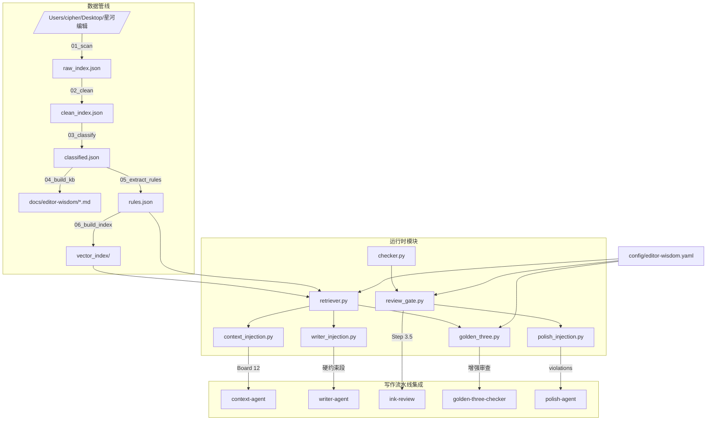

# 编辑智慧模块集成文档

## 架构概览



## 数据流

1. **扫描**（01_scan）：递归读取 288 份编辑建议 Markdown，生成 `raw_index.json`
2. **清洗**（02_clean）：过滤噪音（登录页、短文）和 MinHash 去重，输出 `clean_index.json`
3. **分类**（03_classify）：Claude Haiku 4.5 将每篇建议分入 10 个主题域，输出 `classified.json`
4. **知识库**（04_build_kb）：生成 10 个人类可读 Markdown 文件到 `docs/editor-wisdom/`
5. **规则抽取**（05_extract_rules）：Claude Sonnet 4.6 提取原子规则，输出 `rules.json`（80+ 条）
6. **向量索引**（06_build_index）：BAAI/bge-small-zh-v1.5 本地编码 + FAISS 索引

## 10 个主题域

| 域名 | 说明 |
|------|------|
| opening | 开篇/首段技巧 |
| hook | 钩子/悬念设计 |
| golden_finger | 金手指/外挂设定 |
| character | 人物塑造 |
| pacing | 节奏控制 |
| highpoint | 爽点/高潮设计 |
| taboo | 写作禁忌 |
| genre | 类型/题材技巧 |
| ops | 运营/更新策略 |
| misc | 其他 |

## 如何添加新规则

1. 将新的编辑建议 Markdown 文件放入 `/Users/cipher/Desktop/星河编辑/` 对应子目录
2. 运行 `ink editor-wisdom rebuild` 重建全部管线
3. 新规则将自动进入 `rules.json` 和向量索引
4. 下次写作时自动生效

手动添加规则：直接编辑 `data/editor-wisdom/rules.json`，确保格式符合 `schemas/editor-rules.schema.json`，然后运行 `ink editor-wisdom rebuild`（仅步骤 06 会重建索引）。

## 如何调优阈值

编辑 `config/editor-wisdom.yaml`：

```yaml
enabled: true              # 总开关
retrieval_top_k: 5         # 每次召回规则数
hard_gate_threshold: 0.75  # 硬门禁分数线（低于此分数触发修复循环）
golden_three_threshold: 0.85  # 黄金三章分数线（更严格）
inject_into:
  context: true   # 注入 context-agent
  writer: true    # 注入 writer-agent
  polish: true    # 注入 polish-agent
```

- **hard_gate_threshold**：降低 → 更宽松，升高 → 更严格（修复循环更频繁）
- **golden_three_threshold**：仅对第 1-3 章生效，建议 ≥ 0.80
- **retrieval_top_k**：增大 → 更多规则约束，但可能增加噪声

## FAQ

**Q: 没有 ANTHROPIC_API_KEY 能用吗？**
A: 步骤 01-02 和 06 不需要 API Key。步骤 03（分类）和 05（规则抽取）需要。运行时的 retriever 和 checker 不直接调用 API（checker 通过 agent 调用）。

**Q: 向量索引需要 GPU 吗？**
A: 不需要。BAAI/bge-small-zh-v1.5 是轻量模型，CPU 即可运行。FAISS 使用 IndexFlatIP（暴力搜索），适合百条规则级别的数据量。

**Q: 修复循环最多几次？**
A: 最多 3 次 check + 2 次 polish。3 次都不通过则生成 `blocked.md`，章节不会被发出。

**Q: 黄金三章额外检查哪些类别？**
A: 仅检查 opening、hook、golden_finger、character 这 4 个类别的规则。

**Q: `applies_to` 字段支持哪些值？**
A: 仅支持以下枚举值（定义在 `schemas/editor-rules.schema.json`）：
- `all_chapters` — 适用于所有章节（默认）
- `golden_three` — 仅适用于黄金三章（第 1-3 章）
- `opening_only` — 仅适用于开篇

LLM 抽取的自由文本值会被自动过滤，无效值回退为 `["all_chapters"]`。类别属于 `opening`、`hook`、`golden_finger`、`character` 的规则会自动添加 `golden_three` 标签。

**Q: 如何关闭编辑智慧模块？**
A: 在 `config/editor-wisdom.yaml` 中设置 `enabled: false`。

## Running the Smoke Test

端到端冒烟脚本验证硬门禁是否真正拦截低质量章节：

```bash
# 需要 ANTHROPIC_API_KEY 环境变量
python scripts/editor-wisdom/smoke_test.py
```

脚本执行流程：
1. 检查向量索引是否存在，缺失则自动运行 `ink editor-wisdom rebuild`
2. 生成一段故意违反多条硬规则的劣质章节文本
3. 调用真实的 `run_review_gate` 硬门禁（3 次 check + 2 次 polish）
4. 断言章节被阻断 + `blocked.md` 存在

**预期输出**（有 API Key 时）：
```
Smoke test PASS. Report: /path/to/reports/editor-wisdom-smoke-report.md
```

**无 API Key 时**：脚本以 exit 0 退出，报告中标记 `skipped`。

详细报告写入 `reports/editor-wisdom-smoke-report.md`，包含每步耗时和检查结果。
