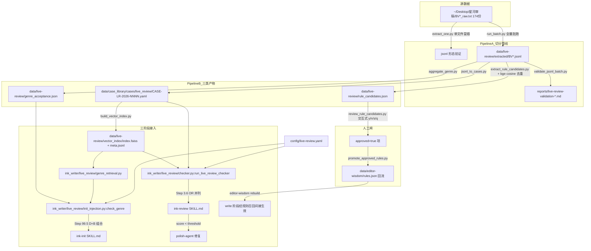

# Live-Review 模块集成文档

## 模块定位

Live-Review 模块基于 **174 份起点编辑星河 B 站直播录像字幕稿**（每份 3.5 小时、中位数 30000+ 字）构建，提供**作品病例 / 题材接受度信号 / 新原子规则候选** 三类产物，分别接入 ink-writer 的 init / write / review 三个阶段。本模块与现有 `editor-wisdom` 模块**并列共存、不替换不合并**：

| 维度 | editor-wisdom（已存）| live-review（本模块）|
|---|---|---|
| 来源平台 | 小红书 + 抖音 | B 站直播录像 |
| 形态 | 编辑加工过的**经验帖** | 未加工的**逐稿口语点评** |
| 单份字数 | 中位数 1099 字 | 中位数 30000+ 字 |
| 抽取颗粒度 | **抽象规则**（"金手指要低成本高收益"）| **具体反例**（"脚臭设定不行" / "3 分钟→1 分钟"）|
| 含分数？ | ❌ | ✅（满分 100，60+ 视为可签约）|
| 含原作品引用？ | ❌（自己的科普）| ✅（可还原"哪本书 → 多少分 → 为什么"）|
| 主要产物 | rules.json | 作品病例 + 题材信号 + 新规则候选 |
| 接入阶段 | context / write / review / golden_three | init / review（write 经规则回流间接生效）|

两模块内容主题约 30-40% 重叠，但形态完全不同，因此采取**独立 domain + 独立调用栈**：

- 现有 410 份病例**零影响**（`case_schema.json` 1.0 → 1.1 仅追加可选 `live_review_meta` block）。
- 新规则候选回流 `editor-wisdom/rules.json` 时**强制经过人工审核闸**（详见 §M-7）。
- review 阶段 Step 3.5（editor-wisdom）与 Step 3.6（live-review）**OR 并列**，任一通过即放行。

详细设计：[docs/superpowers/specs/2026-04-26-live-review-integration-design.md](superpowers/specs/2026-04-26-live-review-integration-design.md)
14-task TDD plan：[docs/superpowers/plans/2026-04-26-live-review-implementation.md](superpowers/plans/2026-04-26-live-review-implementation.md)

## 架构概览



## 数据流

1. **切分**（`extract_one.py` / `run_batch.py`）：递归扫 `~/Desktop/星河审稿/BV*_raw.txt` → 调 LLM（默认 `claude-sonnet-4-6`，可切 `claude-haiku-4-5`）按"哪本书→点评起止行→打分→分维度评论"切分 → 增量 dump 到 `data/live-review/extracted/<bvid>.jsonl`，每行一本被点评小说。支持 `--resume` 断点续跑、`--skip-failed` 失败跳过。
2. **形态验证**（`validate_jsonl_batch.py`）：对每行用 `schemas/live_review_extracted.schema.json` 校验，输出 markdown 报告含 `score_signal` 分布、`score` 非空比例、各 BV 统计。
3. **病例分发**（`jsonl_to_cases.py`）：jsonl → `data/case_library/cases/live_review/CASE-LR-2026-NNNN.yaml`，符合 `case_schema.json` 1.1。`severity` 由 `score` 推导（P0 < 55 / P1 < 60 / P2 < 65 / 其他 P3）；`layer` 由 `dimension` 推导（详见 `scripts/live-review/jsonl_to_cases.py` `DIMENSION_TO_LAYER`）；保留完整 `live_review_meta` block。
4. **题材聚合**（`aggregate_genre.py`）：扫 `CASE-LR-*.yaml` 按 `genre_guess` 笛卡尔贡献分组，计算 `score_mean / score_median / score_p25 / score_p75 / verdict_pass_rate`，统计 `common_complaints`（dimension 频率 Top-N）→ 写 `data/live-review/genre_acceptance.json`。
5. **规则候选**（`extract_rule_candidates.py`）：调 LLM 从 jsonl 抽通用规则文本 → 用 `BAAI/bge-small-zh-v1.5` 与现有 `data/editor-wisdom/rules.json` 计算 cosine 矩阵 → 阈值（默认 0.85）以上标 `dup_with: [EW-XXXX]`，输出 `rule_candidates.json` 待人工审核（`approved` 字段初始 `null`）。
6. **人工审核闸**（`review_rule_candidates.py` + `promote_approved_rules.py`）：交互式 CLI 标记 `approved=true/false`；提交工具仅写入 `approved=true` 的项到 `rules.json`，新加项带 `source: live_review`，现有规则字节级保持不变。
7. **三阶段接入**：
   - **init**（`init_injection.check_genre`）：用户题材输入 → `genre_retrieval` 反向检索 Top-K 病例 + `genre_acceptance.json` 阈值告警 → 终端输出 `📚 星河直播相似案例` + `🎯 该题材统计` + `💡 写作建议` 三段（详见 `ink-writer/skills/ink-init/SKILL.md` Step 99.5）。
   - **review**（`run_live_review_checker`）：章节文本 → cosine 召回 Top-K 病例 → LLM 评分 → `score < threshold` 触发 `polish-agent` 修复（详见 `ink-writer/skills/ink-review/SKILL.md` Step 3.6）。Step 3.5 与 Step 3.6 OR 并列，任一通过即放行。
   - **write**：审核通过的新规则进入 `editor-wisdom/rules.json` 后，下次 `editor-wisdom rebuild` 后**经现有 retriever 自动召回**，无需新增直接接入点。

## 主题域

Live-Review `dimension` 与 editor-wisdom 共享同一 11 主题域命名空间（详见 [docs/editor-wisdom-integration.md](editor-wisdom-integration.md)）：

| 域名 | 说明 | live-review 推导出的 layer |
|------|------|-----|
| opening | 开篇/首段技巧 | upstream |
| hook | 钩子/悬念设计 | upstream |
| golden_finger | 金手指/外挂设定 | upstream |
| character | 人物塑造 | upstream |
| pacing | 节奏控制 | upstream + downstream |
| highpoint | 爽点/高潮设计 | upstream + downstream |
| taboo | 写作禁忌 | upstream |
| genre | 类型/题材技巧 | upstream |
| ops | 运营/更新策略 | upstream |
| simplicity | 直白化（v22 新增）| downstream |
| misc | 其他 | upstream |

`severity` 由 `score` 推导：`None → P3` / `<55 → P0` / `<60 → P1` / `<65 → P2` / 其他 → P3。

## 如何添加新数据

1. **新增直播稿**：把 `BV*_raw.txt` 复制到 `~/Desktop/星河审稿/`。
2. **追加单份**：`python3 scripts/live-review/extract_one.py --input ~/Desktop/星河审稿/BV<新ID>_raw.txt --out data/live-review/extracted/BV<新ID>.jsonl`（bvid 可省略，从文件名自动提取）。
3. **批量追加**：`python3 scripts/live-review/run_batch.py --input-dir ~/Desktop/星河审稿 --output-dir data/live-review/extracted --resume`（已存在的 jsonl 会被跳过）。
4. **重生病例与索引**：
   ```bash
   python3 scripts/live-review/jsonl_to_cases.py --jsonl-dir data/live-review/extracted --cases-dir data/case_library/cases/live_review
   python3 scripts/live-review/aggregate_genre.py --cases-dir data/case_library/cases/live_review --out data/live-review/genre_acceptance.json
   python3 scripts/live-review/build_vector_index.py --cases-dir data/case_library/cases/live_review --out-dir data/live-review/vector_index
   ```
5. **新规则候选回流**（可选）：跑 `extract_rule_candidates.py` → `review_rule_candidates.py` → `promote_approved_rules.py` → `editor-wisdom rebuild`（详见 §M-6/§M-7）。

## 如何调阈值

编辑 `config/live-review.yaml`：

```yaml
enabled: true                       # 总开关；false 时 inject_into 全部强制 false
model: claude-sonnet-4-6            # LLM 模型；可切 claude-haiku-4-5（费用 ~1/5）
extractor_version: '1.0.0'          # 切分管线版本号，便于回溯
batch:
  input_dir: ~/Desktop/星河审稿
  output_dir: data/live-review/extracted
  resume_from_jsonl: true
  skip_failed: true
  log_progress: true
hard_gate_threshold: 0.65           # review Step 3.6 普通章节硬门禁阈值
golden_three_threshold: 0.75        # review Step 3.6 黄金三章（chapter_no <= 3）阈值
init_genre_warning_threshold: 60.0  # init Step 99.5 score_mean < 此值时 warning_level=warn
init_top_k: 3                       # init Step 99.5 反向检索 Top-K 案例数
min_cases_per_genre: 3              # 题材聚合阈值；case_count < 此值的 genre 不入聚合
inject_into:
  init: true                        # 注入 ink-init Step 99.5（false 时早退、不影响选材流程）
  review: true                      # 注入 ink-review Step 3.6（false 时短路、Step 3.5 仍生效）
```

各字段调优指南：

- **hard_gate_threshold / golden_three_threshold**：升高 → 更严格（修复循环更频繁）；建议黄金三章保持 ≥ 0.70。
- **init_genre_warning_threshold**：起点编辑 60 分 = 签约线，保持默认即可；想看更多 warning 调到 65。
- **init_top_k**：增大 → 用户看到更多相似病例，但渲染冗长；建议 3-5。
- **min_cases_per_genre**：聚合阈值；样本不足时（如新题材只有 1-2 个 case）不参与统计避免误导。
- **inject_into.init / review**：单独关停某阶段；与 `enabled: false` 总开关相比更细粒度。

## 用户手动操作清单（ralph 跑完所有 14 条 US 之后由你执行）

> ⚠️ 所有需要真实 `ANTHROPIC_API_KEY`、烧 LLM 费用、或人工判断的步骤都集中在这里。ralph 完成 14 条 US 后**不会**自动跑这些步骤——你要按顺序手动跑。每步前先列预期效果、命令、产物、估算费用。

### §M-1：单文件冒烟（可选 / 推荐先跑）

**做什么**：跑 1 份真实数据 `BV12yBoBAEEn` 验证 LLM 切分形态合理（这份已知含明确 68 分点评，作为 gold reference）

**前置**：US-LR-004 已通过；`export ANTHROPIC_API_KEY=...`

**命令**：
```bash
python3 scripts/live-review/extract_one.py \
  --bvid BV12yBoBAEEn \
  --input ~/Desktop/星河审稿/BV12yBoBAEEn_raw.txt \
  --out data/live-review/extracted/BV12yBoBAEEn.jsonl
```

**预期产物**：`data/live-review/extracted/BV12yBoBAEEn.jsonl`，至少 1 行含 `score: 68 + dimension 含 '设定'/'节奏'`

**估算费用**：$0.10-0.20（Sonnet）

**人工抽检要点**：行数是否合理（应该 5-15 本）、score_signal 分布、人名/标题识别是否合理

### §M-2：5 份小批跑（可选 / 推荐先跑验证形态稳定再上全量）

**做什么**：跑 5 份不同形态的真实数据（含明确打分 / 模糊打分 / 多本 / 单本）验证 prompt 鲁棒性

**前置**：US-LR-005 已通过；§M-1 通过

**命令**：从 `data/live-review/sample_bvids.txt` 读取 5 个 BV ID，然后：
```bash
python3 scripts/live-review/extract_one.py \
  --bvids BV1,BV2,BV3,BV4,BV5 \
  --input-dir ~/Desktop/星河审稿 \
  --output-dir data/live-review/extracted

python3 scripts/live-review/validate_jsonl_batch.py \
  --jsonl-dir data/live-review/extracted
```

**预期产物**：`data/live-review/extracted/<bvid>.jsonl` × 5 + `reports/live-review-validation-*.md`

**估算费用**：$0.5-1.0

**人工 review**：打开 validation 报告，看 `explicit_number` 占比是否 ≥ 30%、score 非空比例是否 ≥ 50%

### §M-3：全量批跑 174 份（必做 · 高峰期长任务）

**做什么**：跑全量 174 份直播稿生成 jsonl

**前置**：US-LR-006 已通过；§M-2 通过且 validation 报告满意

**命令**：
```bash
python3 scripts/live-review/run_batch.py \
  --input-dir ~/Desktop/星河审稿 \
  --output-dir data/live-review/extracted \
  --resume \
  --skip-failed \
  2>&1 | tee logs/live-review-batch-$(date +%Y%m%d-%H%M).log
```

**预期产物**：
- `data/live-review/extracted/BV*.jsonl` × ≤174（已存在的会被 `--resume` 跳过）
- `data/live-review/extracted/_failed.jsonl`（含失败列表，正常应 < 5%）

**估算费用**：$15-25（Sonnet）/ $3-5（Haiku，配 `model: claude-haiku-4-5`）

**估算时长**：1-3 小时（取决于并发度，PRD 默认无并发，串行）

**注意**：可中断，下次跑同命令会自动 `--resume`

### §M-4：jsonl 转病例 yaml（必做）

**做什么**：把全量 jsonl 转成 case_library 病例

**前置**：US-LR-007 已通过；§M-3 完成

**命令**：
```bash
python3 scripts/live-review/jsonl_to_cases.py \
  --jsonl-dir data/live-review/extracted \
  --cases-dir data/case_library/cases/live_review
```

**预期产物**：`data/case_library/cases/live_review/CASE-LR-2026-NNNN.yaml` × N（N 估算 1500-2000 = 174 × 平均 10 本/份）

**估算费用**：$0（纯转换无 LLM 调用）

**估算时长**：< 5 分钟

### §M-5：题材聚合（必做）

**做什么**：聚合所有 case yaml 到 `genre_acceptance.json`

**前置**：US-LR-008 已通过；§M-4 完成

**命令**：
```bash
python3 scripts/live-review/aggregate_genre.py \
  --cases-dir data/case_library/cases/live_review \
  --out data/live-review/genre_acceptance.json
```

**预期产物**：`data/live-review/genre_acceptance.json`，含 ≥ 20 个 genre 的统计

**估算费用**：$0

### §M-6：规则候选抽取（必做）

**做什么**：从 jsonl 抽通用规则候选

**前置**：US-LR-009 已通过；§M-3 完成

**命令**：
```bash
python3 scripts/live-review/extract_rule_candidates.py \
  --jsonl-dir data/live-review/extracted \
  --out data/live-review/rule_candidates.json
```

**预期产物**：`data/live-review/rule_candidates.json`，含 N 条候选（N 估算 50-150）

**估算费用**：$1-3（Sonnet）

**估算时长**：5-15 分钟

### §M-7：人工审核规则候选 + 提交 + 重建 editor-wisdom 索引（必做）

**做什么**：人工逐条审核新规则 → 提交审核通过的 → 重建 RAG 索引让 write 阶段能召回

**前置**：US-LR-010 已通过；§M-6 完成

**命令**：
```bash
# 7-A: 交互式审核（CLI 逐条 y/n/s/q）
python3 scripts/live-review/review_rule_candidates.py \
  --candidates data/live-review/rule_candidates.json

# 7-B: 提交审核通过的（仅写入 approved: true 的项）
python3 scripts/live-review/promote_approved_rules.py \
  --candidates data/live-review/rule_candidates.json \
  --rules data/editor-wisdom/rules.json

# 7-C: 重建 editor-wisdom 向量索引（让新规则被 retriever 召回）
ink editor-wisdom rebuild  # 或 python3 -m ink_writer.editor_wisdom.rebuild
```

**预期产物**：`rules.json` 增加若干 `EW-XXXX` 条目（含 `source: live_review`）+ `data/editor-wisdom/vector_index/` 重建

**估算时长**：人工审核 1-2 小时（取决于候选数）；rebuild < 5 分钟

### §M-8：构建 live_review 向量索引（必做）

**做什么**：构建 init 阶段题材检索用的向量索引

**前置**：US-LR-011 已通过；§M-4 完成

**命令**：
```bash
python3 scripts/live-review/build_vector_index.py \
  --cases-dir data/case_library/cases/live_review \
  --out-dir data/live-review/vector_index
```

**预期产物**：`data/live-review/vector_index/index.faiss` + 元数据 `meta.jsonl`

**估算时长**：< 10 分钟（bge-small-zh-v1.5 本地 CPU 跑）

### §M-9：端到端真 LLM smoke 验证（可选）

**做什么**：用真实 LLM 跑一次 init→review 端到端，验证 mock 与真实输出形态一致

**前置**：US-LR-013 已通过；§M-7 + §M-8 完成

**命令**：
```bash
python3 scripts/live-review/smoke_test.py --with-api
```

**预期产物**：`reports/live-review-smoke-report.md` 全部 PASS

**估算费用**：$0.50-1.00

## FAQ

**Q: 与 `editor-wisdom-checker` 是什么关系？**
A: `live-review-checker` 是与 `editor-wisdom-checker` **OR 并列** 的第二个硬门禁 checker（review Step 3.6 vs Step 3.5）。两者都不通过才阻断章节，任一通过即放行。Step 3.5 不动；Step 3.6 单独可关（`inject_into.review: false`）。两路 violations 都会写入 `evidence_chain` 供 `polish-agent` 参考。

**Q: 阈值 `hard_gate_threshold` / `golden_three_threshold` 是怎么算的？**
A: `score = (1 - violation_density) × verdict_pass_rate_of_top5`，范围 0-1。普通章节 `score < 0.65` 阻断；黄金三章（`chapter_no <= 3`）`score < 0.75` 阻断。阈值在 `config/live-review.yaml` 调。

**Q: 没有 ANTHROPIC_API_KEY 能用吗？**
A: 切分管线（§M-1 ~ §M-3、§M-6、§M-9）需要 API Key。其余步骤（§M-4 / §M-5 / §M-7-B/C / §M-8）不需要。运行时的 `genre_retrieval` 和 `checker` 默认 mock 模式不读 Key（`smoke_test.py` 不带 `--with-api`、`run_live_review_checker(mock_response=...)` 注入路径）。

**Q: 为什么新规则必须人工审核？不能自动写入吗？**
A: LLM 抽出的"规则文本"质量参差（重复、过具体、与现有 EW-XXXX 语义重合），bge cosine 0.85 阈值能去掉明显重复但保不齐边缘情况；自动写入会污染 RAG 召回质量，影响所有 ink-writer 用户。`approved=true` 是唯一进入 `rules.json` 的路径。

**Q: 向量索引需要 GPU 吗？**
A: 不需要。`BAAI/bge-small-zh-v1.5` 是轻量模型，CPU 即可运行。FAISS 使用 `IndexFlatIP`（暴力搜索），适合千条病例级别的数据量。

**Q: 索引落盘格式为什么和 editor-wisdom 不同？**
A: editor-wisdom 用 `rules.faiss + metadata.json`；live-review 用 `index.faiss + meta.jsonl`。jsonl 每行一 record 便于增量扩库（追加病例只需 append + 重建 faiss，不重写整个 metadata 文件）。统一通过 `ink_writer.live_review._vector_index.load_index` API 隔离差异。

**Q: 新增/修改 174 份直播稿的 prompt 后，要重跑全量吗？**
A: 是的。`extractor_version` 字段记录 prompt 版本，bump 后建议用 `--resume` + 删除旧 jsonl 强制重跑（或单独跑某 BV 验证差异后再决定全量）。

**Q: ink-init Step 99.5 的"warn"会不会强制阻断选材？**
A: 不会。`warning_level == 'warn'` 时仅展示 `Top-K 病例 + 题材统计 + 写作建议`，让用户做 y/n 二次确认；`warning_level == 'no_data'` 时仅展示通行（题材未聚合）；`warning_level == 'ok'` 通行无提示。三档都不强制阻断。

**Q: 修复循环最多几次？**
A: live-review 的 `check_review` 仅触发一次 `polish_fn` 不做内部 retry 循环（与 `editor_wisdom.review_gate.max_retries=3` 不同）。OR 并列后整体重试次数已够，且黄金三章阈值差距小、测试断言简单。如果未来需要 retry 循环，再加 `max_retries` 参数。

**Q: 如何关闭整个 Live-Review 模块？**
A: 在 `config/live-review.yaml` 中设置 `enabled: false`。`load_config` 会强制 `inject_into.{init, review}` 全部 false（`& 与` 操作而非赋值），下游所有调用点早退到 `_disabled_response()`。

## Smoke test 段

端到端冒烟脚本验证 init Step 99.5 + review Step 3.6 注入路径是否正常：

```bash
# 默认 mock 模式（不烧 API 费）
python3 scripts/live-review/smoke_test.py

# 复用预构建 vector index 加速（推荐）
python3 scripts/live-review/smoke_test.py --index-dir data/live-review/vector_index
```

脚本执行流程：
1. 检查 `vector_index` 是否存在，缺失则用 `tests/live_review/fixtures/sample_30_cases` 自动重建（首次 ~30s 加载 bge）
2. 调 `init_injection.check_genre('都市重生律师')` → 断言 `warning_level ∈ {ok, warn, no_data}` + `render_text` 非空
3. 调 `run_live_review_checker(fixture_chapter, mock_response=fixture_mock)` → 断言 `score / violations / cases_hit` 字段存在
4. 写 `reports/live-review-smoke-report.md`（含 PASS/FAIL 表 + 每步耗时 + `All checks PASS` 摘要行）

**预期输出**：

```
Smoke test PASS. Report: reports/live-review-smoke-report.md
```

**带 `--with-api` 真 LLM 模式**：仅在 §M-9 手动跑，需要 `ANTHROPIC_API_KEY`，估算费用 $0.50-1.00。

详细报告写入 `reports/live-review-smoke-report.md`，包含每步耗时、检查结果、`All checks PASS` 摘要行（同时满足"内容含 PASS 关键字" AC）。
