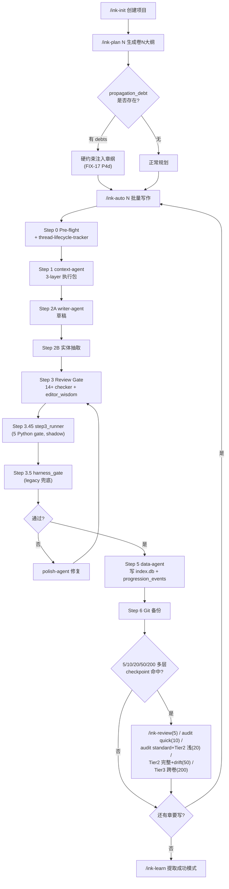

# ink-writerPro v15.0.0 工作流程与优势审查

> **审查日期**：2026-04-18
> **受审版本**：v15.0.0（HEAD=910add7，master 分支）
> **审查范围**：全仓 Python 代码 + SKILL.md + agent 规格 + 数据层 + RAG
> **执行者**：Claude Opus 4.7（1M ctx）
> **配套产出**：[`reports/audit-v15-findings.md`](audit-v15-findings.md) — 问题与修复

---

## 1. 一句话定位

ink-writerPro 是**全球唯一把起点/番茄编辑审核规则 RAG 化为硬门禁的中文长篇网文自动化创作系统**，架构已具雏形但"规格-代码"仍有断层。

---

## 2. 鸟瞰图：主循环工作流



**说明**：13 个节点，覆盖从 init → plan → write → review → polish → data 回流 → macro-review → learn 全闭环。灰色的 Step 3.45 与 Step 3.5 并存是本次审计发现的关键技术债（见产出 B F-001）。

---

## 3. 14 个 Skill / Slash Command 职责

| 命令 | 触发词 | 主要输入 | 主要输出 | 核心依赖 | 定位 |
|------|--------|---------|---------|---------|------|
| `/ink-init` | "创建新书/开书" | 交互对话 / `--quick` | `.ink/state.json` + 3 套方案 | `data/naming/*.json` / `anti-trope-seeds.json` / `editor_wisdom` | 项目骨架+创意种子 |
| `/ink-plan N` | "规划第 N 卷" | 卷号 + 总大纲 | `大纲/卷N章纲.md` | `ink_writer.propagation` (FIX-17 硬约束) | 大纲装配 |
| `/ink-write` | "写一章" | 章号 | `正文/第NNNN章-*.md` + review reports | context/writer/polish/data agent | 主写作流水线 |
| `/ink-auto N` | **主力** "写 N 章" | 章数 N | 批量章节 + 每 5/50 章审计 | 所有 skill 组合 | **日常入口** |
| `/ink-review L-R` | "审查 L 到 R 章" | 章节区间 | `.ink/reports/review_*.json` | `editor_wisdom.review_gate` + 16 checker | 事后审查 |
| `/ink-fix` | "修问题" | 审查报告 | 修订后的章节 | `polish-agent` + `step3_runner` 报告 | 半自动修复 |
| `/ink-audit` | "数据审计" | 项目根 | `.ink/reports/audit_*.md` | `StateManager` + `IndexManager` | SQL/JSON 一致性 |
| `/ink-macro-review` | "宏观审查" | 章节区间（50/200） | 结构分析 + **propagation_debt.json** | `ink_writer.propagation.drift_detector` | 跨卷审计 (FIX-17) |
| `/ink-query` | "查角色/伏笔" | 实体名 / 类别 | 健康度报告 | `IndexManager` mixin | 只读查询 |
| `/ink-resolve` | "处理消歧" | 无 | 用户确认后 SQL 变更 | `SQLStateManager.resolve_disambiguation_entry` | 候选实体仲裁 |
| `/ink-resume` | "继续写" | 无 | 从断点续跑 | checkpoint_utils | 断点恢复 |
| `/ink-learn` | "提取成功模式" | 历史章节 | `project_memory.json` | `IndexManager` 读 | 元学习 |
| `/ink-migrate` | "迁移旧版" | 旧项目路径 | 新 schema | `core/state/migrate_state_to_sqlite.py` | 版本升级 |
| `/ink-dashboard` | "看板" | 无 | 本地 web UI | `dashboard/` 独立服务 | 可视化 |

**规模**：`ink-writer/skills/` 目录 14 个子目录，每个一份 `SKILL.md`（`ls` 实测：`ink-audit / ink-auto / ink-dashboard / ink-fix / ink-init / ink-learn / ink-macro-review / ink-migrate / ink-plan / ink-query / ink-resolve / ink-resume / ink-review / ink-write`），与 `plugin.json:2` 声称的 "ink-writer" plugin 一致。

---

## 4. 22 个 Checker / Agent 的分层职责

### 4.1 流水线主角（4 个）

| Agent | 阶段 | 输入 | 输出 | 关键能力 |
|-------|------|------|------|---------|
| **context-agent** | 1 读 | `chapter_no, project_root` | 3-layer 执行包（任务书+硬约束+参考） | Step 4.5 注入 progression summary (`context-agent.md:486`) |
| **writer-agent** | 2A 写 | 执行包 | 章节草稿 `.md` | 消费 editor_wisdom 硬约束（`writer_injection.py:43-91`） |
| **polish-agent** | 4 修 | 草稿+所有审查报告 | 润色后章节 | 9 层修复（logic/proofreading/anti-detection/镜头…） |
| **data-agent** | 5 存 | 章节文件 | JSON (实体/状态/**progression_events**) | Step B.7.6 输出 6 维角色演进 (`data-agent.md:334-385`) |

### 4.2 内容审查 Checker（Content，6 个）

| Checker | 专属维度 | 硬阻断条件 |
|---------|---------|-----------|
| consistency-checker | 战力/地点/时间线矛盾 | critical 即阻断 |
| continuity-checker | 场景过渡/逻辑漏洞/大纲偏离 | critical 阻断 |
| ooc-checker | 人设漂移/语气指纹/Layer K 跨章 progression（FIX-18） | CROSS_CHAPTER_OOC critical |
| golden-three-checker | 仅章 1-3，10 秒吸引力/承诺兑现 | 阈值 0.92（前 3 章专门加严） |
| logic-checker | 9 层章内微观逻辑（算术/动作/空间/枚举） | critical 阻断 |
| outline-compliance-checker | 7 层大纲合规（MCC 消费） | critical 阻断 |

### 4.3 质量审查 Checker（Quality，7 个）

| Checker | 专属维度 | Python 层实测 |
|---------|---------|--------------|
| anti-detection-checker | 句长 CV / 重复模式 / 连接词频次 | **`sentence_diversity.py` 真执行统计**（CV≥0.35, 均长≥18, 短句占比≤25%） |
| proofreading-checker | 修辞重复/段落结构/代称混乱/文化禁忌 | LLM 执行 |
| emotion-curve-checker | 情绪曲线与目标对齐 | `emotion_detector.py` 真执行 |
| high-point-checker | 8 种爽点模式覆盖密度 | LLM 执行 |
| pacing-checker | Strand Weave 比例（60/20/20） | LLM 执行 |
| editor-wisdom-checker | 288/364 条规则 RAG 命中 | **`editor_wisdom` 真执行**：`retriever.py` + `checker.py:62-70` 硬扣分 |
| prose-impact/sensory-immersion/flow-naturalness | 文笔沉浸感三维 | LLM 执行，v13.7 引入 |

### 4.4 追读与线程（Engagement + Story，3 个）

| Agent | 职责 |
|-------|-----|
| reader-pull-checker | 钩子/微兑现/期待值债务；支持 Override Contract |
| reader-simulator | 模拟目标读者沉浸度 / 弃读热点 |
| thread-lifecycle-tracker | 伏笔+明暗线生命周期（foreshadow + plotline 合并） |

**总计**：22 个 agent（`ls ink-writer/agents | wc -l` = 22），完全覆盖 `docs/agent_topology_v13.md:62` 声明。v13 US-016 已物理删除僵尸 foreshadow/plotline-tracker.md。

---

## 5. 长记忆体系（详细叙述）

长记忆是 ink-writerPro 相对 NovelCrafter / Sudowrite 的最大技术深度。v14+v15 的改造让它**从"双写漂移"走向"SQL 单一事实源"**。

### 5.1 SQLite `index.db` schema 分工

`ink_writer/core/index/index_manager.py` 的 `_init_db()` 创建约 28 张表（v5.5 schema），按 6 个逻辑层次划分：

| 层次 | 代表表 | 作用 |
|------|--------|------|
| **state_kv 单例** | `state_kv` (key/value/updated_at) | 项目信息/进度/主角状态/harness_config — v13 新增为单一事实源 (`memory_architecture_v13.md:54-79`) |
| **章节与场景** | `chapters`、`scenes`、`appearances`、`chapter_memory_cards`、`scene_snapshots` | 章节级元数据、场景切片、实体出场登记 |
| **实体与关系** | `entities`、`aliases`、`state_changes`、`relationships`、`relationship_events` | 人物/物品/势力 + 别名链 + 状态变迁日志 + 关系图 |
| **线程生命周期** | `plot_thread_registry`、`timeline_anchors`、`narrative_commitments` | 主线/支线/暗线 + 伏笔 + 承诺兑现 |
| **审查与治理** | `review_metrics`、`review_checkpoint_entries`、`invalid_facts`、`candidate_facts`、`negative_constraints`、`disambiguation_log`、`writing_checklist_scores`、`tool_call_stats` | 每章审查指标 + 消歧记录 + 否定约束 |
| **v14/v15 新增** | `character_evolution_ledger`、`character_progressions`（FIX-18）、`debt_events`、`chase_debt`、`plot_structure_fingerprints` | 角色演进切片 + 追读力债务 + 剧情结构指纹 |

注意：`character_progressions` 的 schema 为 `(character_id, chapter_no, dimension, from_value, to_value, cause, recorded_at)`，`dimension` 严格枚举 6 值：立场/关系/境界/知识/情绪/目标（`data-agent.md:342-353`）。

### 5.2 写作时上下文装配的调用链

一章生成的记忆读链路：

```
context-agent (Step 1)
  └── CLI: ink_writer.core.cli.ink
       └── IndexManager (ink_writer/core/index/index_manager.py)
            ├── get_recent_chapter_summaries(limit=20)
            ├── get_entities_for_chapter(ch_no)
            ├── get_active_foreshadows(before=ch_no)    # 超期预警
            ├── read_review_metrics(ch_no-1)             # 上一章指标
            ├── build_progression_summary(idx, char_ids, before_chapter=ch_no, max_rows_per_char=5)
            │        # FIX-18 P5c, ink_writer/progression/context_injection.py:39
            └── SemanticChapterRetriever.retrieve(query, k)  # 若 .ink/chapter_index/ 存在
                 └── semantic_recall/retriever.py
                      ├── FAISS 索引 或
                      └── SQLite fallback (quality_score DESC)   # v14 US-004 降级
```

装配结果为 **3 层执行包**（context-agent.md 描述）：
- **L1 任务书**（10+6 板块，含 MCC 大纲合规清单）
- **L2 硬约束**（editor_wisdom 注入 + progression summary + 否定约束 + 创意指纹）
- **L3 参考**（类型画像 / shared-scene-craft / 节奏控制）

### 5.3 增量实体抽取 → 记忆回流

写完一章后 `data-agent` 产出 JSON（`data-agent.md` 规定纯 JSON 零解释）：

```json
{
  "scene_slices": [...],
  "entity_changes": [...],
  "progression_events": [
    {"character_id": "xiaoyan", "dimension": "境界", "from": "斗者", "to": "斗师", "cause": "突破"}
  ],
  "foreshadow_updates": [...]
}
```

`StateManager._sync_index_extensions()`（`state_manager.py:676-690`）消费这份 JSON，遍历写入 `character_progressions` 与 `character_evolution_ledger`，**同一事务 SQL-first** (`state_manager.py:421-447` 先 `_sync_state_to_kv()` 成功后才写 JSON 视图，失败 raise `StateWriteError`)。

### 5.4 FIX-17 反向传播在记忆链路中的角色

常规 Pipeline 是"单向前进"——写完第 80 章发现与第 40 章矛盾，只能在 80 章内修。FIX-17 让"反向修上游大纲"成为可能：

```
每 50 章 → /ink-macro-review → ink_writer.propagation.drift_detector.detect_drifts()
  └── 扫 review_metrics.critical_issues + checker_results
      └── 识别 type ∈ {cross_chapter_conflict, back_propagation, canon_drift} 且 target_chapter < current
          → 写入 .ink/propagation_debt.json (status=open)

下一轮 /ink-plan → 1.5 节 (ink-plan/SKILL.md:108-146)
  └── 读 propagation_debt 中 status ∈ {open, in_progress}
      └── 作为硬约束注入新卷章纲，章纲顶部 consumed_debt_ids 必填
      └── 章纲落盘后 mark_debts_resolved(debt_ids) → 状态翻 resolved
```

**意义**：第一次在中文网文 AI 工具里把"下游发现的上游矛盾"变成可追溯债务，对标 AutoNovel 的 5 层共同演化。drift_detector 的误报控制严格——仅纳入明确标注 `cross_chapter_conflict` 类型且 target_chapter 明确前向的条目（`drift_detector.py:128-159`）。

### 5.5 FIX-18 Progressions 在长记忆链路中的角色

解决的痛点：80 章后配角突然"OOC"，但其实是立场**渐变**——没有渐变切片就无法审计。

```
每章 data-agent 产 progression_events → character_progressions
  │
  ├── 写作前：context-agent 4.5 注入前 N 章 progression summary
  │       → writer-agent 感知"角色应处于何种状态"
  │
  └── 审查：ooc-checker Layer K 跨章 Progression 一致性
          → 若章内 from/to 与历史不连续 → CROSS_CHAPTER_OOC critical
```

Python 层有**真实实现**：`ink_writer/progression/context_injection.py:39` 的 `build_progression_summary(source, char_ids, before_chapter, max_rows_per_char=5)` 从 IndexManager 读 progressions 并裁剪为 Markdown 表格；tests/integration/test_progressions_e2e.py 验证 80 章真实场景（立场从盟友→中立→敌人）。

### 5.6 StateManager.flush()：SQL-first 双写顺序

v14 FIX-03A 的核心：把"先写 JSON 再同步 SQL"反转为"SQL 先写，JSON 失败仅 warning"。

```python
# ink_writer/core/state/state_manager.py:421-447
def save_state(self, backup=True, ...):
    # v13 US-024 (FIX-03A) SQL-first：先同步 SQL（单一事实源），后写 JSON（视图）
    try:
        self._sync_state_to_kv(disk_state)  # 失败 raise StateWriteError
    except Exception:
        raise StateWriteError("SQL sync failed")
    try:
        atomic_write_json(state_path, disk_state)
    except Exception as exc:
        logger.warning("JSON view write failed: %s", exc)  # 非致命
```

v14 US-012/US-013 还新增了 `save_external_state(state_dict)` (`state_manager.py:473-510`) 作为 archive_manager / update_state.py 的 SQL-first 外部入口，消除了 "CLI 工具绕过 StateManager" 的老病根。

---

## 6. 黄金三章 & 网文商业护城河

### 6.1 golden-three-checker 的检查维度

专门审查前 3 章（`ink_writer/editor_wisdom/golden_three.py:11`）：

```python
GOLDEN_THREE_CATEGORIES = frozenset({"opening", "hook", "golden_finger", "character"})
```

流程：
1. 从 `editor_wisdom.retriever` 强制检索 4 个类别的规则（top-k=5），混入正常检索结果
2. checker 让 LLM 按规则逐条评估，返回 violations
3. Python 硬扣分：`hard=-0.3, soft=-0.1`（`checker.py:62-70`）
4. 阈值判决：前 3 章 `golden_three_threshold=0.92`（`config/editor-wisdom.yaml`），普通章 `hard_gate_threshold=0.75`
5. 失败：最多 3 次 check + 2 次 polish；三次都不过写 `blocked.md`，章节阻断

golden-three-checker 专门加一条额外 block：v13.7 起第 1 章 4 项爽点硬阻断（小爽点+大悬念+金手指具象化+章末钩子分级），在 agent spec 里是 "一级验收标准"。

### 6.2 editor_wisdom RAG 的注入链路

从 288 份编辑建议到硬约束的全链路（`docs/editor-wisdom-integration.md`）：

```
/Users/cipher/Desktop/星河编辑/ (288 md)
    │ scripts/editor-wisdom/01_scan.py
    ▼
data/editor-wisdom/raw_index.json
    │ 02_clean.py (MinHash 去重 + 过滤短文)
    ▼
clean_index.json
    │ 03_classify.py (Claude Haiku 4.5 分 10 类)
    ▼
classified.json
    │ 05_extract_rules.py (Claude Sonnet 4.6 原子规则)
    ▼
rules.json (364 条)
    │ 06_build_index.py (BAAI/bge-small-zh-v1.5 + FAISS)
    ▼
data/editor-wisdom/vector_index/rules.faiss
    │
    │ 运行时通过 ink_writer.editor_wisdom.retriever.get_retriever() 单例
    │
    ├─→ context_injection.build_editor_wisdom_section()  # 注入 context-agent
    ├─→ writer_injection.build_writer_constraints()       # 注入 writer-agent (硬+软)
    ├─→ polish_injection.build_polish_violations()        # 注入 polish-agent
    └─→ review_gate.run_review_gate()                     # 硬门禁 3 次 retry
```

**关键**：`editor_wisdom` 是全仓**唯一一套从数据→索引→写作→审查→修复完整闭环的 Python 硬约束**。这是 ink-writerPro 的真实商业护城河。

### 6.3 章末钩子、开篇抓取的具体实现位置

- **开篇 10 秒抓取**：`reader_pull/hook_retry_gate.py` Python gate，评估首句钩子 + 首段节奏
- **章末钩子**：`reader_pull/config.py` 定义 5 类钩子模式；writer-agent L10d 明确要求章末必须收到钩子类型之一
- **承诺兑现**：editor_wisdom 的 `golden_three` 类别规则强制前 3 章兑现卖点
- **首句钩子库**：`ink-writer/skills/ink-init/references/` 下有 hook 样本

---

## 7. 反俗套机制

| 资产 | 路径 | 规模 | 消费方 |
|------|------|------|--------|
| 陈词黑名单 | `data/naming/blacklist.json` | 115 行（30+30+19+14+combo） | ink-init SKILL.md 引用（LLM 执行） |
| 书名模板库 | `data/naming/book-title-patterns.json` | 170+ 条（V1=54/V2=57/V3=59） | ink-init LLM 消费 |
| 绰号库 | `data/naming/nicknames.json` | 125+ 条（分稀有度） | ink-init LLM 消费 |
| 姓名库 | `data/naming/surnames.json` + `given_names.json` | 55 + 204 | ink-init LLM 消费 |
| 反俗套种子 | `ink-writer/skills/ink-init/references/creativity/anti-trope-seeds.json` | 1012 条（v2.0，13109 行） | Quick Mode L1 必读 |
| 元创意规则 | `meta-creativity-rules.md`、`perturbation-engine.md`、`golden-finger-rules.md`、`style-voice-levels.md` | 4 个 md | Quick Step 1 LLM 消费 |
| 敏感词分级 | `style-voice-levels.md:48-61` | L0/L1/L2/L3 四档 × 3 个 Voice 风格 | LLM prompt 层 |

**触达位置**：主要在 `/ink-init` 阶段（项目方案生成时），Quick Step 1 会把种子库、黑名单、书名模板通过 L1 必读注入 LLM context。写作阶段（/ink-write）不再主动消费这些反俗套库，仅靠 data_agent 产出后的被动巡检。

---

## 8. 与主流对标工具的横向优势

| 对比项 | ink-writerPro v15 | NovelCrafter | Sudowrite | 泛 LangGraph |
|--------|-------------------|--------------|-----------|--------------|
| 中文网文商业规则 | ✅ **288+ 条编辑规则 RAG 硬门禁** (`editor_wisdom/`) | ❌ 英文主，无中文网文规则 | ❌ 同左 | ❌ 需自研 |
| 长记忆单一事实源 | ✅ SQLite 28 表 + v14 SQL-first (`state_manager.py:421-447`) | ⚠️ Codex/WorldBook 文档型 | ⚠️ Story Bible 文档型 | ❌ 需自研 |
| 反向传播（下游矛盾回修） | ✅ **drift_detector + propagation_debt** (FIX-17 `propagation/drift_detector.py`) | ❌ | ❌ | ❌ |
| 角色演进追踪（跨 80 章） | ✅ **character_progressions 表 + Layer K OOC** (FIX-18 `progression/context_injection.py:39`) | ⚠️ Progressions 手动填 | ❌ | ❌ |
| 硬门禁检测 AI 味 | ✅ **sentence_diversity.py 统计真执行** + ZT 正则 | ❌ | ❌ | ❌ |
| 黄金三章专检 | ✅ 阈值 0.92 + 4 类别强检 | ❌ | ❌ | ❌ |
| 批量无人值守写作 | ✅ /ink-auto + 检查点续跑 | ❌ | ❌ | ⚠️ 需自研 |
| 多 agent 并发调度 | ⚠️ CheckerRunner 存在但生产 stub（见产出 B F-001） | N/A | N/A | ✅ LangGraph 成熟 |
| 测试规模 | ✅ 120 测试文件 / 2420 passed / 82% 覆盖 | N/A | N/A | N/A |

---

## 9. 量化指标快照

### 9.1 规模与版本

| 指标 | 数值 | 证据 |
|------|------|------|
| 当前版本 | **v15.0.0** | `ink-writer/.claude-plugin/plugin.json:3`、`pyproject.toml:7` 一致 |
| 主分支 HEAD | `910add7` | `git log -1` |
| Skill 数 | **14** | `ls ink-writer/skills/ \| wc -l` = 14 |
| Agent 规格数 | **22** | `ls ink-writer/agents/ \| wc -l` = 22 |
| `ink_writer/` 子包 | **18**（含 v15 新增 `core/`） | 17 个域 + 1 个 core 桶 |
| `ink_writer/core/` 下桶 | **6**（state/index/context/cli/extract/infra） | `tasks/design-fix-11-python-pkg-merge.md:72-86` |
| SQLite 表数（index.db） | **~28** | `index_manager.py` CREATE TABLE 扫 |
| editor_wisdom 规则 | **364 条** | `rules.json` 实际数（v14 审计核对） |
| 测试 Python 文件 | **120** | `find tests -name '*.py' \| wc -l` |
| 测试用例 | **2420 passed** | `README.md:174`（v15 release note） |
| 覆盖率 | **82.02%**（门禁 70%）| `ralph/prd.json:471` US-029 notes |

### 9.2 v14/v15 已解决的技术债（相对 v5 审计 20 条 Top）

| 原 v5 finding | v14/v15 状态 | 证据 |
|---------------|-------------|------|
| #2 ink_writer 6 依赖未声明 | ✅ 已修 | `pyproject.toml:13-27` 全声明（numpy/faiss/yaml/jsonschema/sentence-transformers/anthropic） |
| #3 Memory v13 方向相反 | ✅ 已修 | `state_manager.py:421-447` SQL-first |
| #4 checker_pipeline 零调用 | ⚠️ **部分**（runner 有接线但 stub） | `step3_runner.py:104-215`（见产出 B F-001） |
| #5 5 Python gate 零调用 | ⚠️ **部分**（同上） | 同上 |
| #6 Step 3.5 harness gate 死路径 | ✅ 已修 | v14 US-010 改读 review_metrics |
| #7 Style RAG broken | ✅ 已修 | `style_rag/retriever.py:57-180` 三档降级 |
| #9 创意指纹不落盘 | ✅ 已修 | `tests/harness/test_init_creative_fingerprint.py` 验证 |
| #11 孤儿表/僵尸 agent | ✅ 大部分已清 | foreshadow/plotline-tracker.md 删除；但 architecture_audit.md:14 仍报 123 "unused candidates"（多为误报，propagation/core/progression 未被 AST 识别） |
| #12 覆盖率门禁名存实亡 | ✅ 已修 | 实测 82% 过 70% 门禁 |
| #13 双 Python 包 | ⚠️ **部分**（见产出 B F-005） | `core/` 已建；但 `sys.path.insert` 与 `from data_modules` 仍有残留（ink-auto.sh:750、ink.py:26、skills/ink-resolve/SKILL.md:85） |
| #14 API Key 护栏 | ✅ 已修 | v14 进 PRD |
| #16 Retriever 重复加载 | ✅ 已修 | `editor_wisdom/retriever.py` `get_retriever()` 单例 |
| FIX-17 反向传播 | ✅ 真接入 | `propagation/` 5 文件 + 2 SKILL.md 消费 + 端到端测试 |
| FIX-18 Progressions | ✅ 真接入 | `progression/context_injection.py:39` + context-agent.md:486 + data-agent.md:334 |

### 9.3 仍未修的 v5 findings

| 原 v5 finding | 状态 | 产出 B 对应 |
|---------------|------|------------|
| #1 ChapterLockManager 未接入 | ❌ 未修（诚实降级为 RuntimeWarning） | F-003 |
| #4/#5 checker_pipeline + 5 gate 真实执行 | ❌ stub 化 | **F-001（P0）** |
| #8 Creativity 引擎伪代码 | ❌ 未修（仍 markdown + LLM 自律） | F-007 |
| #10 性能承诺零实证 | ❌ 未修（被 v14 PRD 明确 exclude） | F-010 |
| #18 镜头/感官/句式节奏 4-5 重覆盖 | ❌ 未修 | F-011 |

---

**产出 A 结束。**

配套产出：`reports/audit-v15-findings.md` 列出 20+ 条 F-XXX 问题 + 修复路线图 + 对业主 Top 3 建议。
